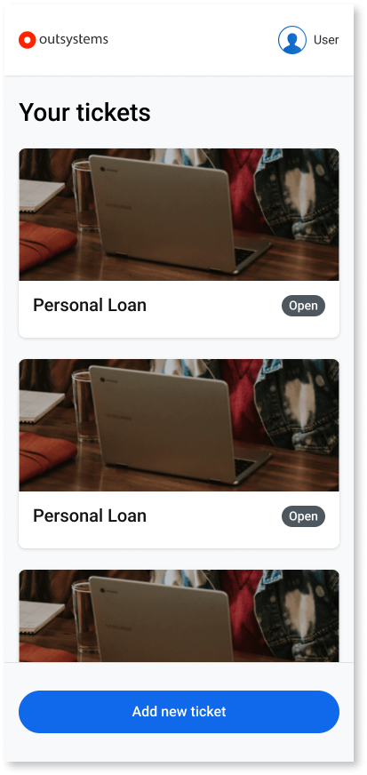
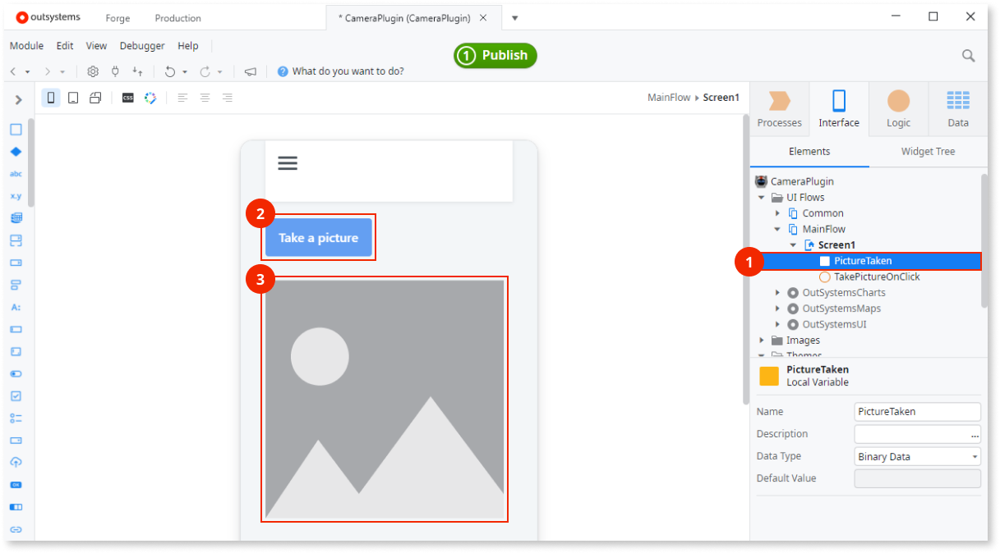
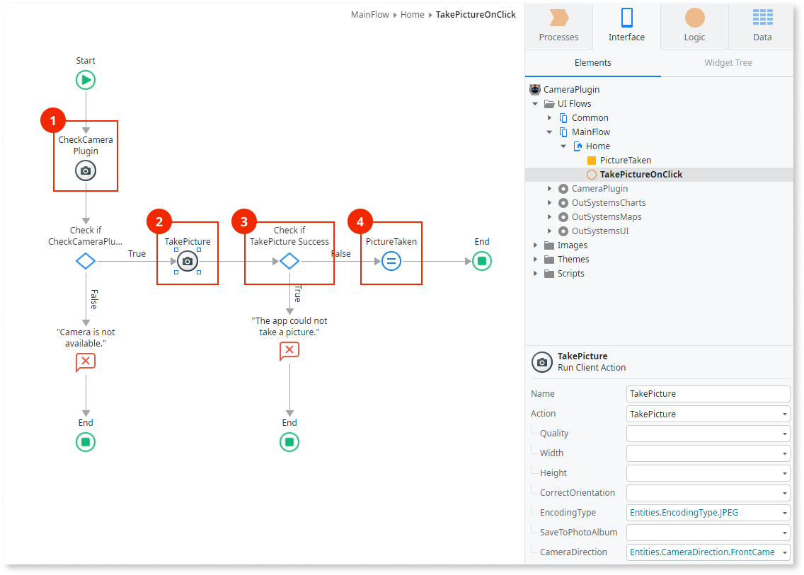
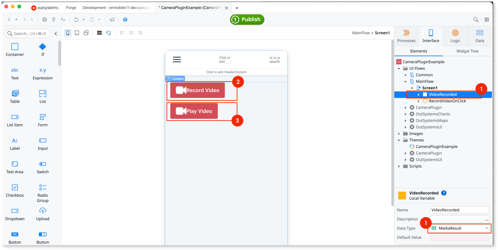
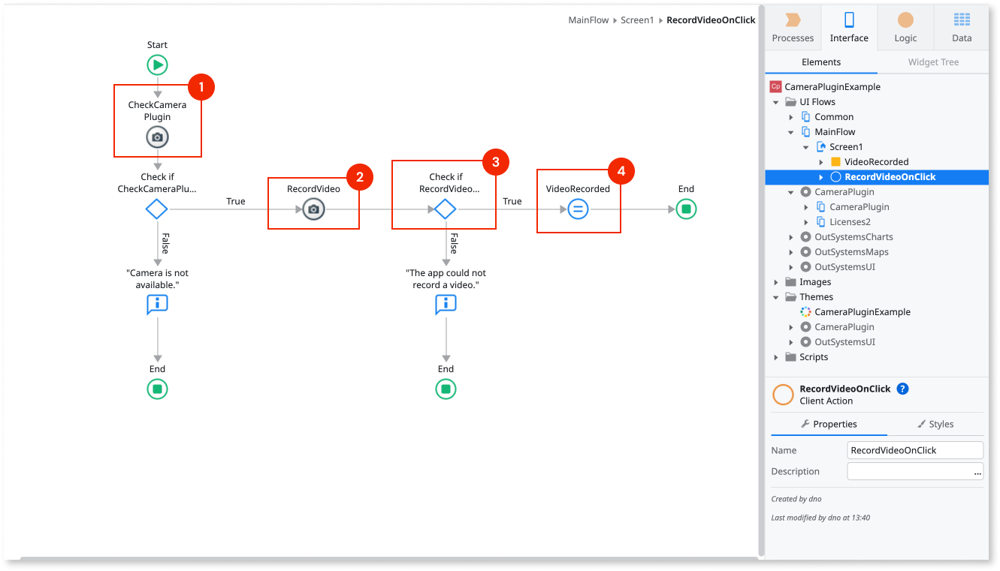
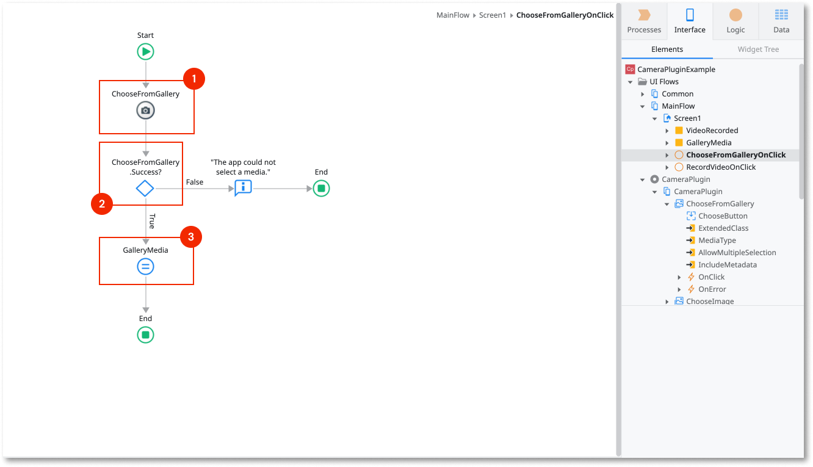
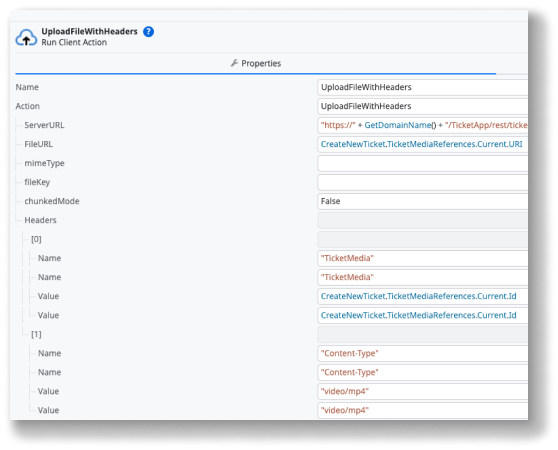
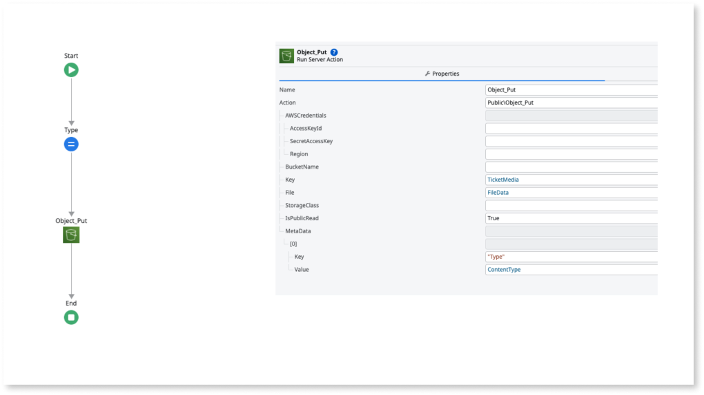
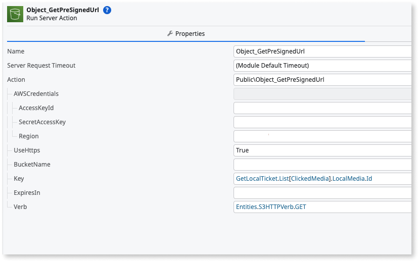

# Camera Plugin version 7

This article documents Camera Plugin version 7.x. For information about version 8.x and later, refer to the [Camera Plugin version 8 article](intro.md). To migrate from version 7.x to 8.x, refer to [Migrating camera plugin from version 7 to version 8](camera-plugin-migration-guide-7-to-8.md).

Applies only to Mobile Apps.

The Camera plugin enables users to take photos and record videos directly from their mobile devices within your app. It supports both native mobile apps and progressive web apps (PWAs), ensuring broad compatibility across platforms. With this plugin, you can configure settings such as image quality, orientation, and file format to suit your apps' requirements.

For more information about installing and referencing a plugin and installing a demo app, refer to [Adding plugins](../intro.md#adding-plugins).

## Demo app

Install the [Camera Demo App](https://www.outsystems.com/forge/component-overview/1390/camera-plugin) from Forge and open the app in Service Studio.
The demo app contains logic for common use cases to examine and recreate in your apps.
For example, the demo app shows how to:

* Take a picture.
* Capture a video.
* Select media from the gallery.
* Edit a picture taken with the camera or selected from the gallery.
* Edit the picture displayed in the app.

## Take a picture

To allow users to take a picture, complete these tasks:

* [Create a user interface](#create-a-user-interface-user-interface-picture)
* [Create logic to take a picture](#create-logic-to-take-a-picture-logic-picture)
* Create logic to [handle errors](#handle-errors-handle-errors)

### Create a user interface {#user-interface-picture}

Start by defining a variable of the **Binary Data** data type to hold the image data (1).
Use a Button (2) or another widget to run the action that takes a picture.
Use an **Image** widget (3) to show the image after using the camera, by setting **Type** to **Binary Data** and **Image Content** to the variable you created.

For more information about creating an interface, refer to the UI accelerators included with the Camera plugin.
In Service Studio, navigate to **Interface** > **UI Flows** > **Camera Plugin** > **Camera Plugin**, and drag the following Blocks to your Screen:

* **ChooseImage**
* **TakePicture**

### Create logic to take a picture {#logic-picture}

To allow your users to take a picture using the Camera plugin, you'll need to configure the app logic that connects user actions to the device camera. This ensures a smooth experience enabling the camera, specifying options, and receiving the captured image. The following procedure outlines the recommended steps to accomplish this.

1. Go to the **Logic** tab in Service Studio and navigate to **Client Actions** > **CameraPlugin**.
1. Use the **CheckCameraPlugin** action to verify if the plugin is available.
   * If the plugin is not available, display an error message to the user.
1. If the plugin is available, use the **TakePicture** action to open the camera and let the user take a picture.
   * In the **TakePicture** action, set parameters such as quality, width, and camera (back or front) based on your app's requirements.
1. After the picture is taken, check if **TakePicture.Success** is **True**.
1. If successful, assign the value of **TakePicture.MediaResult.Thumbnail** to a variable of the **Binary Data** data type, so you can handle the captured image.

## Record a video

Applies only to native mobile apps. Not available on PWAs.

To allow users to record a video, complete these tasks:

* [Create a user interface](#create-a-user-interface-create-user-interface-video)
* [Create logic to record a video](#create-logic-to-record-a-video-logic-video)
* Create logic to [handle errors](#handle-errors-handle-errors)

The following sections describe each step.

### Create a user interface {#create-user-interface-video}

Start by defining a variable of the **MediaResult** data type to hold the video data (1).
Use a Button (2) or another widget to run the action that captures a video.
Use the **PlayVideo** widget (3) to show the video after using the camera, by setting it to the variable you created.

The **PlayVideo** widget plays recorded or locally stored videos on a device.
To display videos from other sources, use the [**Video**](https://success.outsystems.com/documentation/11/developing_an_application/design_ui/patterns/using_traditional_web_patterns/controls/video/) widget.

Video files stored in the cache are deleted when the app closes.
If you set the URI parameter to a cached video file, the video might already be deleted.

For more information about creating an interface, refer to the UI accelerators included with the Camera plugin.
In Service Studio, navigate to **Interface** > **UI Flows** > **Camera Plugin** > **Camera Plugin**, and drag the following Blocks to your Screen:

* **ChooseFromGallery**
* **CaptureVideo**

### Create logic to record a video {#logic-video}

To capture and manage video recordings in your app, you must set up logic that checks for plugin availability, initiates the recording process, and correctly stores the resulting media.

To create logic to record a video, follow these steps:

1. Go to **Logic > Client Actions > CameraPlugin**.

1. To prevent errors, first check if the plugin is available (1) with the action **CheckCameraPlugin**.
   * If the plugin isn't available to the app, display an error to the user.
   * Otherwise, open the camera with **RecordVideo** to let users capture a video (2).

1. In the **RecordVideo** action, set the parameters for saving the recorded media to the device's gallery.

1. Check if recording videos on the device works by verifying the value of **RecordVideo.Success** is **True** (3).
   * If yes, handle the video data in **RecordVideo.MediaResult** by assigning it to a variable of the **MediaResult** data type (4).

## Select media from the gallery

Applies only to native mobile apps. Not available on PWAs.

Until PWA support is available, use **DEPRECATED_ChooseGalleryPicture**.

You can allow users to pick photos or videos directly from their device's gallery, enhancing flexibility for media input in your mobile app. This is especially useful when users want to upload content they have previously captured, rather than recording new media.

The **ChooseFromGallery** action lets users choose a media file from the device gallery, either a photo, a video, or both. The action is in the **Logic** tab of Service Studio, in **Client Actions** > **CameraPlugin**.

The action **ChooseFromGallery** opens a media browser to let users select a media file (1).
[Check for errors](#handle-errors) by verifying **ChooseFromGallery.Success** is **True** (2).
After users select the image, the binary data of the image is in the variable **ChooseFromGallery.MediaResult.** (3).

## Upload media assets from URIs

Use the video and picture URIs returned in the **MediaResult** variable, together with the **FileTransfer** plugin, to upload media files to a server. Then use the hosted URLs to view the media files in your app.

In the following example, the **UploadFileWithHeaders** client action uploads a video file to the app's REST endpoint `rest/tickets/video`.

Upload the video file to an S3 bucket inside the REST endpoint, then use the video's presigned URL with the **Video** widget to play the uploaded video.

## Image quality and app responsiveness

When you set **100%** image **Quality** or use the **PNG** format, your app handles a large amount of image data.
Users experience slower response times after taking an image with the highest quality settings.
The more data the app handles, the less responsive it becomes on low-end devices.

When setting the image quality, consider the use case for your app.
The following table shows examples of quality settings for common use cases.

|Example use case|Image quality|Notes|
|-|-|-|
|Profile image|JPEG 60% (default)|Sufficient quality for a profile image.|
|Insurance claims|JPEG 85-100% or PNG|Higher quality lets users examine all details in the image.|

Changing the image quality setting applies only to .JPEG files.

## Handle errors {#handle-errors}

The app with the camera plugin can run on many Android or iOS devices, with different hardware and configurations.
To ensure a good user experience and prevent the app from crashing, handle the errors within the app.

The following table lists the actions and variables that handle errors.

| Variable | Action | Description |
| - | - | - |
| **IsAvailable** | **CheckCameraPlugin** | True if the camera plugin is available in the app. |
| **Success** | **TakePicture** | True if there aren't errors while taking a picture. |
| **Success** | **ChooseGalleryPicture** | True if there aren't errors while opening a picture from the gallery. |
| **Success** | **EditPicture** | True if there aren't errors while editing a picture. |
| **Success** | **RecordVideo** | True if there aren't errors while recording a video. |
| **Success** | **ChooseFromGallery** | True if there aren't errors while opening a media file from the gallery. |
| **Success** | **PlayVideo** | True if there aren't errors while playing a video. |

Use these actions with **If** nodes to check for errors and control how the app works.

## Reference

The following sections contain additional reference information about the plugin.

For reference on available client actions and structures, refer to the [Camera Plugin version 7 reference](camera-ref-version-7.md).

### MABS compatibility

The following table shows the compatibility of the Camera plugin with the Mobile Apps Builds Service (MABS).

|Plugin version|Compatible with MABS version|Notes|
|-|-|-|
|7.6.4 and later|MABS 11.0 and later.||

## PWA functionality

In PWAs, the camera plugin has the following limitations compared to native mobile apps:

* The **RecordVideo** and **PlayVideo** client actions and blocks aren't available. Video capture and playback are available in native mobile apps only.
* The **EditURIPicture** client action and block aren't available. Use **EditPicture**.
* The **ChooseFromGallery** client action and block aren't available. Use the **DEPRECATED_ChooseGalleryPicture** action.
* The **MediaResult** data structure only offers **Type** and **Thumbnail** attributes. **URI** and **Metadata** are available in native mobile apps only. Use **Thumbnail** to retrieve the image captured by the camera.

## Known issues and workarounds

The following sections describe known issues and possible workarounds.

### Taking multiple pictures doesn't work in PWAs

In PWAs, taking multiple pictures requires browser stream capabilities.
To ensure the app has access to the stream, add the theme **CameraPlugin** as an element to your app.
**Keep the theme as a dependency even when the IDE reports it as not used by the app**.

### Taking multiple pictures doesn't work on some PWA devices

On some devices, the workaround described in the previous section shows a defective UI.
There's no workaround for this issue.

### Crashes on iOS 13.2 and 13.3

**Applies to PWAs.**

In iOS 13.2 and 13.3, the camera stops working because of the [WebKit 206219 bug](https://bugs.webkit.org/show_bug.cgi?id=206219).
If the camera stops working, swipe the open app up in App Switcher and reopen the app.

### Pictures appear rotated

**Applies to PWAs.**

In some Chrome versions, the picture displays rotated in the **Image** widget.
There is no workaround.

### CameraDirection setting has no effect

**Applies to Android only.**

In some versions of Android, the app ignores the **CameraDirection** setting.
Users change the camera direction (back or front) after the camera app opens.

### Resolution and quality settings apply to app images only

When you change the resolution or quality setting, the plugin applies it only to the image the app uses.
The device ignores the settings when saving the images in the device gallery.
The size of the image in the gallery depends on the device's hardware.

### ChooseFromGallery doesn't allow selection on Android 13

**Applies to Android only.**

In Android 13, users can't select content from the device's gallery when using **ChooseFromGallery**.
When targeting Android 13, build apps using MABS 9 or later.

## Related resources

* [Camera Plugin version 8](intro.md)
* [MIgrating camera plugin from version 7 to version 8](camera-plugin-migration-guide-7-to-8.md)
