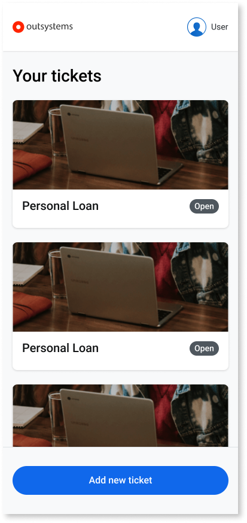
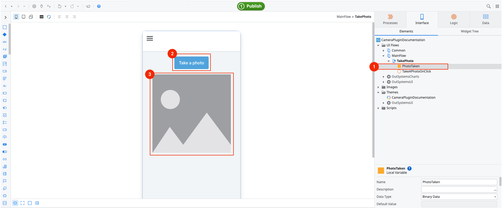
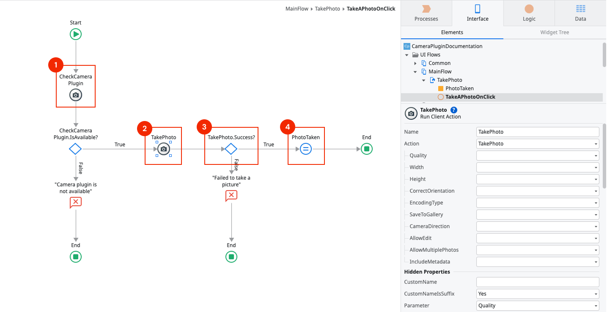
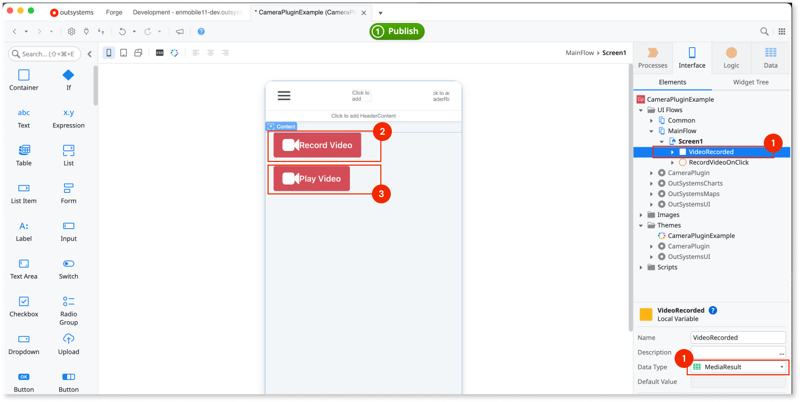
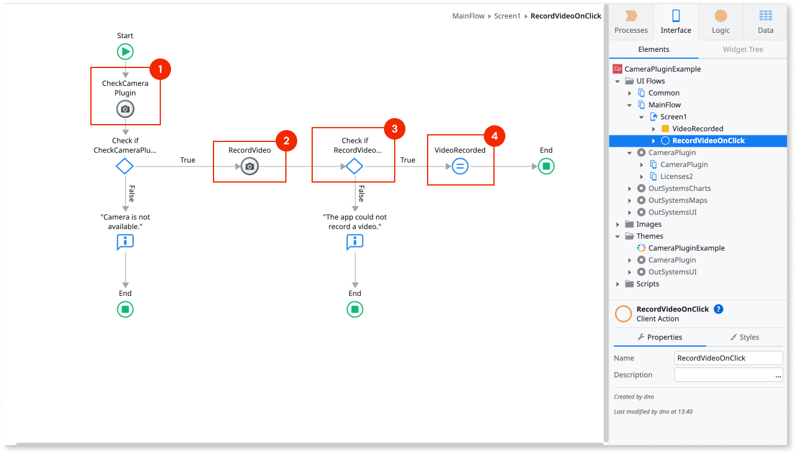
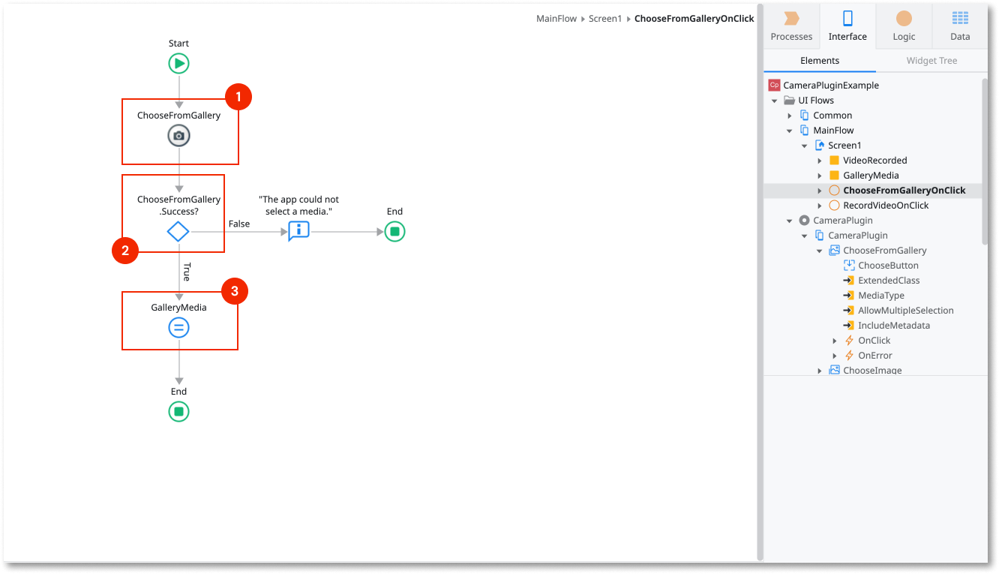
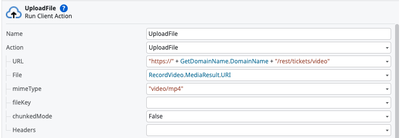
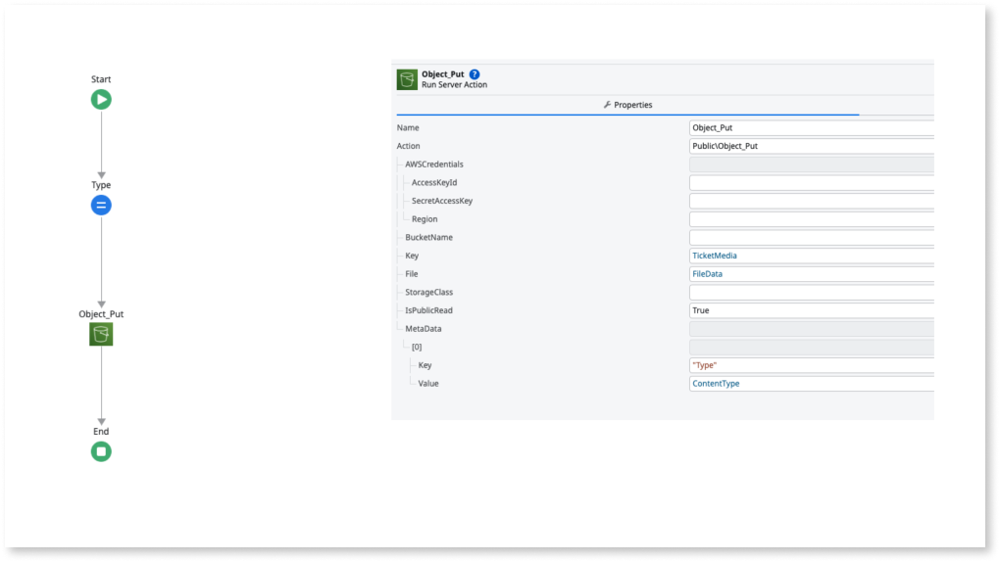
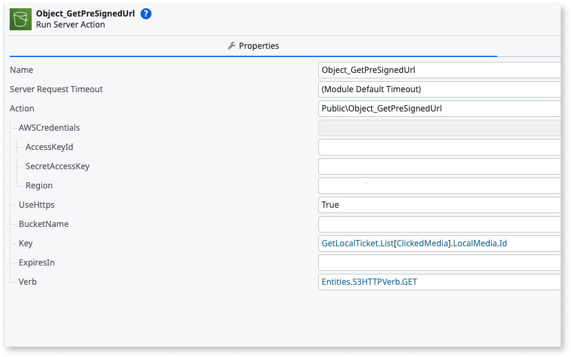
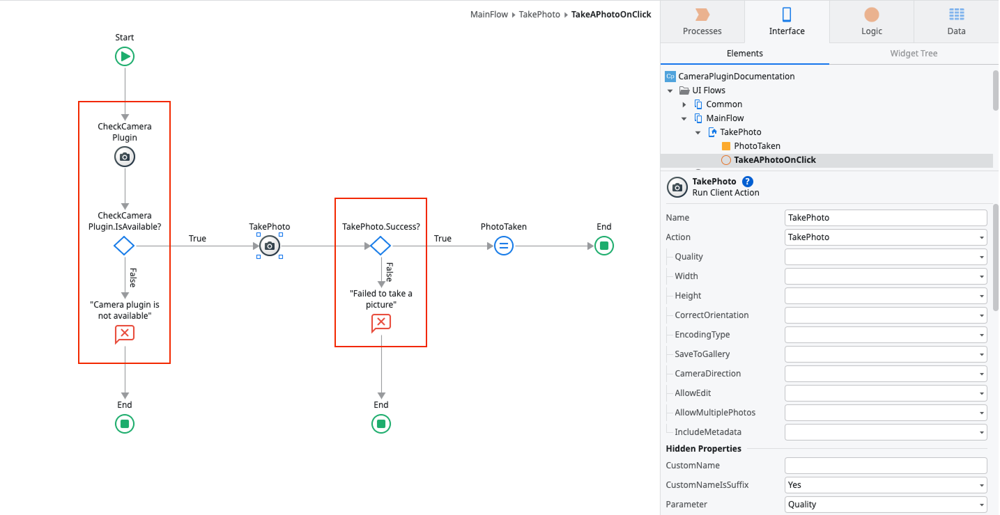

# Camera Plugin version 8

For information about Camera Plugin version 7.x, refer to the [Camera Plugin version 7](camera-plugin-version-7.md).

Camera Plugin version 8.0.0 includes breaking changes. To update from an older version to version 8.0.0, refer to the [Migrating camera plugin from version 7 to version 8](camera-plugin-migration-guide-7-to-8.md).

Applies only to Mobile Apps.

The Camera plugin enables users to take photos and record videos directly from their mobile devices within your app. It supports both native mobile apps and progressive web apps (PWAs), ensuring broad compatibility across platforms. With this plugin, you can configure settings such as image quality, orientation, and file format to suit your apps' requirements.

For more information about installing and referencing a plugin and installing a demo app, refer to [Adding plugins](../intro.md#adding-plugins).

## Demo app

Install the [Camera Demo App](https://www.outsystems.com/forge/component-overview/1390/camera-plugin) from Forge and open the app in Service Studio.
The demo app contains logic for common use cases to examine and recreate in your apps.
For example, the demo app shows how to:

* Take a photo.
* Capture a video.
* Select media from the gallery.
* Edit a photo taken with the camera or selected from the gallery.
* Edit the photo displayed in the app.

## Take a photo

To allow users to take a photo, complete these tasks:

* [Create a user interface](#user-interface-photo)
* [Create logic to take a photo](#logic-photo)
* [Handle errors](#handle-errors)

### Create a user interface {#user-interface-photo}

To set up the user interface for taking a photo, follow these steps:

1. Define a variable of the **Binary Data** data type to hold the image data (1).
1. Add a Button (2) or another widget to run the action that takes a photo.
1. Add an **Image** widget (3) to show the image after using the camera. Set **Type** to **Binary Data** and **Image Content** to the variable you created.

Alternatively, use the pre-built widget included with the plugin. In Service Studio, navigate to **Interface** > **UI Flows** > **Camera Plugin** > **Camera Plugin**, and drag the **TakePhoto** Block to your Screen. Then use the **OnClick** event to receive the returned result. The image binary is in **MediaResult.Thumbnail**.

### Create logic to take a photo {#logic-photo}

To take a photo using the Camera plugin, configure the app logic that connects user actions to the device camera. The following steps outline how to enable the camera, specify options, and receive the captured image.

1. Go to the **Logic** tab in Service Studio and navigate to **Client Actions** > **CameraPlugin**.
1. Use the **CheckCameraPlugin** action to verify if the plugin is available (1).
    * If the plugin is not available, display an error message to the user.
1. If the plugin is available, use the **TakePhoto** action to open the camera and let the user take a photo (2).
    * In the **TakePhoto** action, set parameters such as quality, width, and camera direction (back or front) based on your app's requirements.
1. After the photo is taken, check if **TakePhoto.Success** is **True** (3).
1. If successful, assign the value of **TakePhoto.MediaResult.Thumbnail** to a variable of the **Binary Data** data type to handle the captured image (4).

For more information about error handling, refer to [Handle errors](#handle-errors).

## Record a video

Applies only to native mobile apps. Not available on PWAs.

To allow users to record a video, complete these tasks:

* [Create a user interface](#user-interface-video)
* [Create logic to record a video](#logic-video)
* [Handle errors](#handle-errors)

### Create a user interface {#user-interface-video}

To set up the user interface for recording a video, follow these steps:

1. Define a variable of the **MediaResult** data type to hold the video data (1).
1. Add a Button (2) or another widget to run the action that captures a video.
1. Add the **PlayVideo** widget (3) to show the video after using the camera. Set it to the variable you created.

The **PlayVideo** widget plays recorded or locally stored videos on a device.
To display videos from other sources, use the [**Video**](https://success.outsystems.com/documentation/11/developing_an_application/design_ui/patterns/using_traditional_web_patterns/controls/video/) widget.

The **RecordVideo** action includes an **IsPersistent** parameter that persists videos in your app. It is **True** by default. Set it to **False** to save the video in cache instead. Video files stored in the cache are deleted when the app closes. If you set the URI parameter to a cached video file, the video might already be deleted.

If you don't plan to play the video after closing the app and want to save device storage, set **IsPersistent** to **False**.

Alternatively, use the pre-built widget included with the plugin. In Service Studio, navigate to **Interface** > **UI Flows** > **Camera Plugin** > **Camera Plugin**, and drag the **RecordVideo** Block to your Screen. Then use the **OnClick** event to receive the returned result.

### Create logic to record a video {#logic-video}

To capture and manage video recordings in your app, set up logic that checks for plugin availability, initiates the recording, and stores the resulting media.

To create logic to record a video, follow these steps:

1. Go to the **Logic** tab in Service Studio and navigate to **Client Actions** > **CameraPlugin**.
1. Use the **CheckCameraPlugin** action to verify if the plugin is available (1).
    * If the plugin is not available, display an error message to the user.
1. If the plugin is available, use the **RecordVideo** action to open the camera and let users capture a video (2).
    * In the **RecordVideo** action, set the parameters for saving the recorded media to the device's gallery.
1. Check if **RecordVideo.Success** is **True** (3).
1. If successful, assign **RecordVideo.MediaResult** to a variable of the **MediaResult** data type to handle the video data (4).

For more information about error handling, refer to [Handle errors](#handle-errors).

## Select media from the gallery

Applies to both mobile apps and PWAs, but with [limited support on PWAs](#pwa-functionality).

You can allow users to pick photos or videos directly from their device's gallery, enhancing flexibility for media input in your mobile app. This is especially useful when users want to upload existing files rather than capture new content.

The **ChooseFromGallery** action lets users choose a media file from the device gallery, either a photo, a video, or both. The action is in the **Logic** tab of Service Studio, in **Client Actions** > **CameraPlugin**.

The following example illustrates selecting a single photo from the gallery.

To select media from the gallery, follow these steps:

1. Use the **ChooseFromGallery** action to open a media browser and let users select a media file (1).
1. Verify **ChooseFromGallery.Success** is **True** (2). For more information about error handling, refer to [Handle errors](#handle-errors).
1. After users select the image, retrieve the binary data from **ChooseFromGallery.MediaResult.Current.Thumbnail** (3).

Alternatively, use the pre-built widget included with the plugin. In Service Studio, navigate to **Interface** > **UI Flows** > **Camera Plugin** > **Camera Plugin**, and drag the **ChooseFromGallery** Block to your Screen. Then use the **OnClick** event to receive the returned result.

## Upload media assets from URIs

Use the video and photo URIs returned in the **MediaResult** variable, together with the **FileTransfer** plugin, to upload media files to a server. Then use the hosted URLs to view the media files in your app.

In the following example, the **UploadFile** client action from File Transfer Plugin uploads a video file to the app's REST endpoint `rest/tickets/video`.

Upload the video file to an S3 bucket inside the REST endpoint, then use the video's presigned URL with the **Video** widget to play the uploaded video.

## Image quality and app responsiveness

When you set **100%** image **Quality** or use the **PNG** format, your app handles a large amount of image data.
Users experience slower response times after taking an image with the highest quality settings.
The more data the app handles, the less responsive it becomes on low-end devices.

When setting the image quality, consider the use case for your app.
The following table shows examples of quality settings for common use cases.

|Example use case|Image quality|Notes|
|-|-|-|
|Profile image|JPEG 60% (default)|Sufficient quality for a profile image.|
|Insurance claims|JPEG 85-100% or PNG|Higher quality lets users examine all details in the image.|

Changing the image quality setting applies only to .JPEG files.

## Handle errors

The app with the camera plugin can run on many Android or iOS devices, with different hardware and configurations.
To ensure a good user experience and prevent the app from crashing, handle the errors within the app.

The following table lists the actions and variables that handle errors.

| Variable | Action | Description |
| - | - | - |
| **IsAvailable** | **CheckCameraPlugin** | True if the camera plugin is available in the app. |
| **Success** | **TakePhoto** | True if there aren't errors while taking a photo. |
| **Success** | **EditPhoto** | True if there aren't errors while editing a photo. |
| **Success** | **EditURIPhoto** | True if there aren't errors while editing a photo. |
| **Success** | **RecordVideo** | True if there aren't errors while recording a video. |
| **Success** | **ChooseFromGallery** | True if there aren't errors while opening a media file from the gallery. |
| **Success** | **PlayVideo** | True if there aren't errors while playing a video. |

Use these actions with **If** nodes to check for errors and control how the app works.

Errors return an **Error** structure with **ErrorCode** and **ErrorMessage**. For information about specific error codes and how to handle them, refer to the [error codes section in the reference article](camera-ref.md#error-codes).

## Reference

The following sections contain additional reference information about the plugin.

For reference on available client actions and structures, refer to the [Camera Plugin reference article](camera-ref.md).

### MABS compatibility

The following table shows the compatibility of the Camera plugin with the Mobile Apps Builds Service (MABS).

|Plugin version|Compatible with MABS version|Notes|
|-|-|-|
|8.0.0 and later|MABS 11.0 and later.||
|7.6.4 and later|MABS 11.0 and later.||

## PWA functionality

In PWAs, the camera plugin has the following limitations compared to native mobile apps:

* The **RecordVideo** and **PlayVideo** client actions and blocks aren't available. Video capture and playback are available in native mobile apps only.
* The **EditURIPhoto** client action and block aren't available. Use **EditPhoto**.
* The **ChooseFromGallery** client action and block have limited functionality. They currently only allow selecting one photo at a time, and don't allow video selection.
* The **MediaResult** data structure only offers **Type** and **Thumbnail** attributes. **URI** and **Metadata** are available in native mobile apps only. Use **Thumbnail** to retrieve the image captured by the camera.

## Known issues and workarounds

The following sections describe known issues and possible workarounds.

### Taking multiple photos doesn't work in PWAs

In PWAs, taking multiple photos requires browser stream capabilities.
To ensure the app has access to the stream, add the theme **CameraPlugin** as an element to your app.
**Keep the theme as a dependency even when the IDE reports it as not used by the app**.

### Taking multiple photos doesn't work on some PWA devices

On some devices, the workaround described in the previous section shows a defective UI.
There's no workaround for this issue.

### Photos appear rotated

**Applies to PWAs.**

In some Chrome versions, the photo displays rotated in the **Image** widget.
There is no workaround.

### Resolution and quality settings apply to app images only

When you change the resolution or quality setting, the plugin applies it only to the image the app uses.
The device ignores the settings when saving the images in the device gallery.
The size of the image in the gallery depends on the device's hardware.

## Related resources

* [Camera Plugin version 7](camera-plugin-version-7.md)
* [Migrating camera plugin from version 7 to version 8](camera-plugin-migration-guide-7-to-8.md)
