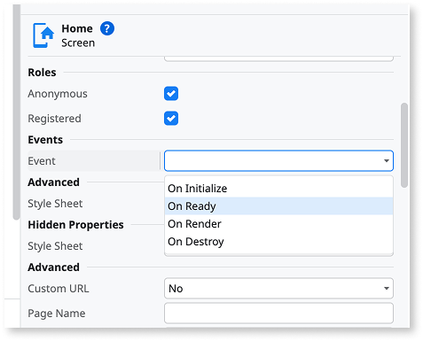
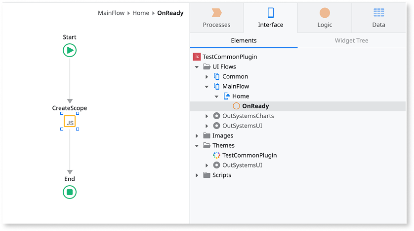
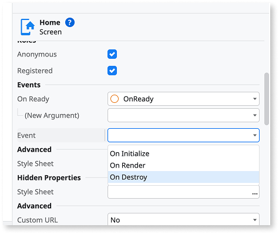
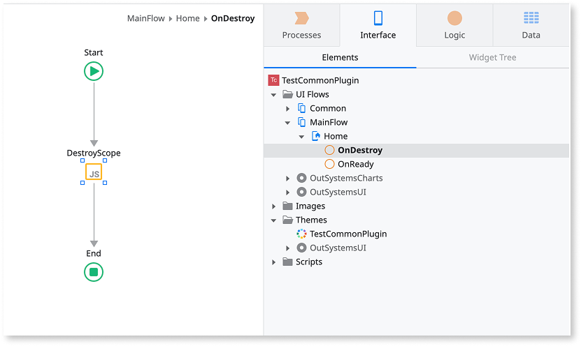

# Common plugin

<div class="info" markdown="1">

Applies only to Mobile Apps.

</div>

The [Common Plugin](https://www.outsystems.com/forge/component-overview/1417/common-plugin-o11) provides you with a set of actions that facilitate obtaining crucial information for the development of mobile apps.

<div class="info" markdown="1">

For more information about installing and referencing a plugin in your OutSystems apps, refer to [Adding plugins](../intro.md#adding-plugins).

</div>

Using the Common Plugin you will be able to:

* Write to the device console with the **ConsoleLog** client action.
* Get the value of the `device.uuid` variable, which should uniquely identify the current device/installation, with the **GetDeviceID** client action.
* Get the operating system the app runs on with the **GetOperatingSystem** client action.
* Get the Cordova platform information with the **GetPlatform** client action.
* Get the WebView user agent with the **GetUserAgent** client action.
* Check whether Cordova is defined with the **IsCordovaDefined** client action.
* Create a scope for your plugin needs. For more information, refer to [**PluginManager**](#plugin-manager).

## Plugin Manager

Plugin Manager is a JavaScript module that allows you to create and use specific scopes in your mobile app. A scope created by the Plugin Manager module can be used to follow the same lifecycles as OutSystems App screens and UI Blocks, allowing you to, for example, safely perform native background tasks and dispatch related information to your OutSystems App.

For example, the [File Transfer Plugin](../file-transfer-plugin/intro.md) creates one scope for download events and another for upload events in the **HandleDownload** and **HandleUpload** UI blocks.

### Add the Plugin Manager to a screen

To add the Plugin Manager JavaScript module to your app screen, follow these steps:

1. In Service Studio, set a handler for the **OnReady** event.

    

1. Add a JavaScript node to your **OnReady** flow.

    

1. Load the **Plugin Manager** module in the **CreateScope** JavaScript node.

    ```Javascript
    require(["PluginManager"], function(module){        
        // handle scope creation here - step 5.

        $resolve();
    });
    ```

1. Implement your own custom callback - for example, you can define a counter variable that gets increased when your callback is called and reset when your screen is destroyed.

1. Then, you can create your own scope by calling `module.createScope(<scope_name>, <on_ready_callback>, <on_destroy_callback>)`.

    For the counter example, the complete code inside the JavaScript node is:

    ```Javascript
    require(["PluginManager"], function(module){      
        var onScopeReady = function(scope) { 
            scope.counter = 0;
        
            scope.increaseCounter = scope.newCallback(function() {
                scope.counter += 1;
            });
        };
        
        var onScopeDestroyed = function(scope) {
            scope.counter = 0;
        };
        
        module.createScope("counter_scope", onScopeReady, onScopeDestroyed);

        $resolve();
    });
    ```

1. To correctly destroy the new scope, you need to add logic to your screen’s **OnDestroy** event.

    
    

1. Destroy your scope by loading **Plugin Manager** and calling `module.destroyScope(<scope_name>)` after verifying it exists.
     For the counter example, the code inside the **DestroyScope** JavaScript node would be:

    ```Javascript
    require(["PluginManager"], function(module){   
        let scope = module.scope("counter_scope");

        if(scope !== undefined) {
            module.destroyScope("counter_scope");    
        }

        $resolve();
    });
    ```

Now you can increase your counter by calling your scope’s new callback:

```Javascript
require(["PluginManager"], function(module){  
    let scope = module.scope("counter_scope");

    if(scope !== undefined) {
        scope.increaseCounter();
    }
    
    $resolve();
});
```
