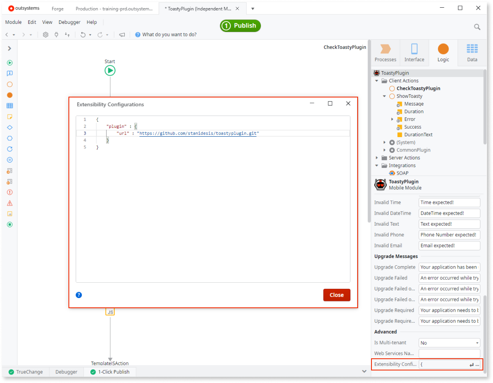
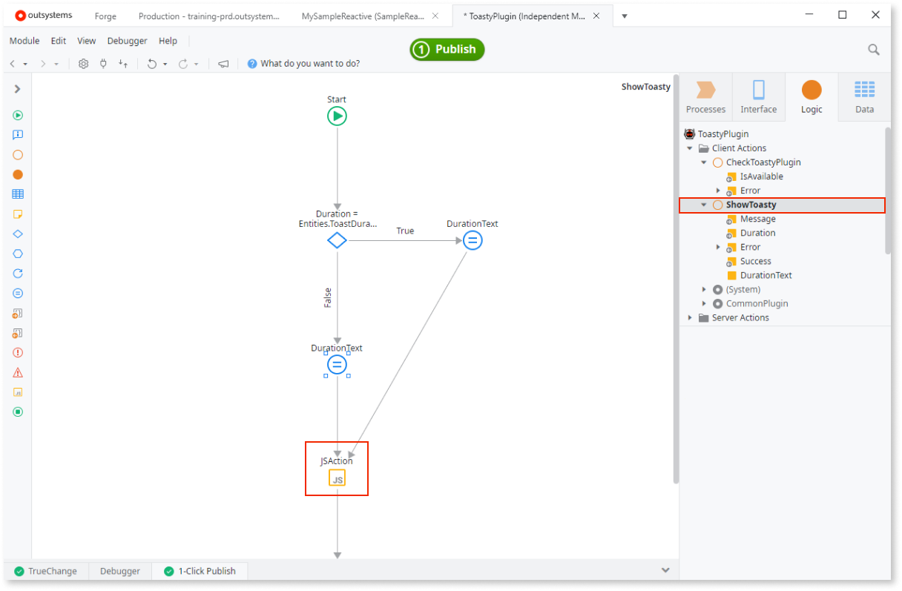
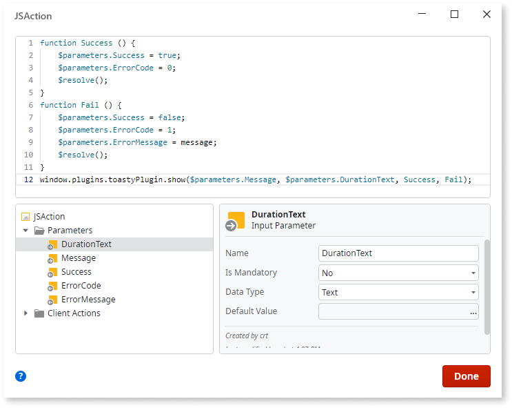
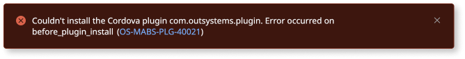
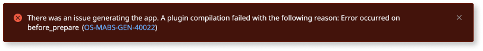

# Using Cordova Plugins

<div class="info" markdown="1">

Applies only to Mobile apps.

</div>

You must wrap Apache Cordova plugins into modules to reference them in your mobile apps. 

To wrap Apache Cordova plugins into modules, do the following:

1. Clone the [Template Plugin from Forge](<https://www.outsystems.com/forge/component-overview/1676/template-plugin/>) that provides the groundwork for all custom Cordova plugins. 
1. Wrap each plugin in its own dedicated module and application; if using several plugins, create an application for each, containing a single wrapper module. 
1. Make the relevant actions and entities of the wrapper module public. 
1. Provide a meaningful name for the wrapper module. For example, "SamplePlugin".

You can only test the functionality of Cordova plugins in native mobile application.

This document explains the process of wrapping an existing Cordova plugin into a module. For step-by-step instructions on how to create and wrap your own Cordova plugin, refer to [How to Create a Cordova Plugin from Scratch](<https://www.outsystems.com/blog/posts/how-to-create-a-cordova-plugin-from-scratch/>).

## Reference Cordova Plugins

Wrap a Cordova plugin through the **Extensibility Configuration** module property. Specify the plugin using one of the following keys within the JSON settings:

* the public repository URL (the value of the `url` key)
* the Cordova identifier (the value of the `identifier` key)
* the ZIP file from the **Resources** folder in the **Data** tab (the value of the `resource` key)

Unless it’s a [plugin supported by OutSystems](intro.md) and you're using a public repository to reference the plugin, it's recommended that you fork the plugin repository or use a tagged version, such as `https://example.com/sampleplugin/sampleplugin.git#v1.1.0`. This prevents breaking changes in the plugin and the applications using the plugin. Additionally, if tags aren't used, two different builds may produce different results. This is important when deploying across one or more environments, where testing in one environment may be invalidated by a different build generated for another environment. 

You can use JSON for configuring additional settings required by the plugin. For detailed information about the description of the JSON, refer to [Extensibility Configurations JSON Schema](../../../deploying-apps/mobile-app-packaging-delivery/customize-mobile-app/extensibility-configurations-json-schema.md).



### JSON Examples

Following is a sample JSON file for the **Extensibility Configuration** module property. You can use only one of the plugin references in the `plugin` key: `url` or `identifier` or `resource`.

A plugin from the npm registry:

```javascript
{
    "plugin": {
        "identifier": "sampleplugin"
    }
}
```

A plugin from a git repository:

```javascript
{
    "plugin": {
        "url": "https://example.com/sampleplugin/sampleplugin.git#1.1.0"
    }
}
```

A plugin from a ZIP file:

```javascript
{
    "resource": "my-plugin.zip",
    "plugin": {
        "resource": "my-plugin"
    }
}
```

The file is located in **Resources** folder of the **Data** tab, in the file `my-plugin.zip`. Select **Do Nothing** in the **Deploy Action** attribute of the **Resource** property. The location of `plugin.xml` within the zip file is `my-plugin\plugin.xml`. In the `plugin.xml` file, there is `id="my-plugin"` attribute within the root `plugin` element.

If the plugin requires additional arguments, you can include them in the `name` and `value` key-value pairs. Following is an example:

```javascript
{
    "plugin": {
        "url": "https://example.com/sampleplugin/sampleplugin.git",
        "variables": [
            {
                "name": "<plugin_var1>",
                "value": "<value_var1>"
            },
            {
                "name": "<plugin_var2>",
                "value": "<value_var2>"
            }
        ]
    }
}
```

## Wrapper module structure

Each plugin must have a `Check<Capability>Plugin` action (such as "CheckToastyPlugin") with an **IsAvailable** output parameter of type Boolean. This enables you to check if the plugin is available in the target module.

Create actions (such as "ShowToast") within the wrapper module and add a JavaScript flow element with the variables. Make the actions public so that they are available in the application. Write the descriptions for all the public actions, inputs and outputs. This helps when using the module in the target application.



Insert the code that connects the wrapper to the Cordova plugin into a JavaScript element:



## Custom hooks

Starting from **MABS 10** you can create custom error messages for any purpose. You can create a custom error message when a plugin is installing or even when the build has started.

This enables better troubleshooting and a better usage experience for each plugin. To create a custom error message you must have a hook stopping the build with a message starting with the pattern `OUTSYSTEMS_PLUGIN_ERROR:`.

If the error occurs at the plugin installation step, the message identifies the plugin and the error code is `OS-MABS-PLG-40021`. However, if the error is at the build step, the error code is  `OS-MABS-GEN-40022` and the error message won't contain the plugin ID by default.

For example, to have your plugin failing in the installation with either of the following experiences requires you to make some changes.

* Customizable plugin install error
  


* Customizable build error
  


you must make the following changes:

1. A hook on your plugin, running at either the installation or build phases. For detailed information, refer to [hook phases](https://cordova.apache.org/docs/en/11.x/guide/appdev/hooks/).
1. A hook that logs the error in the format `OUTSYSTEMS_PLUGIN_ERROR:`. In this example, the following code for the hook was used

```
module.exports = function (ctx) {
    console.log("RUNNING HOOK NOW!");
    ...
    throw new Error(`OUTSYSTEMS_PLUGIN_ERROR: Error occurred on ${ctx.hook}`)
};
```
