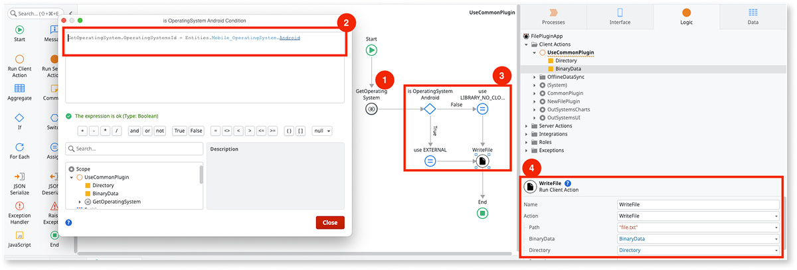
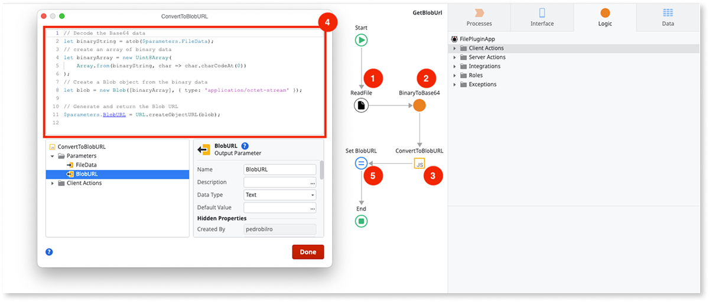

# File Plugin migration guide from version 3 to version 4

This guide is for users transitioning from the older version of the OutSystems File Plugin, [v3.X.X](file-plugin-version-3.md), to [version 4.0.0](intro.md). After updating the plugin, you can choose between two paths:

* [Keep using the same actions from 3.X.X, that have since been marked as deprecated](#deprecated-client-actions).
* [Migrate from the deprecated actions to the new client actions](#migrating-client-actions).

## Deprecated client actions

All client actions from version 3.X.X and below have been marked as deprecated, and it's recommended to use the new actions added in plugin version 4.0.0.

If however, you are updating the plugin in an existent app, and don't want to go through the effort of migrating client actions, you can keep using the deprecated actions for the time being, whose input/output remain the same.

<div class="info" markdown="1">

When you update to version 4.0.0 on Service Studio, you will keep using the client actions from the previous version, but they'll prefixed with **DEPRECATED_**. For instance, the **DeleteFile** of version 3.X.X is now **DEPRECATED_DeleteFile** in version 4.0.0.

</div>

## Migrating client actions

The new client actions have a different structure - some have different names, others different inputs and outputs. There are also client actions that provide new functionality that wasn't available before in the plugin (for example, **Copy**).

<div class="warning" markdown="1">

If you decide to migrate to the new client actions when updating to version 4.0.0, keep in mind that these only work once you generate a new mobile package on both Android and iOS.

</div>

This section will further detail which client actions replace the deprecated ones, and any additional changes that may be required to migrate to the new client actions.

### Client action mapping

| Deprecated Action             | New Action to use   | Migration notes               |
| ----------------------------- | ------------------- | ----------------------------- |
| DEPRECATED_CheckFilePlugin    | **CheckFilePlugin** | The new plugin action can return either an **Error** or a **Warning** - the latter in the case that the plugin is working, but is running an old version. |
| DEPRECATED_CreateDirectory    | **CreateDirectory** | For migrating from the deprecated **StorageType** and **StoragePersistency** to the new **PathDirectory**, [see the section below](#storage-persistence-and-type-to-pathdirectory).  |
| DEPRECATED_DeleteDirectory    | **DeleteDirectory** | For migrating from the deprecated **StorageType** and **StoragePersistency** to the new **PathDirectory**, [see the section below](#storage-persistence-and-type-to-pathdirectory). |
| DEPRECATED_DeleteFile         | **DeleteFile**      | For migrating from the deprecated **StorageType** and **StoragePersistency** to the new **PathDirectory**, [see the section below](#storage-persistence-and-type-to-pathdirectory). |
| DEPRECATED_DeleteFileFromUri  | **DeleteFile**      | Provide the Uri in the **Path** input parameter, and leave **Directory** empty. |
| DEPRECATED_GetFileData        | **ReadFile**        | For migrating from the deprecated **StorageType** and **StoragePersistency** to the new **PathDirectory**, [see the section below](#storage-persistence-and-type-to-pathdirectory). |
| DEPRECATED_GetFileDataFromUri | **ReadFile**        | Provide the Uri in the **Path** input parameter, and leave **Directory** empty. |
| DEPRECATED_GetFileData        | **ReadFile**        | For migrating from the deprecated **StorageType** and **StoragePersistency** to the new **PathDirectory**, [see the section below](#storage-persistence-and-type-to-pathdirectory). |
| DEPRECATED_GetFileUri         | **GetFileUri**      | For migrating from the deprecated **StorageType** and **StoragePersistency** to the new **PathDirectory**, [see the section below](#storage-persistence-and-type-to-pathdirectory). |
| DEPRECATED_GetFileUrl         | **ReadFile**        | The new **ReadFile** does not return blob URL's. You may keep using the deprecated action for the time being, or refer to [Create a blob URL](#create-a-blob-url) to accomplish the same behavior in your app. |
| DEPRECATED_GetFileUrlFromUri  | **ReadFile**        | The new **ReadFile** does not return blob URL's. You may keep using the deprecated action for the time being, or refer to [Create a blob URL](#create-a-blob-url) to accomplish the same behavior in your app. |
| DEPRECATED_ListDirectory      | **ListDirectory**   | For migrating from the deprecated **StorageType** and **StoragePersistency** to the new **PathDirectory**, [see the section below](#storage-persistence-and-type-to-pathdirectory). |
| DEPRECATED_SaveFile           | **WriteFile**       | You may instead use **AppendFile** if you're saving to the end of an existing file and you don't want to overwrite it. For migrating from the deprecated **StorageType** and **StoragePersistency** to the new **PathDirectory**, [see the section below](#storage-persistence-and-type-to-pathdirectory). |
| DEPRECATED_SaveTemporaryFile  | **WriteFile**       | You may instead use **AppendFile** if you're saving to the end of an existing file and you don't want to overwrite it. For migrating from the deprecated **StorageType** and **StoragePersistency** to the new **PathDirectory**, [see the section below](#storage-persistence-and-type-to-pathdirectory). |

### Storage Persistence and Type to PathDirectory

In the deprecated client actions, the way you specify the full path to a file was via a combination of four parameters:

* **Name**: The file name.
* **Path**: Relative path to the directory that contains the file.
* **StorageTypeId**: Android only - Identifies the type of storage system - Internal or External.
* **StoragePersistenceId**: Either Persistent or Temporary storage system.

The combination of **StorageType** and **StoragePersistence** map to a specific location in the device's filesystem.

In the new client actions introduced in version 4.0.0, you now use a **Path** and a **Directory** parameter. The new **Path** is a combination of **Name** + **Path** in the deprecated actions - for instance, **Name**="file.txt" and **Path**="directory" should now translate to **Path**="directory/file.txt". The new **Directory** is of type **PathDirectory**, and it encompasses all combinations of **StorageType** and **StoragePersistence**, while also providing additional locations in the storage system that weren't previously available in the OutSystems Plugin. The [reference page](file-plugin-ref.md) describes each type of **PathDirectory**.

If you have been using File Plugin actions apart from the **(...)FromUri** ones, you'll need to use the appropriate **PathDirectory** value in the new actions to achieve the same behavior, that is, accessing the files at the same locations in previous plugin versions in both Android and iOS. Here's how you can migrate to the new **PathDirectory** parameter from the deprecated **StorageType** and **StoragePersistence**:

1. For **StorageType.Internal** and **StoragePersistence.Persistent** (default for **DEPRECATED_SaveFile**) - use **PathDirectory.LIBRARY_NO_CLOUD**.
1. For **StorageType.Internal** and **StoragePersistence.Temporary** (default for **DEPRECATED_SaveTemporaryFile**) - use **PathDirectory.TEMPORARY**.
1. For **StorageType.External** and **StoragePersistence.Persistent** - there is no direct equivalent **Directory** parameter to achieve the same behavior in both Android and iOS. Android uses **Directory.External**, while iOS uses **PathDirectory.LIBRARY_NO_CLOUD**. If your app targets both platforms, you'll need logic to detect which platform you are on, and pass the appropriate **Directory** value on each case. You can accomplish this with the [Common Plugin](https://www.outsystems.com/forge/component-overview/1417/common-plugin-o11). The screenshot below illustrates how to do it in Service Studio. 
    * Use **GetOperatingSystem** client action (1) and check **OperatingSystemsId** output parameter (2), using **PathDirectory.EXTERNAL** if it's **OperatingSystemsId.Android**, and use **PathDirectory.LIBRARY_NO_CLOUD** otherwise (3); you may assign it to a local variable to then use it in a File Plugin action. For example, **WriteFile** (4).

    

1. For **StorageType.External** and **StoragePersistence.Temporary** - Android uses **PathDirectory.EXTERNAL_CACHE**, while iOS uses **PathDirectory.TEMPORARY**. If you're targetting both platforms, you'll need logic to distinguish between the two, as mentioned above.

### Create a blob URL

The new **ReadFile** method returns file data as **BinaryData**, similarly to the **DEPRECATED_GetFileData**. If you want to obtain a Blob URL from **ReadFile**, (to replace **DEPRECATED_GetFileUrl**), you'll have to add some logic in your app. The screenshot below illustrates what is necessary to create a Blob URL.

After calling **ReadFile** (1), you should convert the **BinaryData** to a Base64 **Text**, which you can do for instance via [BinaryData extension's](https://success.outsystems.com/Documentation/11/Reference/OutSystems_APIs/BinaryData_API) **BinaryToBase64** (2). Then, add a JavaScript Block (3) that receives **BinaryToBase64.Base64**. Inside the JavaScript block - named **ConvertToBlobURL** in this example - is where you convert the data to a blob URL (4). Then you can assign the output of **ConvertToBlobURL** to a variable (5).



Below is the code used in the JavaScript block:

```javascript
// Decode the Base64 data
let binaryString = atob($parameters.FileData);
// create an array of binary data
let binaryArray = new Uint8Array(
    Array.from(binaryString, char => char.charCodeAt(0))
);
// Create a Blob object from the binary data
let blob = new Blob([binaryArray], { type: 'application/octet-stream' });

// Generate and return the Blob URL
$parameters.BlobURL = URL.createObjectURL(blob);
```

### Error handling

For simplicity, the examples above obtained the result directly from the client action. However, it's recommended to check that the action was successful before trying to retrieve the result.

In the deprecated actions, you do this by checking if the **Error.ErrorCode** returned by the action is **0**.

In the new client actions, a separate **Success** Boolean is added, which you should check if it's **true** before proceeding; if it's **false**, then you may look at the **Error** structure for information on what went wrong. For the list of error codes made available since version 4.0.0, see the plugin's [reference page](./file-plugin-ref.md).
