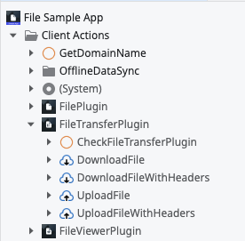
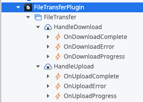
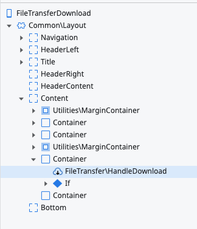
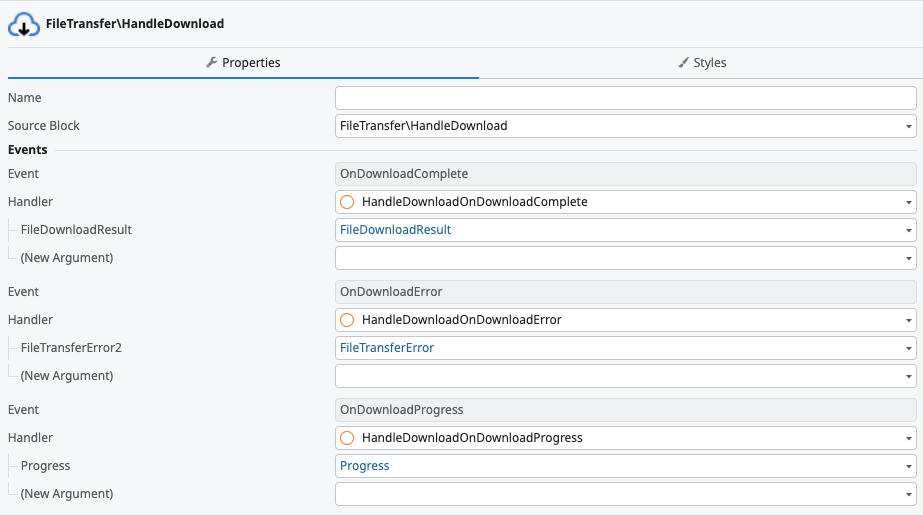

# File Transfer Plugin

<div class="info" markdown="1">

Applies to Mobile Apps and Reactive Web Apps only.

</div>

The File Transfer Plugin lets you download and upload files in your Mobile App or, in the case of a Progressive Web App (PWA), from your device. The plugin provides advanced file transfer that runs in the background, and, in the case of a Mobile App, continues even when the user closes or suspends the app.

The File Transfer Plugin shows progress updates for large transfers, such as videos, music, or images.

<div class="info" markdown="1">

See [Adding plugins](../intro.md#adding-plugins) to learn how to install and reference a plugin in your OutSystems apps, and how to install a demo app.

</div>

The plugin's behavior differs between Mobile Apps and PWAs. These differences are further explained in the next section.

## Using the File Transfer Plugin

To add the File Transfer Plugin to your app, follow these steps:

1. Install the **FileTransfer** Plugin and reference it in your app. For detailed instructions, refer to [Installing a plugin and adding a public element to your app](../intro.md#installing-a-plugin-and-adding-a-public-element-to-your-app).

1. Open ODC Studio.

1. Navigate to **Logic** > **Client Actions**, then select the File Transfer Plugin and use the actions in your logic.

    

It's also possible to know the progress, completion and error of your download/upload task. To subscribe and access these events, you need to use the plugin's **HandleDownload** and **HandleUpload** UI Blocks.

To add and use these UI blocks to your app, follow these steps:

1. Navigate to **Interface** > **Elements** > **UI Flows** and add the File Transfer blocks to the screen you wish to perform files downloads and uploads.
    
    If you wish to handle these events across the whole app, you can also add the UI Blocks to your **Interface** > **Elements** > **UI Flows** > **Common** > **Layout**.


    

    

1. Set the handlers for **OnDownloadComplete**, **OnDownloadError**, **OnDownloadProgress**, **OnUploadComplete**, **OnUploadError**, and on **OnUploadProgress** events.

    In these event handlers, you can define your own logic and what to do with the event data. For example, setting the progress on a **ProgressBar** widget for **OnUploadProgress** and **OnDownloadProgress** events.

    

## Progressive Web Apps vs Mobile Apps

In a Mobile App, the File Transfer Plugin uses the [File Plugin](../file-plugin/intro.md) to save and manage the downloaded files inside the app's sandboxed file system, as well as upload files from it. This means it's possible to choose where to save a downloaded file given a path, as well as upload a file from its path. As of now, the File Plugin is not PWA compatible and as so, it's not possible to access and manage a file system in a PWA or browser context.

In the following sections, it's explained how the PWA implementation of the File Transfer Plugin works around this limitation.

### Download

Instead of using a file system URL/path to save the downloaded file, in a PWA, the plugin triggers a download to the device's default saving folder. The file name is determined based on the following criteria:

1. The server sets the HTTP header `Content-Disposition` with the desired file name.
    ```
    Content-Disposition: attachment; filename="filename.jpg"
    ```

1. If `Content-Disposition` is not set, the optional input `FileName` on the **Download** and **DownloadWithHeaders** client actions is used.

1. If both are missing, use the app name as a default (for example, `FileSampleApp.txt`).

The file type is always decided based on the HTTP header `Content-Type`, set in the server response to the download request.

### Upload { #pwa-upload }

This plugin doesn't offer the upload features in a PWA context, since the [Upload Widget](../../../building-apps/ui/inputs/upload.md) offers the same capabilities.

## Demo app

Install [File Demo App](https://www.outsystems.com/forge/component-overview/10011/file-sample-app) from Forge and open the app in Service Studio. The demo app contains logic for common use cases, which you can examine and recreate in your apps.

## Reference

The File Transfer Plugin uses a Cordova plugin, and for more information refer to  [cordova-plugin-file-transfer](https://github.com/apache/cordova-plugin-file-transfer).

### Actions

Here is the reference for the actions you can use from the File Transfer Plugin, available in **Logic** > **Client Actions** > **FileTransferPlugin**.

Starting on version 3.0.0, all client actions were deprecated and replaced with new ones. Some input and output parameters also changed.

| Action                      | Description                                                 |
| --------------------------- | ----------------------------------------------------------- |
| **CheckFileTransferPlugin** | Checks if the device can upload and download files.         |
| **DownloadFile**            | Action to download files from the server.                   |
| **UploadFile**              | Action to upload files to the server.                       |

The following table contains the reference of the client actions that were deprecated in version 3.0.0.

| Action                                 | Description                                                 |
| -------------------------------------- | ----------------------------------------------------------- |
| **DEPRECATED_CheckFileTransferPlugin** | Checks if the device can upload and download files.         |
| **DEPRECATED_DownloadFile**            | Action to download files from the server.                   |
| **DEPRECATED_DownloadFileWithHeaders** | Action to download files from the server with HTTP headers. |
| **DEPRECATED_UploadFile**              | Action to upload files to the server.                       |
| **DEPRECATED_UploadFileWithHeaders**   | Action to upload files to the server with HTTP headers.     |

### Events

Here is the reference for the events you can use from the File Transfer Plugin, available in **UI Flows** > **FileTransferPlugin** > **FileTransfer**.

| Event                  | Block              | Description              |
| ---------------------- | ------------------ |------------------ |
| **OnDownloadComplete** | **HandleDownload** | Called when the download has completed, with a **FileDownloadResult** object. |
| **OnDownloadError**    | **HandleDownload** | Called when an error occurs. Invoked with a **FileTransferError** object. |
| **OnDownloadProgress** | **HandleDownload** | Called whenever a new chunk of data is downloaded, with a **Progress** object. |
| **OnUploadComplete**   | **HandleUpload**   | Called when the upload has completed, with a **FileUploadResult** object. |
| **OnUploadError**      | **HandleUpload**   | Called when an error occurs. Invoked with a **FileTransferError** object. |
| **OnUploadProgress**   | **HandleUpload**   | Called whenever a new chunk of data is uploaded, with a **Progress** object. | 

### Structures

#### Progress

|Parameter| Data Type | Description |
|:--------|:----------|:------------|
| Loaded | Integer | The size, in bytes, of the data that has been transferred. |
| Total | Integer | The total size, in bytes, of the data being transferred. |
| LengthComputable | Boolean | Indicates if the ratio between **Loaded** and **Total** is calculable. |

#### FileTransferError

|Parameter| Data Type | Description |
|:--------|:----------|:------------|
| Code | Text | One of the predefined error codes listed below. |
| Message | Text | One of the predefined error messages listed below. |
| Source | Text | The source's URL. |
| Target| Text | The target's URL. |
| HttpStatus | Text | HTTP status code. |
| Body | Text | The request's (download/upload) response's body. |
| Exception | Text | The message of the thrown exception. |

List of predefined error codes introduced in version 3.0.0:

* OS-PLUG-FLTR-0005 = `URL to connect to is either null or empty.` or `Invalid server URL was provided - <URL>`
* OS-PLUG-FLTR-0007 = `Operation failed because file does not exist.`
* OS-PLUG-FLTR-0008 = `Failed to connect to server.`
* OS-PLUG-FLTR-0009 = `The server responded with HTTP 304 – Not Modified. If you want to avoid this, check your headers related to HTTP caching.`
* OS-PLUG-FLTR-0010 = `HTTP error: <responseCode> - <message>`

List of predefined error codes for lower versions of the plugin:

* 1 = `FILE_NOT_FOUND_ERR`
* 2 = `INVALID_URL_ERR`
* 3 = `CONNECTION_ERR`
* 4 = `ABORT_ERR`
* 5 = `NOT_MODIFIED_ERR`

#### FileDownloadResult

|Parameter| Data Type | Description |
|:--------|:----------|:------------|
| isFile | Boolean | Returns **True** if the result is a file. |
| isDirectory | Boolean | Returns **True** if the result is a directory. |
| name| Text | Name of the stored file. |
| fullPath | Text | Path to the stored file. |
| **(Removed in version 3.0.0)** filesystems | Text | Device-absolute-file-paths for the downloaded data. The goal of this parameter was to maintain backwards compatibility for older versions of the plugin. Fore more information check [here](https://github.com/OutSystems/cordova-plugin-file-transfer?tab=readme-ov-file#backwards-compatibility-notes). |
| nativeURL | Text | Native URL path to the stored file. |

#### FileUploadResult

|Parameter| Data Type | Description |
|:--------|:----------|:------------|
| bytesSent | Long Integer | Number of bytes sent in the uploaded file. |
| responseCode | Text | Response code from the server. |
| response | Text | Response received from the server. |
| headers | Text | HTTP headers used in the upload. |

### Errors

Starting with version 3.0.0 of the plugin, specific errors are returned on native platforms and PWAs.

| Error code        | Platform(s)       | Message                                                                                                                   |
| ------------------| ----------------- | ------------------------------------------------------------------------------------------------------------------------- |
| OS-PLUG-FLTR-0001 | Android, iOS, PWA | Cordova isn't defined.                                                                                                    |
| OS-PLUG-FLTR-0002 | Android, iOS      | The app is running with an old version of the plugin. Please create a new mobile package.                                 |
| OS-PLUG-FLTR-0003 | Android, iOS      | The File Transfer plugin is not loaded. Make sure the mobile package is valid.                                            |
| OS-PLUG-FLTR-0004 | Android, iOS      | The method's input parameters aren't valid.                                                                               |
| OS-PLUG-FLTR-0005 | Android, iOS, PWA | Invalid server URL was provided - &lt;URL&gt; or URL to connect to is either null or empty.                                     |
| OS-PLUG-FLTR-0006 | Android           | Unable to perform operation, user denied permission request.                                                              |
| OS-PLUG-FLTR-0007 | Android, iOS      | Operation failed because file does not exist.                                                                             |
| OS-PLUG-FLTR-0008 | Android, iOS, PWA | Failed to connect to server.                                                                                              |
| OS-PLUG-FLTR-0009 | Android, iOS      | The server responded with HTTP 304 – Not Modified. If you want to avoid this, check your headers related to HTTP caching. |
| OS-PLUG-FLTR-0010 | Android, iOS, PWA | HTTP error: &lt;responseCode&gt; - &lt;message&gt;                                                                                    |
| OS-PLUG-FLTR-0011 | Android, iOS      | The operation failed with an error - &lt;detailedError&gt;                                                                      |

## Known issues and limitations

### Multiple downloads
**Applies to PWAs.**

Avoid downloading multiple files simultaneously, as it may result in unexpected behaviors.
