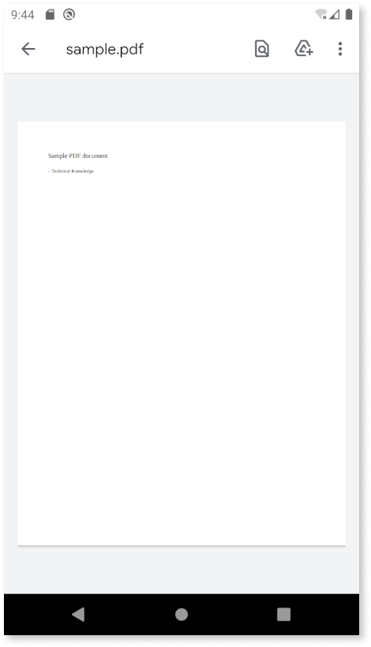
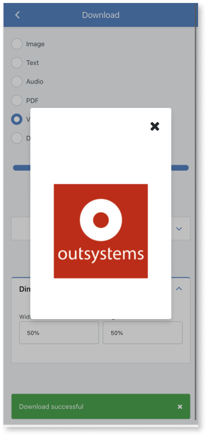
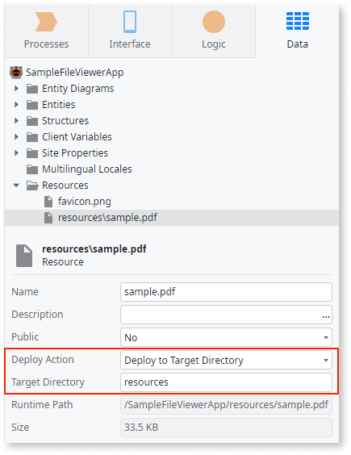
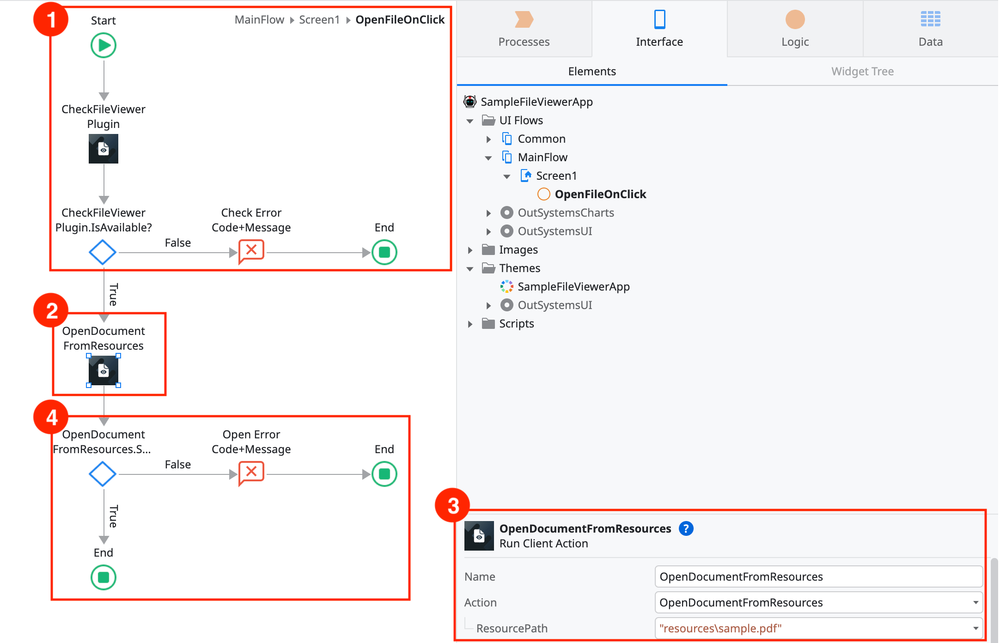

# File Viewer Plugin

Applies only to Mobile Apps.

Use the File Viewer plugin to create logic that lets users open remote or app resource files. In the case of a Progressive Web App (PWA), it allows users to open and view files from their device via a file picker. On Android, users select an app to open the file. iOS provides a native preview for supported file types.

See [Adding plugins](../intro.md#adding-plugins) to learn how to install and reference a plugin in your OutSystems apps, and how to install a demo app.

File Viewer plugin can open:

* **File from the app resources**. The plugin can access the **resources** path to load the file that's part of the app's static content. See [Working with app resources](#working-with-app-resources)
* **Remote file**. The plugin downloads the file to the app sandbox and then opens the file.

## Progressive Web Apps (PWA)

For now, it's impossible to access and manage a file system in a PWA or browser context. This means that using this plugin in a PWA only lets you open files via the device's file picker. You can show them in an OutSystems dialog. Your application needs to manage these limitations as necessary. The File Viewer plugin sample app has an example of this.

When using the device's file picker to open PDF files, the File Viewer plugin uses [Mozilla's PDFjs Javascript library](https://github.com/mozilla/pdf.js), more specifically, the `getDocument` function passing it the file's `objectURL`.

This function uses Regex to validate the name/url passed to it and **this value is not sanitized by plugin**. As such, when using the plugin the application developer should not allow users to open random PDFs directly from the internet in their application.

## Viewing files in Android and iOS

To let users view files in the mobile apps, create logic with one of these three client actions:

1. **OpenDocumentFromLocalPath** - Provide a local file path in the **FilePath** argument.
1. **OpenDocumentFromResources** - If you want to open a file from the app resources see [Working with app resources](#working-with-app-resources).
1. **OpenDocumentFromUrl** - Provide the url poiting to a remote file in the **URL** argument.

For an example of how to use the plugin check the demo app or refer to [the example in this document](#example-of-using-file-viewer-plugin).

For opening media files in the iOS apps, use of the following three actions: **PreviewMediaContentFromLocalPath**, **PreviewMediaContentFromResources**, or **PreviewMediaContentFromUrl**.

These actions let apps handle the media files better by opening them in a media player.

## Working with app resources

Here is how to add a file as a resource and open the file with the plugin.

1. In Service Studio, go to the **Data** tab.

1. Right-click the **Resources** folder and select **Import resources**. A file dialog opens, where you can select the file you want to add as a resource.

1. Select the file you added under **Resources**, and:

    * Enter `resources` in the **Target Directory** property. Note that this value must be `resources` and you can't change it.
    * Select **Deploy to Target Directory** in the **Deploy Action** list.

    

1. In the **OpenDocumentFromResources** action enter `"resources\<file name>"` in the **ResourcePath** property. For example, if you add **sample.pdf** to **Resources**, the value of  **FilePath** is `"resources\sample.pdf"`.

The plugin can access only the resources you deploy in the **resources** path. This is a security limitation by design. Limiting access to the plugin prevents accidental access to the resources of the app.

## Example of using File Viewer plugin

Here is an example of how to use the File Viewer plugin.

A good practice is to check if the plugin is available to the app, and report an error if not. You can check the plugin availability by using the **CheckFileViewerPlugin** action and checking the value of the **CheckFileViewerPlugin.IsAvailable** boolean (1).

When you confirm the plugin is available, use the **OpenDocumentFrom(X)** (2) action to ask the operating system to view the file, where **(X)** can be one of the three kinds of file sources the plugin can read. The example uses a [resource file](#working-with-app-resources) (3).

Finally, to confirm that the file has been opened successfully, check the **OpenDocumentFromResources.Success** boolean (4). If it is false, you may get the **OpenDocumentFromResources.Error** structure for more information. Check the [errors section](#errors) for the types of errors the plugin can return.

## Reference

More information about parts of the plugin.

### Actions

Here is the reference of the actions you can use from the File Viewer plugin. The File Viewer plugin uses a Cordova plugin, and for more information check out [cordova-outsystems-file-viewer](https://github.com/ionic-team/cordova-outsystems-file-viewer).

| Action                               | Description                                                                                  |
| ------------------------------------ | -------------------------------------------------------------------------------------------- |
| **CheckFileViewerPlugin**            | Checks if the plugin is loaded.                                                              |
| **OpenDocumentFromLocalPath**        | Opens a file stored in the local filesystem. For PWA, a file picker is opened.               |
| **OpenDocumentFromResources**        | Opens a file from the application resources.                                                 |
| **OpenDocumentFromUrl**              | Opens a file from a remote URL.                                                              |
| **PreviewMediaContentFromLocalPath** | iOS only. Opens media files in the device's local filesystem, using a built-in media player. |
| **PreviewMediaContentFromResources** | iOS only. Opens media files from the application resources, using a built-in media player.   |
| **PreviewMediaContentFromUrl**       | iOS only. Opens media files from a URL, using a built-in media player.                       |

#### Deprecated Client Actions

The following client actions are still offered, but have been deprecated since version 3.0.0 of the plugin, in favor of the actions referenced above.

| Action                  | Description                                                                          | Deprecated Reason                                                                       |
| ----------------------- | ------------------------------------------------------------------------------------ | --------------------------------------------------------------------------------------- |
| **CheckPlugin**         | Checks if the plugin is available in the app.                                        | Use **CheckFileViewerPlugin** instead.                                                  |
| **OpenDocument**        | Opens a remote file or a [file from the app resources](#working-with-app-resources). | Use **OpenDocumentFrom(X)** where (X) can be `LocalPath`, `Resources`, or `Url`.        |
| **PreviewMediaContent** | iOS only. Action to preview media content.                                           | Use **PreviewMediaContentFrom(X)** where (X) can be `LocalPath`, `Resources`, or `Url`. |

### Errors

Since version 3.0.0 of the Plugin, specific errors are returned on native platforms.

| Error code        | Platform(s)      | Message                                                                                   |
| ------------------| ---------------- | ----------------------------------------------------------------------------------------- |
| OS-PLUG-FLVW-0001 | Android, iOS     | Cordova isn't defined.                                                                    |
| OS-PLUG-FLVW-0002 | Android, iOS     | The app is running with an old version of the plugin. Please create a new mobile package. |
| OS-PLUG-FLVW-0003 | Android, iOS     | File Viewer Plugin is not loaded.                                                         |
| OS-PLUG-FLVW-0004 | Android, iOS     | The file you are trying to open does not exist.                                           |
| OS-PLUG-FLVW-0005 | Android, iOS     | The URL you are trying to open is malformed.                                              |
| OS-PLUG-FLVW-0006 | Android, iOS     | Path of the file to open is either null or empty.                                         |
| OS-PLUG-FLVW-0007 | Android, iOS     | URL to open is either null or empty.                                                      |
| OS-PLUG-FLVW-0008 | Android, iOS     | Could not open the file.                                                                  |
| OS-PLUG-FLVW-0009 | Android, iOS     | Invalid parameters.                                                                       |
| OS-PLUG-FLVW-0010 | Android          | There is no app to open this file.                                                        |
| OS-PLUG-FLVW-0011 | iOS              | Cordova bridge isn’t initialized.                                                         |
| OS-PLUG-FLVW-0012 | iOS              | The download failed.                                                                      |
| OS-PLUG-FLVW-0013 | iOS              | The file has no extension.                                                                |
