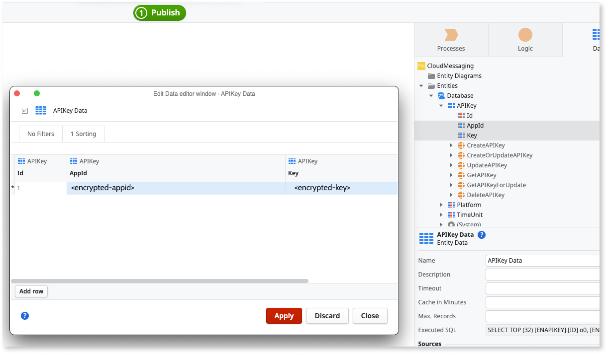
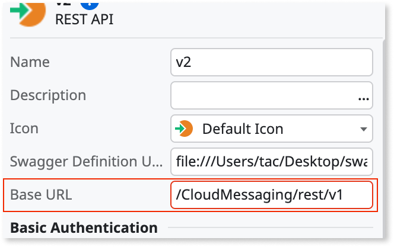
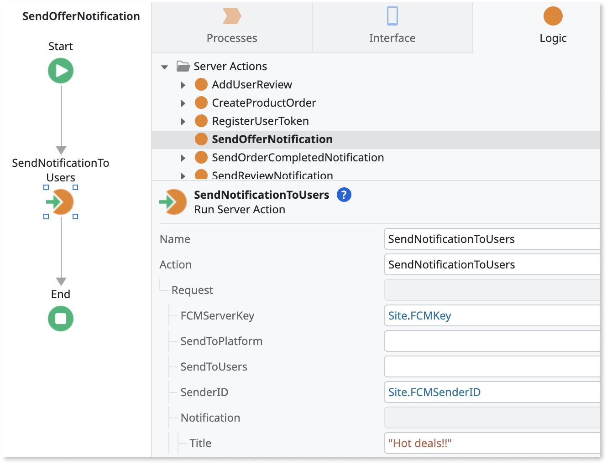

# Firebase Cloud Messaging plugin using configurator APIs

<div class="info" markdown="1">

This article applies only to Firebase Cloud Message plugin version 3.0.1 and older. These old versions use Cloud Messaging Configurator REST APIs to manage the notifications. 

The Cloud Messaging Configurator REST APIs, version 3.0.1 and older, are deprecated. This means that the **v2** and **v1** endpoints are no longer functional. For more information, see [Firebase Cloud Messaging HTTP protocol](https://firebase.google.com/docs/cloud-messaging/http-server-ref). 

OutSystems recommends that you migrate to [Firebase Cloud Messaging plugin](firebase-messaging.md) version 4.0.0  and newer by June 2024.  

</div>

The [Firebase Cloud Messaging plugin](https://www.outsystems.com/forge/component-overview/12174/cloud-messaging-plugin-firebase) lets you set a notification experience that starts the Firebase cross-platform messaging solution. This plugin lets you send normal and silent notifications to your mobile app users. Normal notifications can include customizable actions and sounds.

Normal notifications have a UI that displays visual and auditory cues. The cues either display in the notifications area of the app or in the scope of the app. Silent notifications don't display any visual cues. Notifications can deliver a data package to the app (called extra data) in the form of a key-value pairs list.

OutSystems also has notification features you can use to create custom actions and custom sounds.

Following is a high-level process describing how to implement and manage the notifications of your OutSystems app.

1. Use the **Cloud Messaging Configurator** app to consume REST API methods that let you set up a back-end notification service.

1. Use the **Firebase Cloud Messaging** plugin actions to implement basic notifications functions on your app.

    <div class="info" markdown="1">

    You can download the [Cloud Messaging Configurator](https://www.outsystems.com/forge/component-overview/13300) app compatible with O11 from [Forge](https://www.outsystems.com/forge/).

    </div>

1. To prevent the app from crashing, verify the plugin is available during runtime in your app. To check the availability of your plugin, from ODC Studio use the **Logic** > **Client Actions** > **CloudMessagingPlugin** > **CheckCloudMessagingPlugin** action. If the plugin isn't available to your app, display an error to your end-users.

<div class="info" markdown="1">

To learn how to install and reference a plugin in your OutSystems apps, and how to install a sample app, see [Adding plugins](../intro.md#adding-plugins).
To use this plugin, verify your app meets all the [Firebase prerequisites](https://success.outsystems.com/documentation/11/extensibility_and_integration/mobile_plugins/firebase_plugins/#prerequisites).

</div>

## Sample app

OutSystems provides a sample app that contains logic for common use cases. Install the Firebase sample app from [Forge](https://www.outsystems.com/forge/) and then open it in Service Studio.

This sample app shows you how to do the following:

* Register a device for push notifications and retrieve its token from Firebase.

* Trigger a basic notification, leading to internal routes.

* Trigger a notification with custom actions that lead to internal routes.

* Trigger a notification with custom actions that lead to a given URL in the device’s browser.

* Trigger a notification with custom actions that lead to an external app.

* Trigger a notification with custom actions that open a text field.

* Trigger a notification with a custom sound.

## Compose and Manage push notifications

The following steps show how to create a back-end notification service and how to prepare a mobile app to deal with push notifications:

1. [Set up a back-end notification service using the send Notifications REST API methods](#set-back-end).

1. [Enable basic notification functions in your app using the plugin's actions](#enable-notifications).

1. [Enable notifications with custom actions](#custom-actions).

1. [Enable notifications with custom sounds](#custom-sounds).

1. [Manage the experience of in-app notifications using the Notifications block](#notification-ux).

1. [Manage the experience of custom actions using the Notifications block](#custom-actions-ux).

## Set up a back-end notification service { #set-back-end }

To set up a back-end notification service, do the following:

1. Install the [Cloud Messaging Configurator](https://www.outsystems.com/forge/component-overview/13300) forge component in your environment. This component includes the REST API methods necessary to send notifications to a list of users or topics.

1. Open **Cloud Messaging Configurator**.

1. In the **APIKey** entity, set **AppId** and **Key** using encrypted values. These values are used to authenticate your REST API, so make sure you keep the encrypted values secure.

    

1. Create a new app to serve as your back-end notification. This app can be a Reactive Web or Mobile.

1. In the new back-end app, create a module.

1. In the newly created module, consume the **Cloud Messaging Configurator** REST API methods. For more details on how to consume a REST API, see [Consume one or more REST API methods](../../rest/consume-rest-apis/consume-a-rest-api.md).

    After importing the REST API methods you may get an invalid URL error. If you get an error, then in the consumed REST API properties, change the **Base URL** to include your stage address, setting it as `https://<your-environment>/CloudMessagingConfigurator/rest/v1`. Replace `<your-environment>` with your environment address and `<rest-api-version>` with the version you want to use.

    

    <div class="info" markdown="1">

    OutSystems offers two versions for Cloud Messaging Configurator REST APIs based on the features you want to use. See the [reference page](firebase-cloud-api-v1-v2.md) to learn more about the versions.

    </div>

1. Then use the AppId and Key you defined in step 3 to authenticate your REST calls. In the consumed REST API properties, add the following **HTTP headers**:

    * `X-Send-AppId` = `<your-appid>`, replacing `<your-appid>` with the **AppId** defined in step 3.

    * `X-Send-Key` = `<your-key>`, replacing `<your-key>` with the **Key** defined in step 3.

Now you can start to create the UI for your back-end notification service. For example, to send a notification to all users on the associated Firebase project (using an app with the Cloud Messaging plugin), associate a **SendNotifcationToUsers** method to a button.



To access values for the parameters **FCMServerKey** and **SenderID**, in the ODC Studio, navigate to **Project Settings** > **Cloud Messaging** > Firebase Console.


Other available methods include **SendNotificationToTopics**, **SendSilentNotificationToUsers**, and **SendSilentNotificationToTopics**.

## Enable basic notification functions in your app { #enable-notifications }

This section describes some of the actions that you can use to leverage notification functions on your mobile app.

On first use you might want to send to receive notifications to your app user. For that you can use the **RegisterDevice** action on initialization of your app. On first use, this action displays a native request permission dialog and upon user acceptance, the device is registered on the Firebase Cloud Messaging service and is ready to receive notifications. On future verifications you can always use the **CheckPermission** action to verify if the app has permission to receive notifications.

Alternatively you can provide an explicit way to register and unregister the device from the Firebase cloud Messaging service using the **RegisterDevice** / **UnregisterDevice** actions. Then associate the actions to a UI element such as a toggle.


After registering the device on the Firebase Cloud Messaging service, the active device's token becomes available and can be retrieved using the action **GetToken**.

To manage topic subscriptions you can use the **Subscribe / Unsubscribe** actions. The user will need to set the topic name to which the app will subscribe (or unsubscribe). If the topic doesn't exist yet on the Firebase Cloud Messaging project, it creates a new one.


To retrieve all pending silent notifications you can use the **GetPendingNotification** action. This action will output a silent notifications list with Timestamp, MessageID, TimeToLive, and an ExtraData list of key-value pairs. Silent notifications are notifications that have no UI representation in the form of a visual or auditory stimulus in the app. Despite being silent, these notifications can deliver a data package to the app (called extra data), in the form of a list of key-value pairs.

<div class="info" markdown="1">

Note that when receiving a silent notification without extra data, and your app is on the background, the notification is not saved in the database, i.e., it won’t be returned in the **GetPendingNotifications** action.

</div>

As part of the notification experience, the developer might want to control the badge number which is a value that appears on the top-right corner of the app icon. The way you control the badge number differs from operative system:

* For iOS you can use the **GetBadgeNumber** action to retrieve the current badge number and the **SetBadgeNumber** to specify a given number to be shown on the app icon badge.

* For Android you can only specify a given badge number after receiving a notification. Thus, you can use the **SendLocalNotification** action and set the badge number through the action parameter *BadgeNumber*.


Finally, you might want to give the opportunity to your user to clear all app's notifications remaining in the notification center. For this you can associate the **ClearNotifications** action to a piece of UI such as a button.


## Enable notifications with custom actions { #custom-actions }

To enhance your notification with custom actions you must use the **v2 REST API**, using the **ActionList** parameter inside the Notification parameter on the **SendNotificationToTopics** or **SendNotificationToUsers** REST API methods.

<div class="info" markdown="1">

OutSystems offers two versions for Cloud Messaging Configurator REST APIs based on the features you want to use. See the [reference page](firebase-cloud-api-v1-v2.md) to learn more about the versions.

</div>

We have 3 types of custom actions:

1. **Internal route** - Sends an event to be handled by the app, similar to a basic notification click.
* For this you must check the Manage the experience of custom actions. 

2. **Web route** - Opens a given URL in the device’s browser.

3. **App route** - Opens a route in an external app.

4. **Reply field** - Opens a text field that allows the user to send a text directly to the app.

## Enable notifications with custom sound { #custom-sounds }

To enhance your notification with custom sounds, you must put the .wav files you want to use as notification sounds into a .zip file called **sounds.zip**. Then, upload the .zip file to the app’s Resources folder. Additionally, you must use the **v2 REST API**, using the *Sound* parameter inside the *Notification* parameter on the **SendNotificationToTopics** or **SendNotificationToUsers** methods.

It is important to note the following requirements for custom sounds:

* Only .wav files are supported.

* There are some limitations to the name of the sound file (.wav) to include in the Resources folder: it can only contain lowercase letters, numbers, and underscores. If it has a character that doesn’t match this rule else, the Android build won’t work.

* The **sounds.zip** file should be included with the “Deploy Action” set to “Deploy to Target Directory”.

<div class="info" markdown="1">

* Check [our documentation](../../../building-apps/data/resources.md) to learn more about how to use resources.

* OutSystems offers two versions for Cloud Messaging Configurator REST APIs based on the features you want to use. See the [reference page](firebase-cloud-api-v1-v2.md) to learn more about the versions.

</div>

## Manage the experience of in-app notifications { #notification-ux }

A Cloud Messaging notification is by default presented in the notification center, however the developer might want to handle the notification content in-app when the app is on foreground. To enable this you can use the **NotificationsHandler** block. This block triggers events that pass the parameters of both notifications and silent notifications to the context of the app.

You need to add this block to each screen that might handle the notification content.

## Manage the experience of custom actions using the Notifications block. { #custom-actions-ux }

A Cloud Messaging notification is by default presented in the notification center, however the developer might want to handle the notification content in-app when the app is on foreground. To enable this you can use the **NotificationsHandler** block, using **InternalRouteActionClicked** for custom actions. This block triggers events that pass the parameters of both notifications and silent notifications to the context of the app.

You need to add this block to each screen that might handle the notification content.

## Optional setup for notification Channel Name and Description - Android only

By default the Cloud Messaging plugin defines values for the notification channel name and description on local notifications. But in some instances the developer might want to define a different default value. You can do this by adding the following properties on the extensibility configurations of your app:

```JSON
{
    "preferences": {
        "android": [
            {
                "name": "NotificationChannelDefaultName",
                "value": "This is my channel Name"
            },
            {
                "name": "NotificationChannelDefaultDescription",
                "value": "This is my channel Description"
            }
        ],
    }
}
```

## Limitations

### On Silent Notifications

For iOS.

With a device in low battery state, the silent notification will not be processed by the app.

For more information see: Apple documentation

### On Subscribe to Topic

For both iOS and Android.

Firebase SDKs for Android and iOS do not support subscribing to topics for which the name contains spaces, like `TV Shows`.

## On Compatibility with Firebase Performance

For both iOS and Android.

Using the Firebase Cloud Messaging in combination with Firebase Performance requires v1.0.4 (or higher) of the latter.
