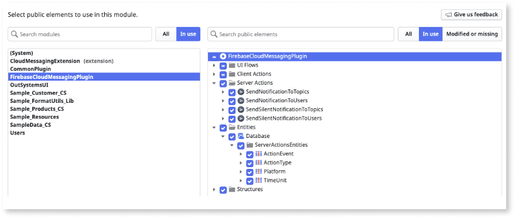
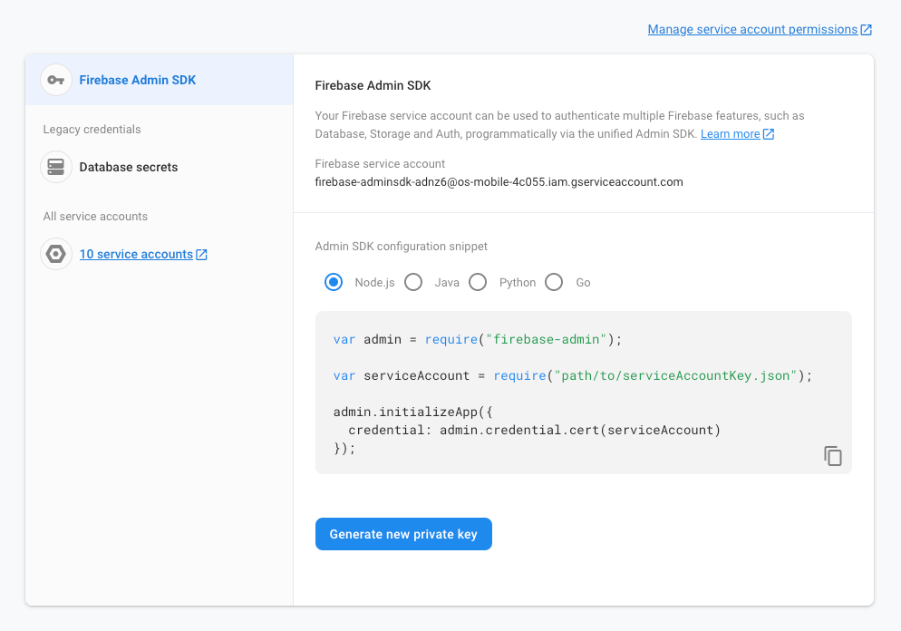
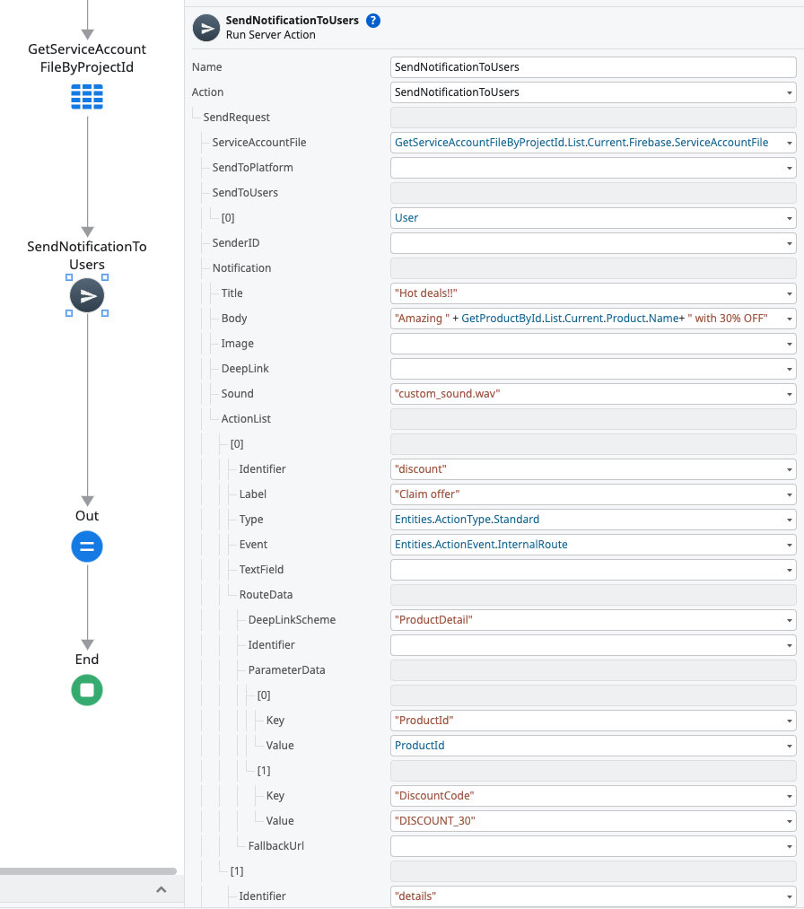
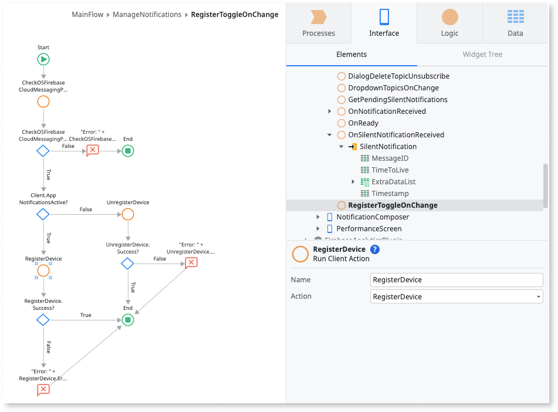
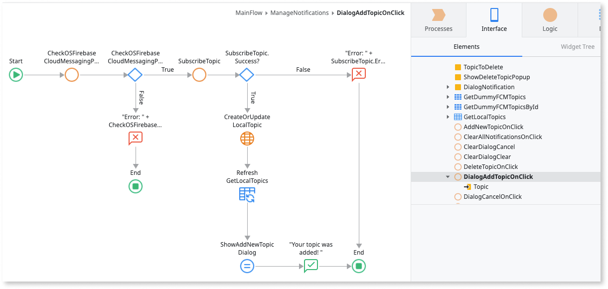
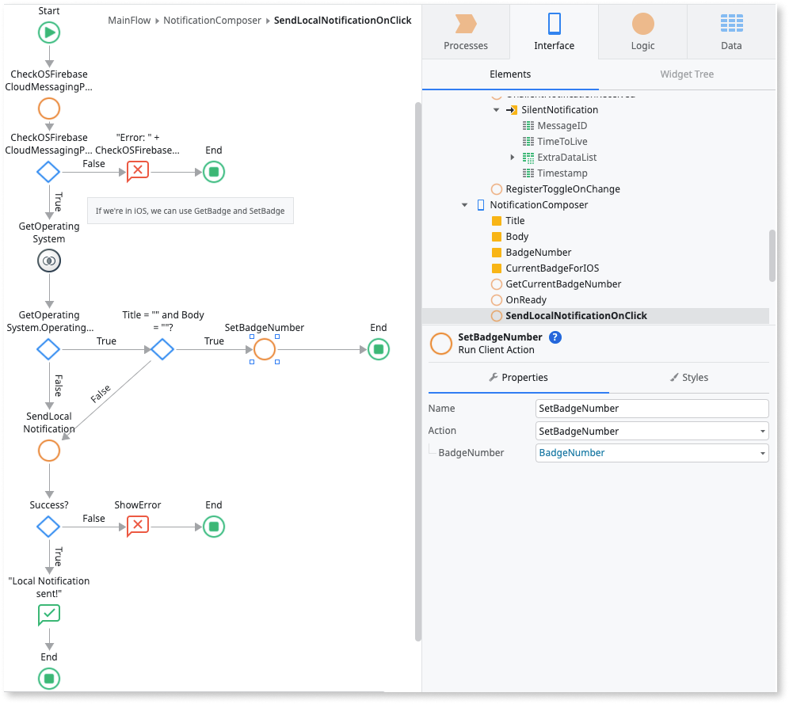
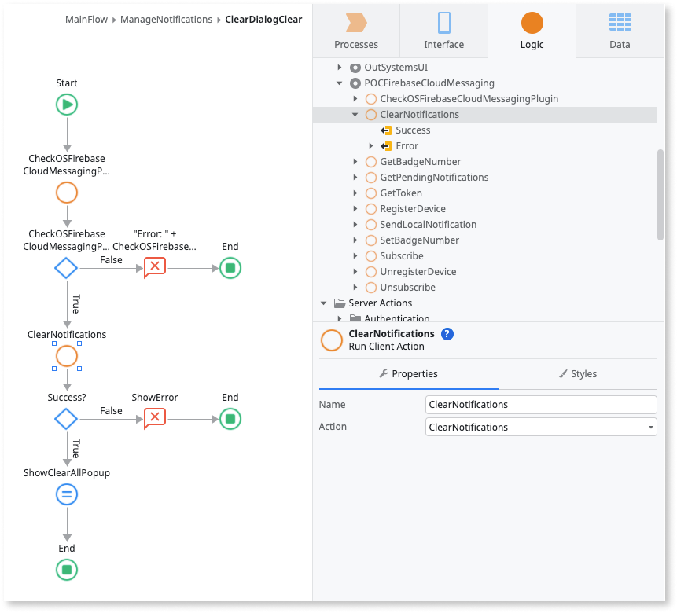
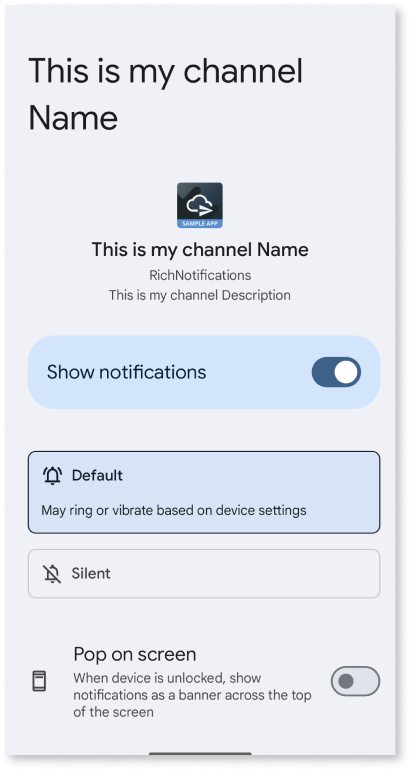

# Firebase Cloud Messaging Plugin using server actions


<div class="info" markdown="1">

This article applies only to Firebase Cloud Message plugin version 4.0.0 and newer. The newer versions use [server actions](#server-actions-reference) to manage the notifications.

If you are still using Firebase Cloud Message plugin version 3.0.1 and older, OutSystems recommends that you migrate to version 4.0.0 and newer by June 2024.
 
</div>

The [Firebase Cloud Messaging plugin](https://www.outsystems.com/forge/component-overview/12174/cloud-messaging-plugin-firebase) lets you set a notification experience that starts the Firebase cross-platform messaging solution. This plugin lets you send normal and silent notifications to your mobile app users. Normal notifications can include customizable actions and sounds.

Normal notifications have a UI that displays visual and auditory cues. The cues either display in the app's notifications area or in the app's scope. Silent notifications don't display any visual cues. Notifications can deliver a data package to the app (called extra data) in the form of a key-value pairs list.

OutSystems also has notification features you can use to create custom actions and custom sounds.

The following is a high-level process describing how to implement and manage the notifications of your OutSystems app.

1. Use the **Firebase Cloud Messaging Plugin’s Server Actions** to set up a back-end notification service.

1. Use the **Firebase Cloud Messaging Plugin's Client Actions** to implement basic notification functions in your app.

1. To prevent app runtime errors, verify if the plugin is available during runtime in your app. To check the availability of your plugin, from Service Studio, go to **Logic** > **Client Actions** > **CloudMessagingPlugin** > **CheckCloudMessagingPlugin** action. If the plugin isn't available in your app, display an error to your end-users.

<div class="info" markdown="1">

To learn how to install and reference a plugin in your OutSystems apps, and how to install a sample app, see [Adding plugins](../intro.md#adding-plugins).
To use this plugin, verify your app meets all the [Firebase prerequisites](https://success.outsystems.com/documentation/11/extensibility_and_integration/mobile_plugins/firebase_plugins/#prerequisites).

</div>

## Sample app

OutSystems provides a sample app that contains logic for common use cases. Install the Firebase sample app from [Forge](https://www.outsystems.com/forge/) and then open it in Service Studio.

This sample app shows you how to do the following:

* Register a device for push notifications and retrieve its token from Firebase.

* Trigger a basic notification, leading to internal routes.

* Trigger a notification with custom actions that lead to internal routes.

* Trigger a notification with custom actions that lead to a given URL in the device’s browser.

* Trigger a notification with custom actions that lead to an external app.

* Trigger a notification with custom actions that open a text field.

* Trigger a notification with a custom sound.

## Compose and Manage push notifications

The following steps show how to create a back-end notification service and how to prepare a mobile app to deal with push notifications:

1. [Set up a back-end notification service using the send Notifications through Server Actions](#set-back-end).

1. [Enable basic notification functions in your app using the plugin's actions](#enable-notifications).

1. [Enable notifications with custom actions](#custom-actions).

1. [Enable notifications with custom sounds](#custom-sounds).

1. [Manage the experience of in-app notifications using the Notifications block](#notification-ux).

1. [Manage the experience of custom actions using the Notifications block](#custom-actions-ux).

## Set up a back-end notification service { #set-back-end }


To set up a back-end notification service, follow these steps:

1. Install the [Firebase Cloud Messaging Plugin](https://www.outsystems.com/forge/component-overview/12174/cloud-messaging-plugin-firebase) forge component in your environment.

    This component includes four **Server Actions** that allow you to send notifications to a list of users or topics.

1. Create a new app to serve as your backend notification service.

   This app can be a Reactive Web or Mobile app.

1. In the new back-end app, create a module.

1. In the newly created module, consume the **Firebase Cloud Messaging Plugin** and add the Server Actions, along with its associated Static Entities.

    

1. Create the logic to store and access your Firebase Service Account File in the app you just created.

    1. To access your Firebase Service Account File, go to **Firebase Console** > **Settings** > **Service Accounts** > **Generate new private key**.

    1. For extra security, encrypt and store this file as such, keeping the encryption key secure.

       

        **Note**: In addition to encrypting the Firebase Service Account File, the binary data associated with the Firebase Service Account File is required to use the Plugin’s Server Actions for notification triggering. This means that there should be a simple way to fetch this information in the app. One way to achieve this is to associate it with the Firebase Project Identifier by, for example, keeping this mapping stored in a database table.

Now you can start to create the UI for your back-end notification service. For example, to send a notification to a user on the associated Firebase project (using an app with the Cloud Messaging plugin), associate the **SendNotificationToUsers** Server Action to a button and add logic to retrieve your Service Account file. 

If you want to send the notification to specific users, note that these are identified by their Firebase Token, that can be obtained with the **GetToken** client action. You can find this ID on the Firebase Project Settings under the Cloud Messaging tab. 

To send a notification to all users, or to all Android or iOS users, you need to fill the **SenderID** structure attribute of the **SendRequest** parameter. You can find this ID on the Firebase Project Settings under the Cloud Messaging tab. 

Moreover, to send a notification specifically to all Android or iOS users, you should set the **SendToPlatform** structure attribute to one of the values in the **Platform** static entity that the plugin provides.



Other available methods include **SendNotificationToTopics**, **SendSilentNotificationToUsers**, and **SendSilentNotificationToTopics**. 

For silent notifications (**SendSilentNotificationToUsers** and **SendSilentNotificationToTopics**), the **TimeToLive** structure attribute sets the notifications' expiration time. More specifically, if the **TimeValue** for a specific **TimeUnit** is greater than 0, the message will persist in the local storage and be delivered at the first opportunity, until the expiration time has passed.

For topic notifications (**SendNotificationToTopics**, **SendSilentNotificationToTopics**), set the topics for which a notification will be delivered to in the **SendToTopics** structure attribute.

## Enable basic notification functions in your app { #enable-notifications }

This section describes some of the actions that you can use to leverage notification functions on your mobile app.

On first use, you might want to register your users to receive notifications. For that, you can use the **RegisterDevice** action when your app opens. For example, if the user isn’t already registered, you can call the **RegisterDevice** action on the **OnReady** event of the app’s home screen. On first use, this action displays a native permission request and, upon user acceptance, the device is registered on the Firebase Cloud Messaging service, ready to receive notifications.

Alternatively, you can provide an explicit way to register and unregister the device from the Firebase Cloud Messaging service using the **RegisterDevice** / **UnregisterDevice** actions. Then associate the actions to a UI element such as a toggle.

To prevent errors, it's a good practice to first check if the plugin is available using the **CheckCloudMessagingPlugin** action.



After registering the device on the Firebase Cloud Messaging service, the active device's token becomes available and can be retrieved using the action **GetToken**. For iOS devices, the Apple Push Notification service token can also be retrieved, using the **GetAPNsToken** action.

To manage topic subscriptions, you can use the **Subscribe / Unsubscribe** actions. The user will need to set the topic name to which the app will subscribe (or unsubscribe). If the topic doesn't exist yet on the Firebase Cloud Messaging project, it creates a new one.



To retrieve all pending silent notifications, you can use the **GetPendingNotification** action. This action outputs a silent notifications list with Timestamp, MessageID, TimeToLive, and an ExtraData list of key-value pairs. Silent notifications are notifications that have no UI representation in the form of a visual or auditory stimulus in the app. Despite being silent, these notifications can deliver a data package to the app (called extra data), in the form of a list of key-value pairs.

<div class="info" markdown="1">

Note that when receiving a silent notification without extra data and your app is in the background, the notification is not saved in the database, that is, it won’t be returned in the **GetPendingNotifications** action.

</div>

As part of the notification experience, the developer might want to control the badge number which is a value that appears on the top-right corner of the app icon. The way you control the badge number differs from operative system:

* For iOS you can use the **GetBadgeNumber** action to retrieve the current badge number and the **SetBadgeNumber** to specify a given number to be shown on the app icon badge.

* For Android you can only specify a given badge number after receiving a notification. Thus, you can use the **SendLocalNotification** action and set the badge number through the action parameter *BadgeNumber*.

<div class="info" markdown="1">

Starting on Android 14, most devices do not show the badge number when long-pressing the app's icon.

</div>



Finally, you might want to give the opportunity to your user to clear all the app's notifications remaining in the notification center. For this, you can associate the **ClearNotifications** action to a piece of UI, such as a button.



## Enable notifications with custom actions { #custom-actions }

To enhance your notification with custom actions you must use the **Plugin's Server Actions**, using the **ActionList** parameter inside the Notification parameter on the **SendNotificationToTopics** or **SendNotificationToUsers** methods.

We have 3 types of custom actions:

1. **Internal route** - Sends an event to be handled by the app, similar to a basic notification click.
* For this you must check the Manage the experience of custom actions. 

2. **Web route** - Opens a given URL in the device’s browser.

3. **App route** - Opens a route in an external app.

4. **Reply field** - Opens a text field that allows the user to send a text directly to the app.

## Enable notifications with custom sound { #custom-sounds }

To enhance your notification with custom sounds, you must put the .wav files you want to use as notification sounds into a .zip file called **sounds.zip**. Then, upload the .zip file to the app’s Resources folder. Additionally, you must use the **Plugin's Server Actions**, using the **Sound** parameter inside the **Notification** parameter on the **SendNotificationToTopics** or **SendNotificationToUsers** methods.

It is important to note the following requirements for custom sounds:

* Only .wav files are supported.

* There are some limitations to the name of the sound file (.wav) to include in the Resources folder: it can only contain lowercase letters, numbers, and underscores. If it has a character that doesn’t match this rule else, the Android build won’t work.

* The **sounds.zip** file should be included with the “Deploy Action” set to “Deploy to Target Directory”.

<div class="info" markdown="1">

* Check [our documentation](https://success.outsystems.com/documentation/11/developing_an_application/use_data/use_resources/) to learn more about how to use resources.

</div>

## Manage the experience of in-app notifications { #notification-ux }

A Cloud Messaging notification is by default presented in the notification center, however the developer might want to handle the notification content in-app when the app is on foreground. To enable this you can use the **NotificationsHandler** block. This block triggers events that pass the parameters of both notifications and silent notifications to the context of the app.

You need to add this block to each screen that might handle the notification content.

Optionally, you can use the **NotificationDialog** block, which provides a notification dialog UI inside the app.

## Manage the experience of custom actions using the Notifications block. { #custom-actions-ux }

A Cloud Messaging notification is by default presented in the notification center, however the developer might want to handle the notification content in-app when the app is on foreground. To enable this you can use the **NotificationsHandler** block, using **InternalRouteActionClicked** for custom actions. This block triggers events that pass the parameters of both notifications and silent notifications to the context of the app.

You need to add this block to each screen that might handle the notification content.

## Manage the experience of notification clicks

When the end-user clicks on a notification in the notification center, the app opens by default. If you want your app to handle the notification click, you can use the **NotificationsHandler** block and define a handler for the **NotificationClicked** event.

If you want to navigate to a screen inside your app when the end-user clicks on a notification, you can use the **BuildInternalDeepLink** client action from the plugin. You should pass the name of the destination screen to the **Notification > DeepLink** attribute of the **SendRequest** parameter of the server action you called to deliver the notification (**SendNotificationToUsers** or **SendNotificationToTopics**). If you want the **BuildInternalDeepLink** action to build a deep link with query parameters, you should set the **key-value** pairs using the **ExtraDataList** attribute. 

Our Sample App has this scenario implemented. If you want your app to do something else when the end-user clicks on a notification, simply implement your logic in the handler you create for the **NotificationClicked** event.


<div class="warning" markdown="1">

When sending a notification with a deep link, you should avoid using the following values for the **Key** attribute of **ExtraDataList**: from, notification, deepLink, showDialog, timeToLive, com.outsystems.fcm.notification, google.message_id, google.product_id, google.delivered_priority, google.original_priority, google.sent_time, google.ttl, gcm.n.analytics_data, collapse_key, FMOCA_TITLE, FMOCA_BODY, FMOCA_IMAGE, FMOCA_DATA.

</div>

## Optional setup for notification Channel Name and Description - Android only

By default the Cloud Messaging plugin defines values for the notification channel name and description on local notifications. But in some instances the developer might want to define a different default value. You can do this by adding the following properties on the extensibility configurations of your app:

```JSON
{
    "preferences": {
        "android": [
            {
                "name": "NotificationChannelDefaultName",
                "value": "This is my channel Name"
            },
            {
                "name": "NotificationChannelDefaultDescription",
                "value": "This is my channel Description"
            }
        ],
    }
}
```

The following image illustrates how the notification channel's name and description will appear in the user device:



## Enable message delivery data export to BigQuery

BigQuery allows to:

* analyze the push notification data using BigQuery SQL
*  export it to another cloud provider
*  use the data for your custom ML models. 

Starting on version 4.3.0, the plugin offers a way to enable an app's message delivery data export to BigQuery. This is available through two client actions:
* `DeliveryMetricsExportToBigQueryEnabled`: Determines whether Firebase Cloud Messaging exports message delivery metrics to BigQuery.
* `SetDeliveryMetricsExportToBigQuery`: Enables or disables Firebase Cloud Messaging message delivery metrics export to BigQuery.

To have a better idea of what BigQuery is and how to enable it within the Firebase Console, please refer to the [official documentation](https://firebase.google.com/docs/cloud-messaging/understand-delivery?platform=ios#bigquery-data-export).

The feature is disabled by default. To enable it, `SetDeliveryMetricsExportToBigQuery` needs to be called with its `Enable` input parameter set to `true`.

### Known limitations on iOS

As explained in the following [page](https://firebase.google.com/docs/cloud-messaging/understand-delivery?platform=ios#enable-message-delivery-data-export), there are two ways to enable the data export on iOS, one for [alert](https://firebase.google.com/docs/cloud-messaging/understand-delivery?platform=ios#enable_delivery_data_export_for_alert_notifications) and another for [background notifications](https://firebase.google.com/docs/cloud-messaging/understand-delivery?platform=ios#enable_delivery_data_export_for_background_notifications). On OutSystems mobile apps, it's not possible to enable data export for alert notifications, so you won't be able to enable the feature for all notifications.

## Server actions reference

### SendNotificationToTopics

Sends a notification to all users associated with a topic or group of topics.

|Parameter| Type | Data Type | Description |
|:--------|:--------|:----------|:------------|
| SendRequest | Input | SendToTopics Data Structure | The notification to topics request. |
| Response | Output | FirebaseResponse Data Structure | The Response sent by Firebase. |

### SendNotificationToUsers

Sends a notification to a user or group of users.

Parameter| Type | Data Type | Description |
|:--------|:--------|:----------|:------------|
| SendRequest | Input | SendToUsers Data Structure | The notification to users request. |
| Response | Output | FirebaseResponse Data Structure | The Response sent by Firebase. |

### SendSilentNotificationToTopics

Sends a silent notification to all users associated with a topic or group of topics.

|Parameter| Type | Data Type | Description |
|:--------|:--------|:----------|:------------|
| SendRequest | Input | SilentTopicNotification Data Structure | The silent notification to topic request. |
| Response | Output | FirebaseResponse Data Structure | The Response sent by Firebase. |

### SendSilentNotificationToUsers

SendSilentNotificationToUsersSends a silent notification to a user or group of users.

|Parameter| Type | Data Type | Description |
|:--------|:--------|:----------|:------------|
| SendRequest | Input | SilentUserNotification Data Structure | The silent notification to users request. |
| Response | Output | FirebaseResponse Data Structure | The Response sent by Firebase. |

## Limitations

### On Silent Notifications

For iOS.

With a device in low battery state, the silent notification will not be processed by the app.

For more information see: Apple documentation

### On Subscribe to Topic

For both iOS and Android.

Firebase SDKs for Android and iOS do not support subscribing to topics for which the name contains spaces, like `TV Shows`.

### On Transitive Dependencies

Starting on version 4.0.0 of the plugin, builds of your app can fail if:
1. it contains a dependency to another app, mobile or web, that includes an asset from the Firebase Cloud Messaging plugin
2. the app doesn't include the necessary configuration files for Firebase plugins (e.g. google-services.json).

## On Compatibility with Firebase Performance

For both iOS and Android.

Using the Firebase Cloud Messaging in combination with Firebase Performance requires v1.0.4 (or higher) of the latter.
