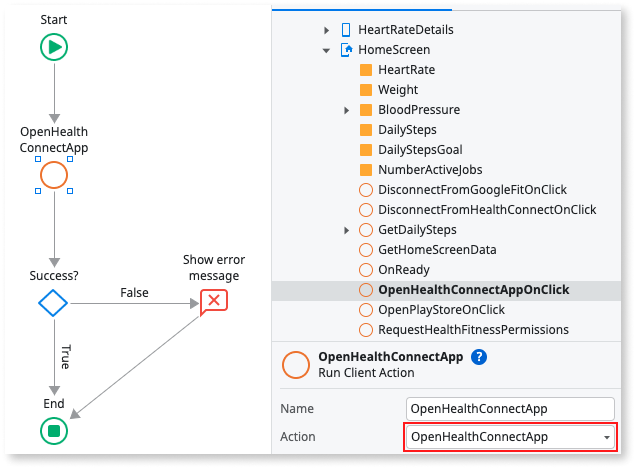

# Health and Fitness Plugin using HealthKit and Health Connect

<div class="info" markdown="1">

Applies only to Mobile Apps.

</div>

The [Health & Fitness plugin version 2.0.0](https://www.outsystems.com/forge/component-overview/11715/) enables you to access and use health and fitness data in a mobile app. The plugin provides access to Apple's HealthKit (iOS) and Google's Health Connect (Android) by letting you use data relevant to your health and fitness use cases.

The plugin is unaware of the provider you use for data, but you always need to request user permissions to access data. The plugin saves no health and fitness data to the device. In cases where your app writes data to the APIs, the package name is the identifier of the data source.

As a good practice, verify the plugin is available in the app and prevent the app from crashing. Use the **Logic** > **Client Actions** > **HealthFitnessPlugin** > **CheckHealthFitnessPlugin** action to check for the plugin availability. If the plugin isn't available to the app, display an error to your users.

<div class="info" markdown="1">

To learn how to install and reference a plugin in your **OutSystems** apps, and how to install a sample app, see [Adding plugins](../intro.md#adding-plugins).

</div>

## Sample app

**OutSystems** provides a sample app that contains logic for common use cases. Install the [Health & Fitness sample app](https://www.outsystems.com/forge/component-overview/11715/) from Forge and then open it in Service Studio.

This sample app shows you how to do the following with the health and fitness data:

* Request permission to access data.
* Do simple queries that return the last logged value for a given variable.
* Do advanced queries for a specific period that return a list of values.
* Write profile data (e.g. writing data for weight).
* Retrieve raw data related to workouts for a specific period. This is currently available on iOS only.
* Use the data in user interface components, such as cards, tables, and graphs.


## Important note about Health Connect (Android only)

Starting on Android 14, [Health Connect](https://health.google/health-connect-android/) already comes pre-installed. For lower versions of Android, users must install the Health Connect app from the Google Play Store.

<div class="info" markdown="1">

Please note that before users can use your app, you must request access to Health Connect data types by filling out the Developer Declaration Form from Google. For more information, see [Request access to Health Connect data types](https://developer.android.com/health-and-fitness/guides/health-connect/publish/request-access).

</div>

### Navigating from your app to the Health Connect app page on the Play Store (Android only)

The following image shows how you can use the **RedirectToURL** Destination to navigate from your app to the Health Connect app page on the Google Play Store. This is especially important for users with Android 13 or lower devices that need to install the Health Connect app from the Play Store.


### Navigating from your app to the Health Connect app (Android only)

If users already have the Health Connect app installed on their device, you can use the **OpenHealthConnectApp** client action to navigate from your app to the Health Connect app. This is especially important when users deny permissions to access Health Connect data types enough times that the permission prompt isn't shown again, when using the **RequestPermissions** client action. When this happens, you can redirect users to the Health Connect app so they can grant the necessary permissions.

To navigate to the Health Connect app, simply call the **OpenHealthConnectApp** client action, as shown in the image below.



## Providing the Privacy Policy file (Android only)

You must provide the privacy policy file through the Resources of your app. This file holds the content that your end-users see after clicking on the privacy policy link that appears in the permissions screen when calling the **RequestPermissions** client action. It should contain the rationale of the requested permissions, describing how your app uses and handles the user's data.

To add the privacy policy file to your mobile app, complete the following steps:

1. In Service Studio, go to the **Data** tab.
1. Right-click the **Resources** folder, and select **Import Resource**. The **Import Resource** dialog opens.

    

1. Select your privacy policy file. Please note that it should be a text file (.txt) and it should named **HealthConnect_PrivacyPolicy.txt**.
1. In the **Deploy Action** list, select **Deploy to Target Directory**. Leave the **Target Directory** field empty.


## (Optional) Configuring which Health Connect data types you wish to access (Android only)

By default, when using the Health and Fitness plugin, your app will be configured to access every Health Connect data type the plugin provides. In other words, every variable will be configured to have read and write access. If you wish to provide a custom configuration, you can do so through the Extensibility Configurations of your app.

To configure the access type for a given Health Connect data type (variable), you simply define an Android preference in your app's Extensibility Configurations, as follows:

```json
        {
            "preferences": {
                "android": [
                    {
                        "name": "<VARIABLE_NAME>",
                        "value": "<ACCESS_TYPE>"
                    }
                ]
            }
        }
```

For specific variables, the **name** of the preference should be the **Identifier** of the variable record in the **AllVariables** static entity of the plugin. For heart rate, for example, the **name** of the preference should be "HeartRate".

You can also define preferences for variable groups (e.g. fitness variables). More specifically, you can define preferences for the following variable groups: "AllVariables", "FitnessVariables", "HealthVariables", and "ProfileVariables".

The **value** of the preference should be the access type for the variable, which can be one of the following: "Read", "Write", or "ReadWrite".

Note that the most specific preference has precedence over less specific ones. For example, if the "Steps" variable is set to have write access, while the "FitnessVariables" group is set to have read access, every fitness variable will be set to have read access, except for "Steps", which will have write access instead.

Here's a concrete example of a configuration that sets write access to the "Steps" variable, read access to all fitness variables (except for "Steps"), write access to all health variables (e.g. "HeartRate"), and read and write access to all remaining variables ("AllVariables):

```json
        {
            "preferences": {
                "android": [
                    {
                        "name": "Steps",
                        "value": "Write"
                    },
                    {
                        "name": "FitnessVariables",
                        "value": "Read"
                    },
                    {
                        "name": "HealthVariables",
                        "value": "Write"
                    },
                    {
                        "name": "AllVariables",
                        "value": "ReadWrite"
                    },
                ]
            }
        }
```

## Enabling your users to track their health and fitness data

The following steps show how to design a use case that includes health and fitness data.

1. Create logic to request permission to access health and fitness data.
1. Create a user interface.
1. Create logic to access and store health and fitness data.
1. Create logic to access and use workout data (iOS only).
1. Optionally, create logic to write and store new health and fitness data.
1. Create logic to define a background job.

<div class="info" markdown="1">

Refer to the sample app for examples.

</div>

### Requesting access to health and fitness data

Before your app can access data, request permission from the users to access their health and fitness data. From Service Studio, select **Logic** > **Client Actions** > **HealthFitnessPlugin** and use the **RequestPermission** action.

You can define the variables and the following permissions access types:

* Read
* Write
* Read and write

In the screen logic, request the permissions from the app users, in an action that's triggered by the **On Initialize** event.

The plugin comes with groups of permissions. Use the groups of permissions as accelerators to check for access when you request data.

The plugin has groups of default variables in **Data** > **Entities** > **HealthFitnessPlugin** that define the permission type for:

* HealthVariables
* FitnessVariables
* ProfileVariables
* WorkoutType


<div class="info" markdown="1">

Refer to the sample app for more examples.

</div>

### Creating a user interface

Start, for example, by defining a variable that corresponds to the type of output you want to show. Create a variable that holds the data so that you can access, store, and display the number of steps taken in a day (1).


To show the step count for the day, you can use an **Expression** and customize the look and feel of the parent widget (2).

### Create logic to access and use health and fitness data

The plugin reads and writes the data using **AdvancedQuery** client action. In the **AdvancedQuery** action, set the values for the predefined variables.

The health or fitness query parameters might include:

* period: start, end
* time unit: second, minute, hour, day, week, month, year
* operation type: sum, min, max, average


<div class="info" markdown="1">

Verify that access and storage of health or fitness data on the device works. Check the value of **AdvancedQuery**. If **Success** is True, handle the data in **AdvancedQuery.** by assigning it to a variable of the same data type. Refer to the sample app for an example.

</div>

#### Notes about AdvancedQuery on Android

* The **TimeUnit** parameter can't be set to **MILLISECONDS** or **SECONDS**. By default, **TimeUnit** will be set to **MINUTE**.
* The query result for **BloodPressure** is a list with structure **[systolic, diastolic, systolic, diastolic]**, where each element on the list is a pair of two readings. Example: [118, 76, 119, 77].
* The dates returned in the **Result** and **ResultDataPoints** output parameters are in the UTC timezone.

#### Notes about AdvancedQuery on iOS

* When querying the **Sleep** variable, the results correspond to the "IN BED INTERVALS" that are registered in the Health app from the system. Using different time units or operations won't alter the results returned.

### Create logic to access and use workout data (iOS only)

To enrich the data that the developer can already obtain from the **AdvancedQuery**, there's also a **GetWorkoutsData** client action that retrieves data related to workouts. To achieve that, it's required to set the values for the input parameters, including:

* period: start, end
* workout type and variable map: list of a structure that relates a Workout Type and a list of Variables to query on.

For the Workout Type and Variable map structure, the plugin already provides a couple of convenient default values to use:

* If no list is provided or it's empty, the plugin considers all workout types available and applies two variables to each: **Heart Rate** and **Active Energy Burned**.
* If the list contains an item that has a workout type set but with no variable list associated (or an empty one), the plugin considers two variables: **Heart Rate** and **Active Energy Burned**.


<div class="info" markdown="1">

Verify that access and storage of health or fitness workout data on the device works. Check the value of **GetWorkoutsData**. If **Success** is True, handle the data in **GetWorkoutsData.** by assigning it to a variable of the same data type.

</div>

### Create logic to write health and fitness data

To write health and fitness data you can use the **WriteData** action. Set the parameters for the type of health or fitness variable you want and the new value you want to store.

To check that writing the health or fitness data on the device is working, verify the value of **WriteData.Success** is **True**.

### Create logic to define a background job

To define a background job you can use the **SetBackgroundJob** action. Set the parameters for the type of health or fitness variable you want to monitor, define the notification trigger condition and its frequency, and define the notification content.

Parameterization for two different use cases of a background job is shown below:

#### Setting up a daily steps goal

In the case of a daily steps goal evaluator, you will probably want to issue a single notification per day if the daily steps goal is met. To achieve this you can use the following parameterization:


#### Setting up a heart rate monitoring alarm

In the case of a heart rate monitoring alarm, try to strike a balance between job frequency and notification frequency. For example, you may want to check your heart rate every ten seconds. However, you would probably find it intrusive to receive notifications every time your heart rate goes above, or drops below, a certain value.

Consider the following parameterization for a background job that notifies you if your heart rate is above 190 bpm, with a maximum notification frequency of one notification per minute:


After you have created your background job you can update or delete it using the **UpdateBackgroundJob** action and the **DeleteBackgroundJob** action.

To check the background job was successfully created, verify the value of **SetBackgroundJob.Success** is **True**.

#### Setting a background job in Android

Starting in Android 15, when setting a background job for the first time, the Health Connect permission to read data in the background will be requested.

Starting in Android 14, when setting a background job for the first time, for some variables, the permission to schedule exact alarms will be requested. More specifically, this permission will be requested when setting the first background job if the variable is one of the following: weight, height, sleep, blood glucose, or body fat percentage.

With that said, it is a best practice to present a message to the user explaining why these permissions are necessary (e.g. to get notifications about health and fitness data), before calling the **SetBackgroundJob** client action.

#### (Optional) Opt-out of permissions for background jobs (Android only)

By default, all necessary background job Android permissions (e.g. "android.permission.ACTIVITY_RECOGNITION") are configured. If you don't want to use background job features and don't want these permissions to be included in your app, set the (`DisableBackgroundJobs`) preference in the Extensibility Configurations to **true**, as follows:

```json
        {
            "preferences": {
                "android": [
                    {
                        "name": "DisableBackgroundJobs",
                        "value": true
                    }
                ]
            }
        }
```

#### Additional information about background jobs in Android

When using the **SetBackgroundJob** client action, the **IMMEDIATE** option for the **JobFrequency** field of the **Variable** input parameter only applies to the following variables: steps, heart rate, calories burned, blood pressure, basal metabolic rate, walking speed, and distance. For the other variables (weight, height, sleep, blood glucose, body fat percentage, oxygen saturation and body temperature), the **IMMEDIATE** option will run every minute, as it is the minimum recommended frequency for alarms on Android.

Background jobs run using foreground services, which results in a temporary notification being shown to the user. In most cases, as the background job processing is fast, the temporary notification won't be presented to the user. Nevertheless, you can define the **title** and **description** of this notification, in case it is shown. By default, we already set a title and description, but you can define your own values as follows:

```json
        {
            "preferences": {
                "android": [
                    {
                        "name": "BackgroundNotificationTitle",
                        "value": "Measuring your health and fitness data."
                    },
                    {
                        "name": "BackgroundNotificationDescription",
                        "value": "Your health and fitness data is being measured in the background."
                    }
                ]
            }
        }
```

### Create logic to disconnect your Android app from Health Connect

To disconnect your Android app from Health Connect, and consequently revoke all permissions, you can use the **DisableHealthConnect** action. To check that your app is no longer connected to Health Connect, verify the value of **DisableHealthConnect.Success** is **True**.

After calling this action, you can also verify that the app no longer has access to any data by calling **AdvancedQuery**, **GetFitnessData**, **GetHealthData**, or **GetProfileData**.

<div class="info" markdown="1">

Your app should be implemented so that when a user chooses to disconnect it from Health Connect, it does not try to fetch any data or request any permissions until the user changes their decision.

</div>

### Handling errors

An app with the health and fitness plugin can run on many Android or iOS devices, with different hardware and software configurations. To ensure a good user experience and prevent the app from crashing, handle the errors within the app.

Following is a list of actions you can use to make sure there are no errors:

| Variable        | Action                   | Description                                                    |
| --------------- | ------------------------ | -------------------------------------------------------------- |
| **IsAvailable** | CheckHealthFitnessPlugin | True if the plugin is available in the app.                    |
| **Success**     | RequestPermissions       | True if there aren't errors while requesting permissions.      |
| **Success**     | AdvancedQuery            | True if there aren't errors while accessing and storing data.  |
| **Success**     | GetWorkoutsData          | True if there aren't errors while accessing and storing data.  |
| **Success**     | GetFitnessData (*)       | True if there aren't errors while accessing and storing data.  |
| **Success**     | WriteProfileData         | True if there aren't errors while writing data.                |
| **Success**     | SetBackgroundJob         | True if there aren't errors while creating a background job.   |
| **Success**     | DeleteBackgroundJob      | True if there aren't errors while deleting a background job.   |
| **Success**     | UpdateBackgroundJob      | True if there aren't errors while updating a background job.   |
| **Success**     | ListBackgroundJobs       | True if there aren't errors while listing the background jobs. |
| **Success**     | OpenHealthConnectApp     | True if there aren't errors while opening the Health Connect app. |
| **Success**     | DisableGoogleFit         | True if there aren't errors while disconnecting from Google Fit.|
| **Success**     | DisableHealthConnect     | True if there aren't errors while disconnecting from Health Connect.|

(*) There are several actions in the Health & Fitness plugin that begin with **Get** and have a **Success** variable.

### Units of measurement

Following is the full list of health and fitness variables our plugin supports, and their units of measurement:

| Variable                 | Android                          | iOS                              |
| ------------------------ | -------------------------------- | -------------------------------- |
| **Heart Rate**           | Beats per minute (bpm)           | BPM (beats per minute)           |
| **Steps**                | Number of steps in sample        | Number of steps in sample        |
| **Weight**               | Kilograms (kg)                   | Kilograms (kg)                   |
| **Height**               | Centimetres (cm)                 | Centimetres (cm)                 |
| **Calories Burned**      | Kilocalories (kcal)              | Kilocalories (kcal)              |
| **Sleep**                | Duration of sleep                | Duration of sleep                |
| **Blood Pressure**       | Millimeters of mercury (mmHg)    | Millimeters of mercury (mmHg)    |
| **Blood Glucose**        | Millimoles per litter (mmol/L)   | Milligrams per deciliter (mg/dL) |
| **Body Fat Percentage**  | Percentage                       | Percentage                       |
| **Basal Metabolic Rate** | Kilocalories per day (kcal/day)  | Kilocalories per day (kcal/day)  |
| **Walking Speed**        | Meters per second (m/s)          | Meters per second (m/s)          |
| **Distance**             | Meters (m)                       | Meters (m)                       |
| **Oxygen Saturation**    | Percentage                       | Percentage                       |
| **Body Temperature**     | Celsius (ºC)                     | Celsius (ºC)                     |

Note that the **Workout** variable isn't on the list because it doesn't have a single unit for measure, as iOS supports different types of workouts. Also, this variable is currently not available on Android.
