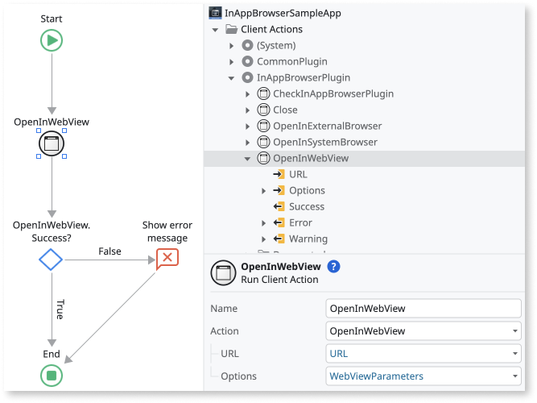
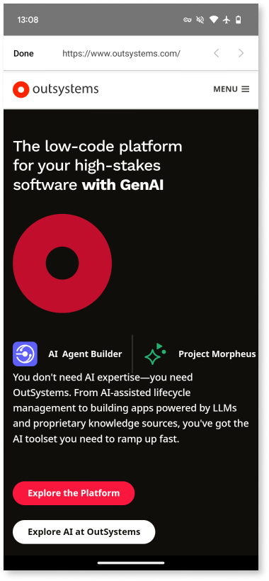
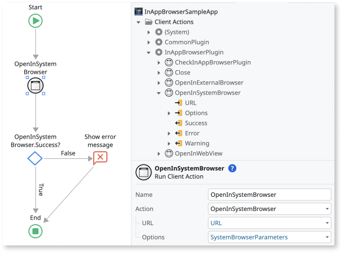
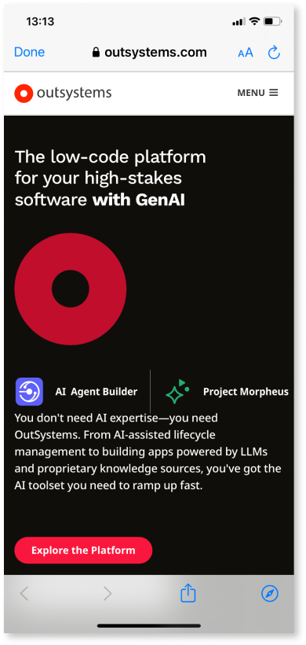
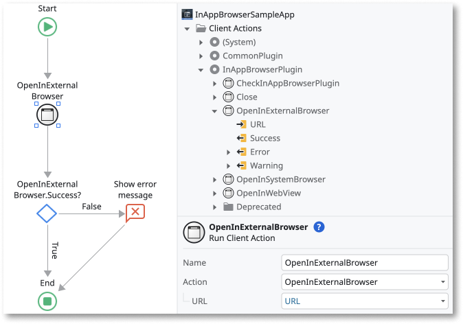
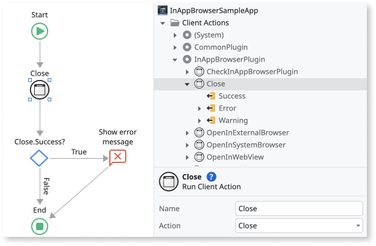

# InApp Browser Plugin

<div class="info" markdown="1">

Applies only to Mobile Apps.

</div>

This documentation page applies to version 3.0.0 of the plugin and onwards.

Use the InAppBrowser Plugin to open external URLs directly in your application, either within a web view, or a system in-app browser (Custom Tabs for Android and SafariViewController for iOS). You can also use the plugin to open URLs in the device's default browser.

All three browser targets of the plugin behave like standard web browsers, and can't access Cordova APIs. For this reason, the plugin is recommended if you need to load third-party (untrusted) content, instead of loading it into the main Cordova WebView (for example, using the RedirectToURL destination). The plugin's browser targets aren't subject to the whitelist.

As a good practice, verify that the plugin is available in the app. Use the **Logic > Client Actions > InAppBrowserPlugin > CheckInAppBrowserPlugin** action to check for the plugin's availability before using other plugin actions. If the plugin isn't available to the app, display an error to your users.

The **CheckInAppBrowserPlugin** can return a warning with code "OS-PLUG-IABP-0002" that means you're using an older version of the native (Cordova) plugin. In other words, you updated the plugin in your environment but didn't generate a new native build. We recommend building and distributing a new version of your app.

<div class="info" markdown="1">

To learn how to install and reference a plugin in your OutSystems apps, and how to install a sample app, see [Adding plugins](../intro.md#adding-plugins).

</div>

## Open a URL in a web view inside the app

To create the logic to open a URL in a web view, follow these steps in Service Studio:

1. Go to **Logic > Client Actions > InAppBrowserPlugin** and drag the **OpenInWebView** action to your flow.

    

1. Pass in the URL you want to open, as a **Text**, in the **URL** input parameter of the **OpenInWebView**.
   
1. Optionally, you can set the **Options** input parameter, passing in a structure of type **WebViewOptions**.

1. As a good practice, you should handle the result of calling the action by checking the **Success** output parameter. If any errors or warnings occur, you can check them using the **Error** and **Warning** output parameters.

Here's the result of opening a URL in the web view, on Android:



## Open a URL in a system browser inside the app

To create the logic to open a URL in a system browser (SafariViewController for iOS and Custom Tabs for Android), follow these steps in Service Studio:

1. Go to **Logic > Client Actions > InAppBrowserPlugin** and drag the **OpenInSystemBrowser** action to your flow.

    

1. Pass in the URL you want to open, as a **Text**, in the **URL** input parameter of the **OpenInSystemBrowser**.
   
1. Optionally, you can set the **Options** input parameter, passing in a structure of type **SystemBrowserOptions**.

1. As a good practice, you should handle the result of calling the action by checking the **Success** output parameter. If any errors or warnings occur, you can check them using the **Error** and **Warning** output parameters.

Here's the result of opening a URL in the system browser, on iOS:




## Open a URL in an external browser outside the app

To create the logic to open a URL in an external browser, outside the your app, follow these steps in Service Studio:

1. Go to **Logic > Client Actions > InAppBrowserPlugin** and drag the **OpenInExternalBrowser** action to your flow.

    

1. Pass in the URL you want to open, as a **Text**, in the **URL** input parameter of the **OpenInExternalBrowser**.

1. As a good practice, you should handle the result of calling the action by checking the **Success** output parameter. If any errors or warnings occur, you can check them using the **Error** and **Warning** output parameters.

Here's the result of opening a URL in the external browser, on Android (Google Chrome):


## Handle browser events

<div class="info" markdown="1">

Applies only to to OpenInWebView and OpenInSystemBrowser.

</div>

Your app can handle events triggered when the browser finishes loading the URL and when the user closes the browser.

To enable this you can use the **InAppBrowserEvents** block, which lets you handle the **OnBrowserPageLoaded** and **OnBrowserClosed** events. You should add this block to every screen that you want these events to be handled in.

## Close (only applies to OpenInWebView and OpenInSystemBrowser)

The plugin also offers a **Close** client action that you can use to automatically close the browser, provided that it was open with either the **OpenInWebView** or **OpenInSystemBrowser** actions.

To create the logic to close an open browser, follow these steps in Service Studio:

1. Go to **Logic > Client Actions > InAppBrowserPlugin** and drag the **Close** action to your flow.

    

3. As a good practice, you should handle the result of calling the action by checking the **Success** output parameter. If errors or warnings occur, you can check them using the **Error** and **Warning** output parameters.

## Opening HTTP URLs with OpenInWebView on Android

To enable your app to open HTTP URLs in the web view, set the **InAppBrowserCleartextTrafficPermitted** preference in your app's Extensibility Configurations, as follows:

```json
        {
            "preferences": {
                "android": [
                    {
                        "name": "InAppBrowserCleartextTrafficPermitted",
                        "value": true
                    }
                ]
            }
        }
```
