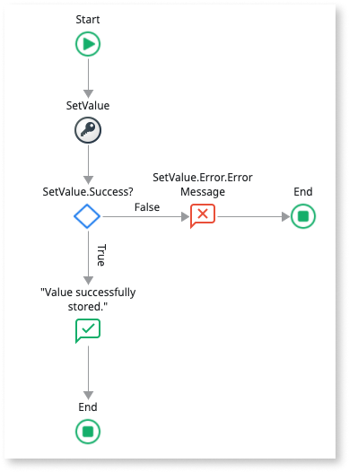
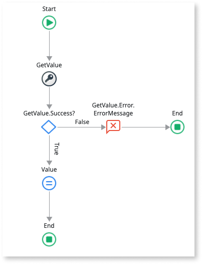
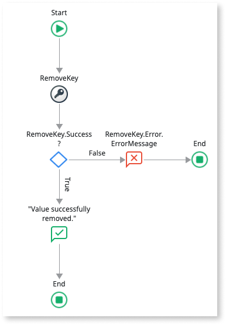
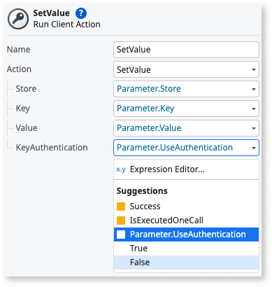

# Key Store plugin

<div class="info" markdown="1">

Applies only to Mobile Apps.

</div>

The [Key Store](https://www.outsystems.com/forge/component-overview/1550/key-store-plugin) plugin allows your application to securely store, get and remove secrets (key-value pairs).
These can be usernames, passwords, tokens, certificates, or other sensitive information on iOS & Android devices.

After adding the plugin to your app, you should follow the good practice of verifying if the plugin is available to your app at runtime.
This prevents the app from crashing when trying to use an unavailable feature.
Use the **Logic** > **Client Actions** > **KeyStorePlugin** > **CheckKeyStorePlugin** action to check for the plugin availability.
If the plugin isn't available to the app, display an error to your users.

<div class="info" markdown="1">

See [Adding plugins](https://success.outsystems.com/documentation/11/extensibility_and_integration/mobile_plugins/intro.md#adding-plugins) to learn how to install and reference a plugin in your OutSystems apps, and how to install a demo app.

</div>

## Plugin functionalities

The Key Store Plugin allows you to do the following:

* Set, get, and remove your secrets;
* Choose if you want authentication to access your secrets (available from version 2.3.0);
* Migrate the key-value pairs stored in a previous version to a new version of the plugin (only for Android, available from version 2.3.0).

### Set, get, and remove your secrets

To create your key-value pair, you can use the client action **_SetValue_**:

1. Add the **_SetValue_** client action after the Start node;
1. Handle the response from the client action. After the **_SetValue_**, add an If;
1. Set the Condition of the **_If_** to **_SetValue.Success_**;
1. In the **_False_** branch of the **_If_**, add a **_Message_**, set the message type to **Error**, and set a **_Message_** to show to end users.



After setting your key-value pair, you can access them using the **_GetValue_** client action:

1. Add the **_GetValue_** action after the Start node;
1. Handle the response from the client action. After the **_GetValue_**, add an If;
1. Set the Condition of the **_If_** to **_GetValue.Success_**; Then, you can handle the response by assigning its value to a local variable.
1. In the **_False_** branch of the **_If_**, add a **_Message_**, set the message type to **Error**, and set a **_Message_** to show to end users.



In case you want to remove a key-value pair that you previously created, you can do it using the **_RemoveKey_** client action:

1. Add the **_RemoveKey_** action after the Start node;
1. Handle the response from the client action. After the **_RemoveKey_**, add an If;
1. Set the Condition of the **_If_** to **_RemoveKey.Success_**;
1. In the **_False_** branch of the **_If_**, add a **_Message_**, set the message type to **Error**, and set a **_Message_** to show to end users.



### Choose if you want authentication to access your secrets

<div class="info" markdown="1">

This functionality is only available for Key Store ≥ 2.3.0.

</div>

From version 2.3.0, you can set if you want additional authentication to access your key-value pairs by setting the value for **_KeyAuthentication_** in the **_SetValue_** client action. By default, no authentication is required to access the key-value pair (**_False_**). If **_True_**, access to the key-value pair requires an additional user authentication method. This authentication method depends on the user’s device lock screen settings.

<div class="info" markdown="1">

Any value chosen for the KeyAuthentication variable doesn't affect the security of your secrets. Whether the key-value pair requires authentication or not, secrets are always encrypted.

</div>



#### (Optional) Set the authentication dialog content (Android only)

<div class="info" markdown="1">

Applies to version 2.4.0 and higher

</div>

You can set the content of the authentication dialog that appears to the end-user when accessing key-value pairs. More specifically, you can set values for the dialog's **title** and **subtitle**. For devices with an Android version below or equal to 10, you can also set the value for the **cancel button** (also known as **negative button**). 

<div class="info" markdown="1">

For Android versions 10 or lower, these values only apply to biometric authentication (for example, fingerprint). These values also apply to Android version 11 and higher when using the standard authentication methods. 

For Android versions 10 or lower, when using standard authentication methods (for example, PIN), the Android system uses predefined values

</div>

To set the values for these fields, define the following Android preferences in your app's Extensibility Configurations:

```json
        {
            "preferences": {
                "android": [
                    {
                        "name": "AuthPromptTitle",
                        "value": "Authentication required"
                    },
                    {
                        "name": "AuthPromptSubtitle",
                        "value": "Please authenticate to continue"
                    },
                    {
                        "name": "AuthPromptCancelButton",
                        "value": "Cancel"
                    }
                ]
            }
        }
```

**Note:** These preferences are optional. If they're not set, then the values in the example above are used by default.

### Migrate the key-value pairs stored in a previous version to a new version of the plugin

<div class="info" markdown="1">

This functionality is only available for Key Store ≥ 2.3.0. In addition, migration is only possible if the current Key Store version is ≥ 2.2.0.

</div>

As the **_KeyAuthentication _**variable is only available from version **2.3.0**, you can use the **_MigratedKeysAuthentication_** preference to migrate your secrets from an older version of the plugin (starting from 2.2.0). The value used on this preference is applied to **_KeyAuthentication_** for all your key-value pairs.
By default, no authentication is required to access the pair (**_False_**). If **_True_**, access to the pair requires an additional user authentication method. This authentication method depends on the user’s device lock screen settings.

<div class="info" markdown="1">

Any value chosen for the KeyAuthentication variable doesn't affect the security of your secrets. Whether the key-value pair requires authentication or not, secrets are always encrypted.

</div>

```json
        {
   "preferences":{
       "global": [
            {
                "name": "MigratedKeysAuthentication",
                "value": true
            }
       ]
   }
}
```

## Known issues and workarounds

Check the following known issues and possible workarounds.

### Compatibility with operating systems

Compatible with both iOS and Android.
