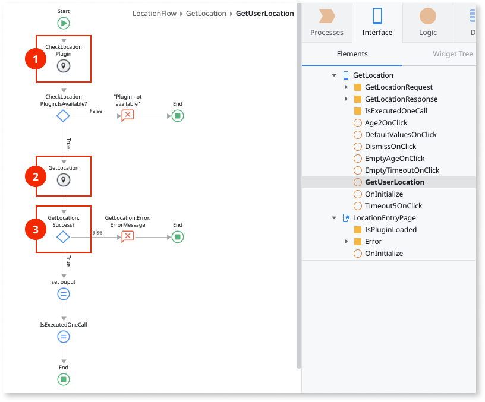
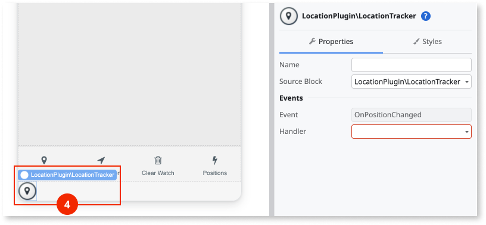
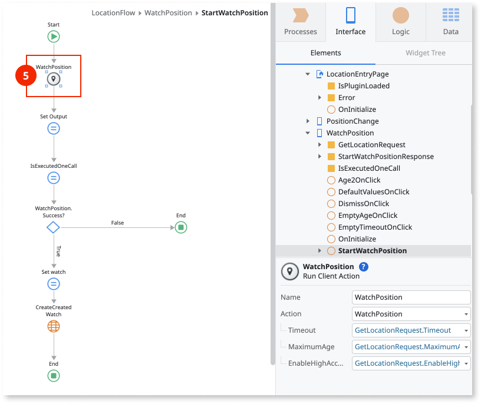
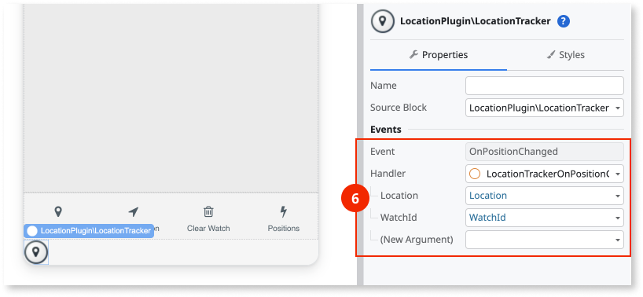
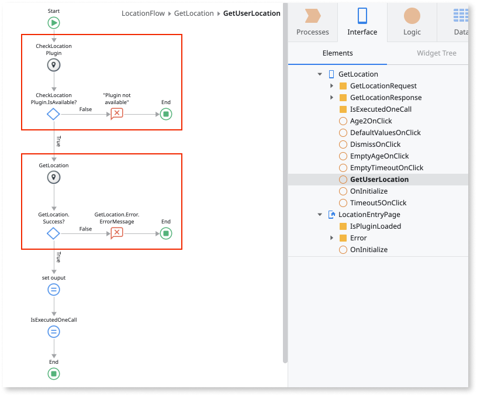

# Location Plugin

Use the Location Plugin to enable an application to access the GPS capabilities of the user device, like latitude, longitude, and altitude. This plugin works with native mobile apps, progressive web apps (PWAs), and web apps.

<div class="info" markdown="1">

See [Adding plugins](../intro.md#adding-plugins) to learn how to install and reference a plugin in your OutSystems apps, and how to install a demo app.

</div>

## Adding necessary permissions (Property List Keys) for Location (iOS only)

To use the Location Plugin on iOS, you should provide descriptions for two property list keys: **NSLocationWhenInUseUsageDescription** and **NSLocationAlwaysAndWhenInUseUsageDescription**.

This can be done by setting two iOS preferences in your app's Extensibility Configurations file, as follows:

```json
        {
            "preferences": {
                "ios": [
                    {
                        "name": "NSLocationAlwaysAndWhenInUseUsageDescription",
                        "value": "This app accesses your location to give you the best restaurants near you."
                    },
                    {
                        "name": "NSLocationWhenInUseUsageDescription",
                        "value": "This app accesses your location to give you the best restaurants near you."
                    }
                ]
            }
        }
```

## Creating logic to get the device location

The Location Plugin actions are in the **Logic** tab of Service Studio, in **Client Actions** > **LocationPlugin**.

To prevent errors, it's a best practice to first check if the plugin is available (1) with the action **CheckLocationPlugin**. If the plugin isn't available to the app, display an error to the user.

Otherwise, you can use the **GetLocation** action to get the device current location (2). In the **GetLocation** action you can enable the high accuracy mode, define the timeout of the action and set the maximum age (in milliseconds) to use the cached location.

Check if getting the device location works by verifying the value of **GetLocation.Success** (3) is **True**. If **True**, you can handle the device location data and apply any logic that you want. If **False**, you can show an **Error** to the user.



## Check current device location in real time

To check the device location in real time and have a good user experience:

* Add the **LocationTracker** block on your screen
* Use the **WatchPosition** action to update location in real time
* Create logic to handle the event of the position changing
* Create logic to handle errors
* See the sections that follow for more information

## Add the LocationTracker block on your screen

To check if the device location changed, you can drag the **LocationTracker** block on your screen (4). This block handles the **OnPositionChanged** event to trigger another action in your app logic.



## Use the WatchPosition action to update location in real time

After adding the **LocationTracker** block in your app, you need to use the **WatchPosition** action to trigger and start monitoring the device position (5). Use the **WatchPosition** action in the flow that suits your app use case. The inputs are the same as in **GetLocation** action to update the device location in real time.

As an output, this **WatchPosition** action returns a **WatchId**, an identifier that you can use in the **ClearWatch** action to stop the process of actively updating the device position.



## Create logic to handle the event of the position changing

At last, you need to create a custom action and use it as the **Handler** of the **OnPositionChanged** event in the **LocationTracker** block (6). This event of the position changing returns the **Location** structure and the **WatchId**.



## Handling errors

The app with the Location Plugin can run on many Android or iOS devices, with different hardware and configurations. To ensure a good user experience and prevent the app from crashing, handle the errors within the app.

Here is the list of actions you can use to handle the errors. Use these actions with the **If** nodes to check for errors and control how the app works.

| Variable    | Action              | Description                                                                    |
| ----------- | ------------------- | ------------------------------------------------------------------------------ |
| IsAvailable | CheckLocationPlugin | True if the Location Plugin is available in the app.                           |
| Success     | GetLocation         | True if there aren't errors while getting the device position.                 |
| Success     | WatchPosition       | True if there aren't errors while receiving position updates in real time.          |
| Success     | ClearWatch          | True if there aren't errors while canceling position updates in real time. |



## Actions

Here is the reference of the actions you can use from the plugin. Location Plugin uses a Cordova plugin, and for more information check [cordova-plugin-geolocation](https://github.com/OutSystems/cordova-plugin-geolocation).

| Action              | Description                                                                                 | Available in PWA |
| ------------------- | ------------------------------------------------------------------------------------------- | ---------------- |
| CheckLocationPlugin | Checks if the location plugin is available in the app.                                      | Yes              |
| GetLocation         | Get the current GPS information if the GPS is enabled on the device.                        | Yes              |
| WatchPosition       | Tracks the device position and triggers OnPositionChanged event from LocationTracker block. | Yes              |
| ClearWatch          | Clears a previously registered position watch.                                              | Yes              |

## MABS compatibility

The table shows the compatibility of the Location Plugin with the Mobile Apps Builds Service (MABS).

| Plugin version  | Compatible with MABS version | Notes |
| --------------- | ---------------------------- | ----- |
| 5.2.0 and later | MABS 10.0 and later.         |       |
| 5.1.8 and later | MABS 9.0 and later.          |       |
