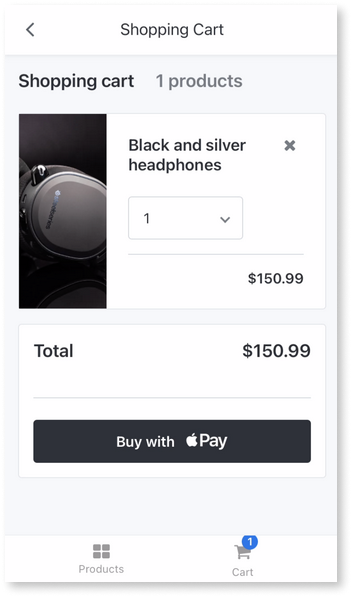
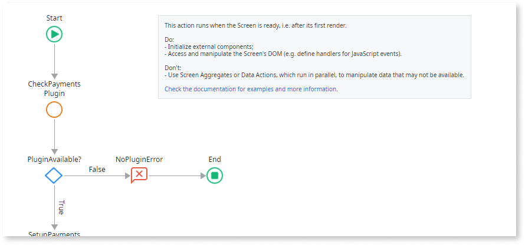
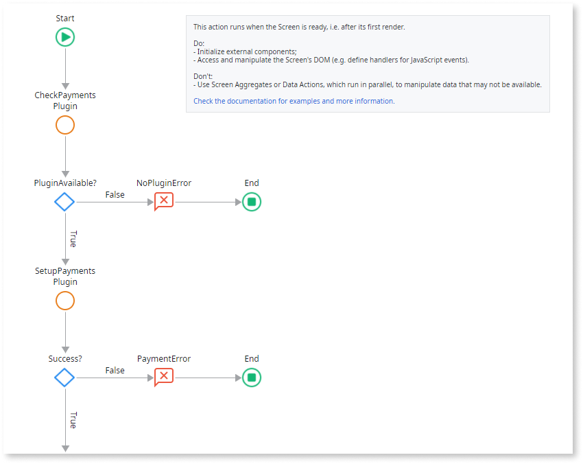
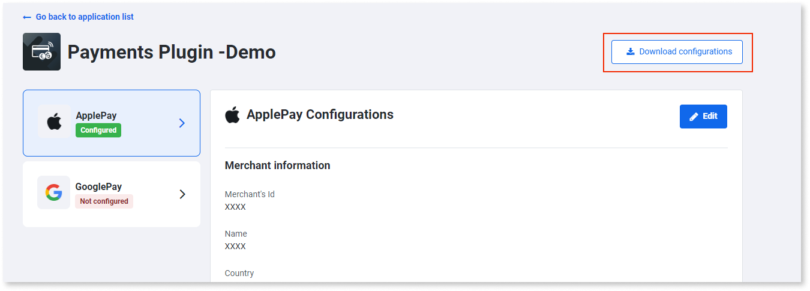
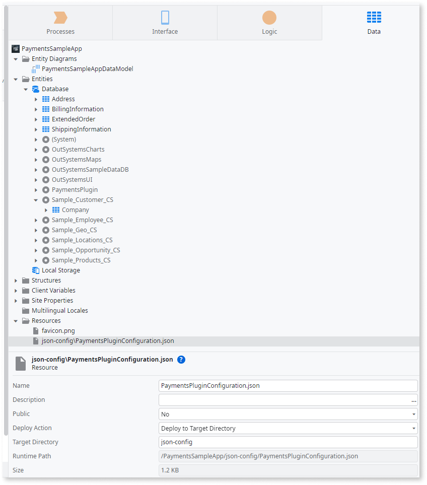
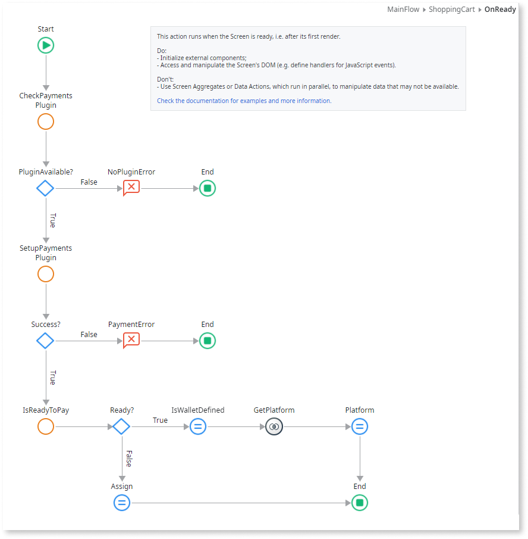
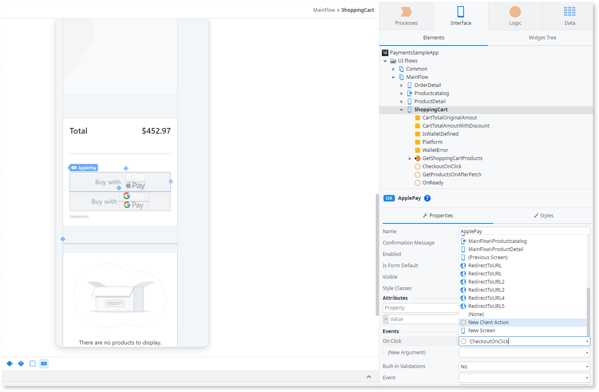
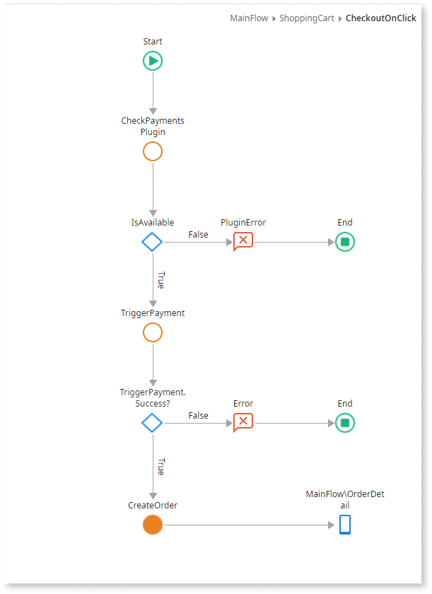

# Payments Plugin

Applies only to Mobile Apps.

Use the [Payments Plugin](https://www.outsystems.com/forge/component-overview/13678/payments-plugin) to enable users to complete payments using Apple Pay or Google Pay. This plugin lets users provide payment details, merchant information, the amount and currency of the transaction, and billing contacts.

The following is a high-level process describing how to add and configure the Payment plugin to your mobile app:

1. Add the plugin to your mobile app.

1. Create a payment logic to verify the plugin availability using the CheckPaymentsPlugin action (Navigation: Service Studio > **Logic** > **Client Actions** > **PaymentsPlugin** > **CheckPaymentsPlugin**).

1. When the verification completes on your users' devices, your app is ready to take the required pre-defined actions while interacting with that user.

* To prevent your app from crashing, don't use a plugin that's unavailable at runtime.

* To learn how to install and reference a plugin in your OutSystems mobile apps and how to install a demo app, see [Adding plugins](../intro.md#adding-plugins).

## Compatibility with operating systems

The OutSystems mobile Payments Plugin is available for both iOS (Apple Pay) and Android (Google Pay).

## Sample app

OutSystems provides a sample app that contains logic for common use cases.
Install the [Payments sample app](https://www.outsystems.com/forge/component-overview/13678/payments-plugin) from Forge and open it in the Service Studio.

This sample app shows you how to complete the following procedures:

* To set the configuration information for the plugin, from the Payments Plugin Configurator, get the Apple Pay or Google Pay configuration.

* To trigger the payment flow, add the logic to a button.

## Enable a frictionless payment experience in your app

The following is a high-level process describing how to enable your users to pay with Apple Pay or Google Pay:

1. If you want to use a Payment Service Provider (PSP) to process the payments, configure your payment account in the provider's dashboard.

1. In the Payments Plugin Configurator app, configure a mobile payment service for your app.

1. In your app, create the logic to set up the plugin and verify that the payment is possible.

1. In your app, create a button and a logic to trigger the payment.

### Configure your account in the provider's dashboard

Only some providers offer end-to-end payment processing in the Payments plugin, for example, Stripe. If the Payments plugin doesn't provide an end-to-end process for a provider (for example, Adyen or WorldPay), you can configure an account in your provider's dashboard. Then implement the payment process with the provider on your app.

To configure your payment account in the Stripe dashboard, create a [Stripe](https://stripe.com/) account. From **Stripe Dashboard** > **Developers**, make a note of the **Publishable key** and **Secret key** field values. These fields are necessary to properly process payments using Stripe with the Outsystems O11 Payments Plugin.

When using the built-in Stripe integration, enabling **PAN_ONLY** capabilities may increase card compatibility, but it's not guaranteed to work with every bank. This is due to the lack of 3DS support for this configuration.

### Configure a mobile payment service for your app

Before triggering a payment in an app, you need to configure a mobile payment method service (such as [Apple Pay](https://developer.apple.com/documentation/apple_pay_on_the_web/applepaypaymentrequest) and [Google Pay](https://developers.google.com/pay/api/android/reference/request-objects)’s base information) in the app using the [Payments Plugin
Configurator](https://www.outsystems.com/forge/component-overview/13679/payments-plugin-configurator), a Reactive Web app.

You need the following information:

* Access to the Payments Configurator at `https://<your-environment>/PaymentsConfigurator/`, where you should replace `<your-environment>` with your development environment address.

* Access to a mobile PSP by either configuring a new mobile payment service or editing an existing one. To configure PSP details, add the following information (depending on the PSP):

    * Merchant ID: The merchant id.
      
    * Name: The merchant name.
      
    * Country: The merchant country.
 
    * Allowed networks: The networks that the merchant allows (VISA, MasterCard, Amex, etc).
 
    * Supported capabilities: The capabilities that the merchant supports (Debit, Credit, 3DS, etc).
 
    * Supported card countries: The supported card countries that the merchant supports. The default value is "All countries" and you can only specify the countries on ApplePay configuration.
 
    * Allowed countries to ship (Google Pay only): The supported countries the merchant ships to. (Google Pay only)
 
    * Required contacts for shipping: The shipping contact information that you require from the user to execute the payment (name, email, phone number and postal address).
 
    * Required contacts for billing: The billing contact information that you require from the user to execute the payment (name, email, phone number and postal address).
 
    * Payment Service Provider (PSP): The identification of the Payment Service Provider (PSP) that you are going to use to process the payment.

The PSP in the Payments Configurator identifies the PSP that you're using in your application. If you want to integrate with a PSP other than Stripe then you need to integrate and configure the Payment Service Provider API to the Service Studio. You need a PSP license for the plugin to work.

To process payments with Stripe using an OutSystems implementation, complete the following steps:

1. Open the Service Studio.

1. Open the **Payments Plugin Configurator** app.

1. Navigate to **Logic** > **Integrations** > **REST** > **Stripe**.

1. In the Basic authentication section, fill the **Username** field with the **secret key** value you obtained from the Stripe dashboard [Configure your account in the provider's dashboard](intro.md#configure-your-account-in-the-providers-dashboard).

### Create logic to set up the plugin

Follow these steps, to verify the plugin’s availability, trigger the payment by adding an action, and then set up the plugin:

1. Verify the plugin’s availability and add an action to trigger the payment.

   From the **CheckPaymentsPlugin** client action, you can verify the plugin's availability. This step represents the action from the sample app. Follow these steps to verify the plugin availability and then to add an action that triggers the payment:

   1. From the Service Studio, Interface tab, navigate to **UI Flows** > **Main Flow** > **ShoppingCart** > **OnReady**.

   1. To check if the Payments plugin works correctly during the runtime, add the **CheckPaymentsPlugin** action after the Start node.

      

   1. To handle the response from the CheckPaymentsPlugin, after the CheckPaymentsPlugin node, add an **If** condition.

   1. To set the condition results and message, set the condition of the **If** node to CheckPaymentsPlugin.**IsAvailable**. Then in the False branch of the **If**, add a **Message**, set the message **Type** to **Error** and set a message for the user.

1. Set up the plugin.

   To set up the plugin, use the SetupPaymentsPlugin client action.​​ This action gets the information inside the Payments Plugin Configurator app about the Apple Pay or Google Pay configuration. This illustration represents the second part of the action from the sample app.

   1. From the Service Studio, Interface tab, navigate to **UI Flows** > **Main Flow** > **ShoppingCart** > **OnReady**.

   1. In the **OnReady** action, below the flow that you already defined, after checking the plugin's availability, add the **SetupPaymentsPlugin** action.

      

   1. For testing configuration, use a test environment for payments.
      
      * For **Android** (Google Pay), use the SetupPaymentsPlugin.**Environment** parameter to set the Test environment of your payments. During development, use the Test option. Remember to change this to Production when you are releasing your app to the store.
            
      * For **iOS** (Apple Pay), to learn more about sandbox testing, see [Sandbox Testing](https://developer.apple.com/apple-pay/sandbox-testing/).
            
   1. To handle the response from the SetupPaymentsPlugin, after the SetupPaymentsPlugin node, add an **If** condition and evaluate the success of this operation. In the False branch of the **If**, add a **Message**, set the message **Type** to **Error**, and set a message for end users in case of failure to set up the payments plugin.

1. Get the JSON configuration file.

   1. Navigate to **Apps** > **Payments Configurator** and edit the Payments app details such as Google Pay and Apple Pay.

   1. Select **Download configurations** to download the JSON configuration file **PaymentsPluginConfiguration.json**.

      

   1. In your Payments app, add the **PaymentsPluginConfiguration.json** file as a Resource of your app.

      

      Don't edit the JSON file.

      The Target Directory parameter of the Resource must be filled with json-config.

      

         

      

      Repeat the above steps each time you change the Apple Pay and/or Google Pay configuration on the Payments Plugin Configurator app.

      

1. Verify if the PSP is available.
   
   As a best practice, OutSystems recommends you must verify if ApplePay or GooglePay is available and configured on the device. Then if there’s any valid card to make the payment, you can call the **IsReadyToPay** client action. To do this verification, complete the following steps:

   1. After setting up the plugin, add the **IsReadyToPay** action.

   1. To handle the response from the **IsReadyToPay** action, set the logic to apply conditions for your app based on whether the user has Apple Pay or Google Pay available or neither configured on the device, and if there’s any valid card to make the payment.

      

The sample app uses that response to enable/disable the pay button and to handle error messages on the screen depending on each platform (Android or iOS).

### Create a button and logic to trigger the payment

Enable the plugin to execute the payment through the **TriggerPayment** client action.​​

To trigger the payment on your app's screen, complete the following steps:

1. In Service Studio, in your app's login screen, add a **Button** for each payment method service you want to enable. Ensure you follow the provider's branding guidelines when creating each button ([Apple Pay](https://developer.apple.com/design/human-interface-guidelines/apple-pay/overview/introduction/) and [Google Pay](https://developers.google.com/pay/api/android/guides/ux-best-practices) guidelines).

1. For each button you added, add an action to handle the **OnClick** event. In the properties of the payment button, open the **Events** > **OnClick** dropdown and select the **New Client Action**.**OnClick** event.

    

1. In the action flow of each action, you created in the previous step, check if the plugin is working properly during runtime. After the Start node, add the **TriggerPayment** action.

    

1. To handle the response from TriggerPayment, after **TriggerPayment**, add an **If** node.

1. In the **False** branch of the **If** node, add a **Message** indicating that the payment process failed.

1. In the **True** branch of the **If** node, you can create a logic to redirect for a confirmation screen as in the sample app.

The **TriggerPayment** client action has the optional parameters **PSP**, **ClientID**, and **ClientSecret**. If you want to process payments with Stripe using the Payments Plugin, you should set **PSP** to **Entities.PaymentServiceProvider.Stripe**. Obtain the **ClientID** and **ClientSecret** field values from the Payments Configurator dashboard inside your app's configuration. Don't pass the **ClientSecret** value directly to the **TriggerPayment** client action. Instead, it's recommended you save this value securely by creating an Aggregate to obtain it and pass it to the client action. It's suggested you save the **ClientSecret** in a Site Property. Find more info on Site Properties [here](../../../ref/lang/auto/class-site-property.md). If the **PSP** parameter of the **TriggerPayment** client action is set to **Entities.PaymentServiceProvider.None**, no PSP payment processing takes place.

