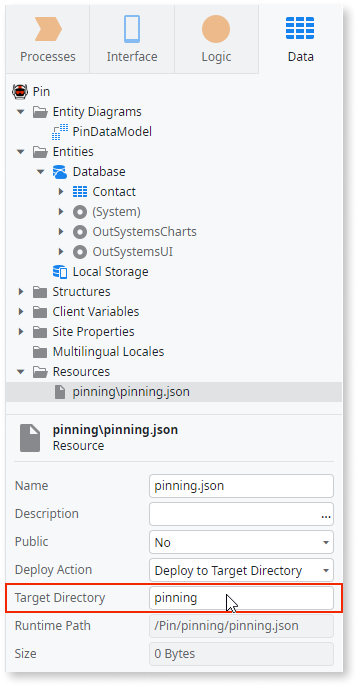
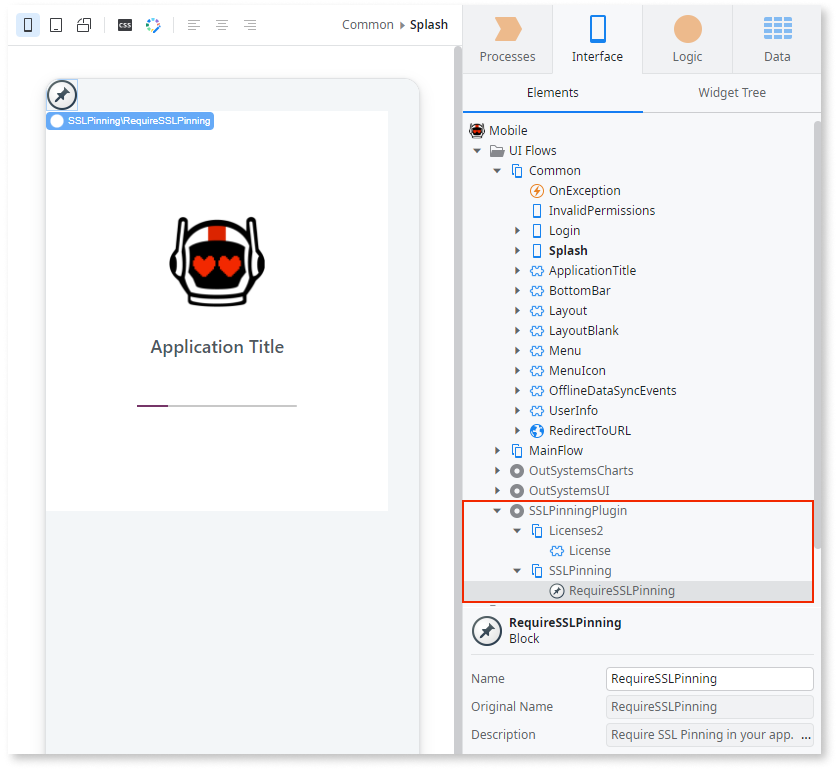

# SSL Pinning Plugin

Applies only to Mobile Apps.

In native mobile apps, SSL Pinning or HTTP Public Key Pinning (HPKP) provides an extra layer of security to HTTPS communications to avoid, for example, man-in-the-middle attacks. SSL Pinning works on the client-side. SSL Pinning verifies the client-server certificate by comparing hashes of the public keys of the pre-bundled mobile app.

By design, if there's a hash mismatch, calls to server actions stop working.  When there's a hash mismatch, you must add a new hash list in your app, build a new version of the app, and distribute it to your users. To prevent a hash mismatch, design the app to verify the certificate validity. To learn more about hash validity, see [Check the hash validity](#check-the-hash-validity) section.

OutSystems SSL Pinning Plugin uses a customized version of the SSL certificate validation and doesn't rely on the older SSL Pinning versions that may be in your browsers.

To learn how to install and reference a plugin in your OutSystems mobile apps, and how to install a demo app, see [Adding plugins](../intro.md#adding-plugins).

## Important note about certificates

To keep your environments secure, OutSystems continuously updates server certificates for their domains. This is important especially if your environments use OutSystems default domains and certificates.

When certificates change, the environments using these certificates in their apps may stop working. To fix this problem, you must generate a new app and distribute the app. If OutSystems, due to any unforeseen circumstances, is unable to notify you every time there is a change, everyone involved is at risk.

OutSystems no longer supports the native Mobile apps generation when using SSL Pinning to pin your apps to OutSystems managed certificates. This change affects all environments, production and non-production. If this change affects your environments, get new domains and certificates, and provide their details to OutSystems.

## How to implement SSL pinning in OutSystems

To implement SSL Pinning, you must have two certificates on the server - one as the primary certificate and the second as a backup (if the primary certificate gets compromised).

To implement SSL Pinning in OutSystems, follow these steps:

1. Generate hashes for the public keys of the certificates.
1. Create a configuration file with the hashes.
1. Install the SSL Pinning plugin from Forge.
1. Add the configuration file to your mobile app.
1. Validate that the certificates are working only for the hashes in the mobile app.

If you update the [configuration file](#create-the-configuration-file) of the SSL Pinning plugin in new versions of your app, you need to manually run the app build creation. To learn more about when you must install a new build, see [Situations when the user must install a new build](../../../deploying-apps/mobile-app-packaging-delivery/mobile-app-update-scenarios.md#required-new-build)

### Generate the hashes for public keys

To generate the hash of a public key in a certificate, get the certificate from server and use [OpenSSL](http://slproweb.com/products/Win32OpenSSL.html) commands to do the following:

1. Obtain the public key from the certificate.
1. Calculate hash of the public key using the SHA-256 algorithm.
1. Encode hash of the public key in Base64.

The following is an example of the openSSL commands to generate the hash of the certificate public key.

`openssl x509 -in my-certificate.crt -pubkey -noout | openssl rsa -pubin -outform der | openssl dgst -sha256 -binary | openssl enc -base64`

To generate a hash with **openssl**, use Command Prompt on Windows or a console on Linux. Use PowerShell with caution as it may generate a different hash value.

For more examples of the openSSL commands, check out this [Mozilla](https://developer.mozilla.org/en-US/docs/Web/HTTP/Public_Key_Pinning#extracting_the_base64_encoded_public_key_information) page or [this script](https://github.com/datatheorem/TrustKit/blob/master/get_pin_from_certificate.py) in GitHub.

### Create the configuration file

To create a JSON configuration file and populate it with hashes and the server addresses, use the following format:

    {

        "hosts": [{

            "host": "www.example.com",

            "hashes": [

                "sha256/AAAAAAAAAAAAAAAAAAAAAAAAAAAAAAAAAAAAAAAAAAA=",

                "sha256/BBBBBBBBBBBBBBBBBBBBBBBBBBBBBBBBBBBBBBBBBBB="

                ]

        }]

    }

When creating the JSON configuration file, verify your file adheres to the following requirements:

* The JSON structure as provided above.
* The file has a .json extension, for example, pinning.json.
* Include the full hostname of your server.
* Doesn't have any subdomains in the host.
* Each host has at least two hash keys.
* Hashes have the prefix `sha256/.`
* For iOS, only unique hash keys are allowed.
  
If you're using an OutSystems personal environment, use a dummy text for the second hash key, as there’s only one certificate and hash key available for this environment.

If you change the SSL Pinning resource file **pinning.json**, you need to manually run the app build creation. To learn more about when you must install a new build, see [Situations when the user must install a new build](../../../deploying-apps/mobile-app-packaging-delivery/mobile-app-update-scenarios.md#required-new-build)

### Add the configuration file to the app

Add the configuration file to the mobile app, so that the build service can bundle the configuration in the native app build.

In Service Studio, complete the following steps in the mobile app: 

1. Add a resource with the configuration file. Only use 1 JSON configuration file as a resource otherwise the pinning may not work as expected.

1. Set the **Deploy Action** property to **Deploy to Target Directory**.

1. Set the **Target Directory** property to pinning (no quotes).

    

### Implement additional verification of the server certificate

To add the SSL Pinning verification, you must install the [SSL Pinning Plugin](https://www.outsystems.com/forge/component-overview/1873/ssl-pinning-plugin) from Forge in your environment. 

  

In Service Studio, complete the following steps in your mobile app:

1. Go to **Manage dependencies** (Ctrl+Q) and add the reference to SSLPinningPlugin.

1. Drag the **RequireSSLPinning** block to one of your screens. SSL Pinning works for all HTTPS requests in the mobile app. 

    You can add the block in the **Splash** screen.

### Check the hash validity

Calls to server actions stop working if there's a hash mismatch. It's a good practice to check for hash validity. If there's a mismatch, inform users that they must get the new version of the app. Use the client action **CheckCertificateForUrl** to check if a hash from the configuration list is valid or not. If the check doesn't pass, display a notification informing the users to install a new version of the app.

By default, the **CheckCertificateForUrl** action evaluates the current environment URL. Optionally, you can enter a value for the URL parameter. 

The action returns the following two values:

* Success: Boolean.
  True if the connection to the server was successful.

* Error: Error_structure.
  Optional, available if there's an error during the request to the server. The values are "SSLPinning found an issue with the configured certificate for the url!" (when there's a problem with the configured hash value) and "Message: SSLPinning found some problem with the request!" (a generic error that requires troubleshooting).

### Test the SSL Pinning

To test the mobile app with SSL Pinning, do the following:

1. Publish and generate the new version of your Mobile app with SSL Pinning.

1. Install and run the app on your smartphone. 

1. Verify that the app works (it has the right certificate and hash keys).

To test that the SSL Pinning rejects a certificate, do the following:

1. Edit the configuration file and tamper with the hashes, for example, change one character in each hash.

1. In your mobile app:

    * Remove the resource with the old configuration file.

    * Add a resource with the new configuration file (remember to set the properties).

    * Publish and generate the new version.

1. Install and run the new version on your smartphone.

1. The Mobile app won’t work because the SSL Pinning displays an error due to an invalid certificate.

## SSL pinning for multiple servers

When dealing with multiple servers, version 7.0.0 of the SSL Pinning Plugin introduces a breaking change for **Android Applications**. This means that any android apps built with previous versions of the plugin may work but won't work on this new version. We recommend you update to version 7.0.0.

If you want your mobile app to perform SSL Pinning validations while connecting to multiple servers, complete the following steps:

1. For each server, get its two certificates and generate their hashes.

1. Create the configuration file in the following JSON format:

    {

        "hosts": [{

            "host": "www.myserver1.com",

            "hashes": [

                "sha256/AAAAAAAAAAAAAAAAAAAAAAAAAAAAAAAAAAAAAAAAAAA=",

                "sha256/BBBBBBBBBBBBBBBBBBBBBBBBBBBBBBBBBBBBBBBBBBB="

                ]

        },{

            "host": "www.myserver2.com",

            "hashes": [

                "sha256/CCCCCCCCCCCCCCCCCCCCCCCCCCCCCCCCCCCCCCCCCCC=",

                "sha256/DDDDDDDDDDDDDDDDDDDDDDDDDDDDDDDDDDDDDDDDDDD="

                ]

        },

        ...

        ]

    }

1. Bundle the configuration file and implement the verification in your mobile app (as explained for a single server).

## Plan for the certificate renewal

If you're planning to update your certificate soon, release a new version of the app with the JSON configuration containing the hash values for both the current certificate and the new certificate. Do this before you update the certificate to give users enough time to update the app. This ensures that when you update the certificate, the app continues to work.

### Information about using a Blob object and an Android phone

When working with [Blob](https://developer.mozilla.org/en-US/docs/Web/API/Blob), remember the following:

* Blob works with apps generated for Android 7 and later if you use SSL Pinning 6.0.0 and later. 
* Blob doesn't work in the Android apps with SSL Pinning 5.1.1 and earlier.
    
