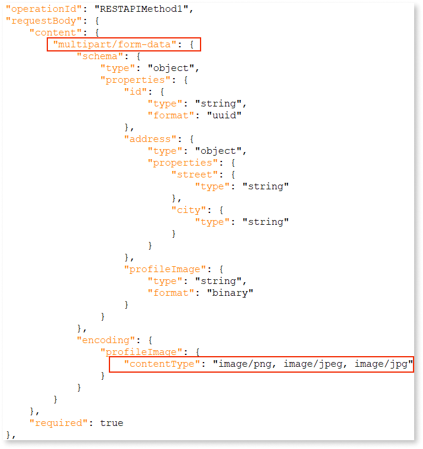
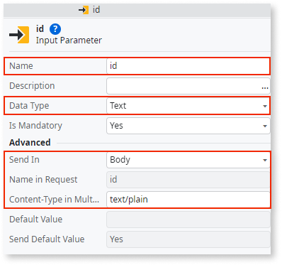
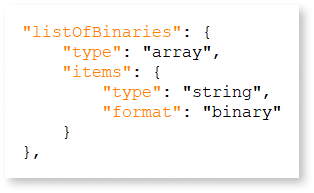
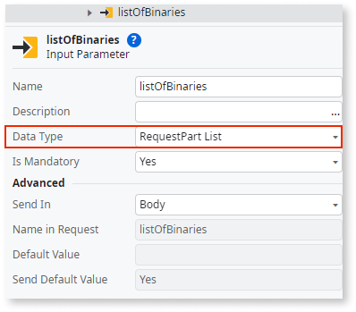
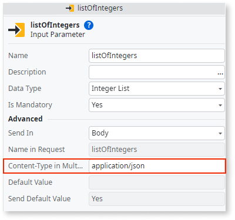
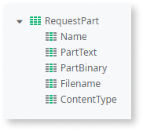
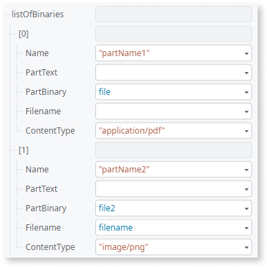

# Consuming a REST API with a multipart or form data method

## Prerequisites

* Platform Server 11.19.0

* Service Studio 11.53.40 

Multipart/form-data allows you to submit binary data and multiple data types in a single request. For example, you can use these requests for file uploads and transferring a file with a JSON object.

**Note**: To upload large files to your applications (not just when using REST APIs), you may need to increase the maximum request length allowed by the application server.
For more information, see [Altering file upload limits in OutSystems apps](https://success.outsystems.com/support/troubleshooting/application_runtime/altering_file_upload_limits_in_outsystems_apps/).

Multipart requests combine one or more data sets into the body of a single request, separated by boundaries. A boundary is a unique string used to distinguish between these different data sets known as parts. Each part has its own section in the payload with internal HTTP headers.

Consuming a multipart/form-data is a commonly used functionality in REST services. OutSystems supports this functionality as part of its native support of REST services. This means you can set the request format of a REST method to multipart/form-data. 

When the **Request Format**property of a method is set to **Multipart/form-data**, the method can receive multiple inputs sent in the body of the request. For each part defined in the OpenAPI specification of the REST API method you are consuming, Service Studio creates an input, with its **Send In** property set to **Body**. Each one of the input data types correspond to the data type of the part specified in the specification.  

For example, the OpenAPI specification below has the request set to multipart/form data with a list of parts (address, profileImage, and id) that have their content-type defined.

 

When you consume a REST API method, the corresponding fields, **Name**, **Data Type**, **Send In**, **Name in Request**, and **Content-Type in Multipart** for each part are automatically populated in Service Studio.

If a part is specified as a **Binary dynamic list**, there are as many parts as elements of the list with the data type automatically set to **RequestPart**.

 

If no content-type is specified for a part, the **Content-Type in Multipart** field is populated based on the type of schema properties. For example, if the specification contains a list of integers without the content-type defined, the field is automatically populated based on the type of the schema properties.

  

**Note**: You can set the data type of each input, **overriding** whatever value was originally there. This means that, in the case of a multipart/form-data method, you can, for example, change the data type of an input from **Integer** to **RequestPart**.

The **Content-Disposition** header associated with each part specifies  the name of the form field and the name of the file (if a file is being uploaded). Its format is **Content-Disposition: form-data; name="field_name"; filename="file_name"**. To avoid interoperability issues, both **"field_name"** and **"file_name"** must be in the ASCII encoding. Non-ASCII characters in headers are encoded using the MIME encoded-word syntax,  This format allows for the use of non-ASCII characters in headers if necessary. For more information, see the [TCP/IP Guide](http://www.tcpipguide.com/free/t_MIMEExtensionforNonASCIIMailMessageHeaders-2.htm). 

## RequestPart data structure

Whenever an API contains at least one method with its **Request Format** set to multipart/form-data, the **RequestPart** data structure is created. This structure is read-only, meaning it can't be modified through delete, copy, or cut operations. It’s also managed automatically by the REST plugin, which means that it’s deleted and recreated as needed.

You can use this structure if you want an arbitrary number of parts in the request. For each part (in this case, an item of the list) you can specify the name, the content-type and the filename (if it's a file). As mentioned before, when consuming a method with a binary list input using the Open API specification, the data type is automatically set to **RequestPart List**.

The following is an auxiliary data structure that represents a part and has a **Name**, **PartText**, **PartBinary**, **Filename**, and **Content-Type** properties.

 

These properties are useful if you want greater flexibility to modify the parts (Name, Filename, and Content-Type). Sending a dynamic number of files with different extensions is the typical scenario for using multipart/form-data. The following image demonstrates this scenario.

 

## Updating a multipart/form-data REST API method

You can update a multipart/form-data method like any other REST API method. To learn how to refresh a REST API or manually update a single method, see [Refresh a REST web service](refresh-rest-service.md#multipart). The manual update option allows you to manually add, edit or remove parts of a multipart/form-data method, as well as update the parts' data type or content type.  

## Testing a multipart/form-data REST API method

You can test a multipart/form-data method under the **Test** tab on the same window where you edit it. See [Consume one or more REST API methods](consume-a-rest-api.md) for more information on how to test REST API methods.

## Error handling

**Service Studio** runs several verifications whenever a REST web service sends a multipart request at development time. These include:  

* Invalid HTTP Method in multipart request (for example, PUT instead of POST)

* Invalid request format (for example, changing from a multipart request with multiple parts to JSON)

* Multipart request with zero parts 

* Multipart request with a single basic part

* Nameless single multipart request parts

* Multipart method with a JSON part, with the data type of the respective input set to something other than a structure or list

In case one of these verifications fails, an error displays on the **TrueChange** panel on **Service Studio**, stating the cause of the error and recommended mitigation steps.

## Callbacks

When consuming a REST API with callbacks, you can add logic to customize the information sent in requests or received in responses. Use the **OnBeforeRequest** callback to modify the information of the original request, such as the URL, request text, or headers. The callback receives an **HTTPRequest** structure representing the original request and produces a customized request. For more information on how to customize specific parts of a multipart/form-data request, see [Simple Customizations](simple-customizations.md#multipart).

Service Center log redaction is not supported when the request text property is changed inside the **OnBeforeRequest** callback.

