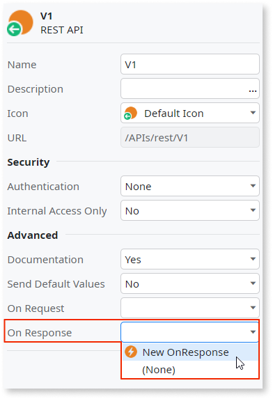

# Customize REST API Responses


OutSystems allows you to customize the information sent in responses when exposing a REST API.

For that, do the following:

1. In the **Logic** tab, open the **Integrations** folder.

1. In the exposed REST API, set the property **On Response** to `New OnResponse`.

    

1. Open the OnResponse callback action that's now available under the REST API.

1. Design the logic to customize the information of the response.

    

    You can get the text of the response by accessing the "ResponseText" attribute of the "Response" input parameter or its binary contents by accessing the "ResponseBinary" attribute.

    Make sure to set the "CustomizedResponse" output to the request after your preprocessing.

    <div class="info" markdown="1">

    The "ResponseText" and "ResponseBinary" attributes of the "Response" input parameter contain only the **response body** in serialized JSON format and in binary format, respectively. They don't include the headers that are part of the response.

    If you fill in the "ResponseText" attribute of the "CustomizedResponse" output parameter with some value, this is the response that's sent to the API client, even if you also set the "ResponseBinary" attribute.

    </div>

Once defined and configured in the REST API, OutSystems executes the OnResponse callback for **all methods** exposed by the REST API.

## Example use case

You can use the OnResponse callback to customize the response when an exception occurs. You may want to improve the default response, similar to the following:

```javascript
{
    "Errors": [
        "The 'Id' URL parameter is missing in the request.",
        "The request body is missing."
    ],
    "StatusCode": 400
}
```

You can provide a response with more detail, like in the following example:

```javascript
{
    "HTTPStatus": {
        "HTTPCode": 404,
        "developerMessage": "Not Found",
        "userMessage": "The server can not find the requested resource. In an API, this can mean that the endpoint is valid but the resource itself does not exist.",
        "errorCode": "404",
        "moreInfo": "For more information please visit https://en.wikipedia.org/wiki/List_of_HTTP_status_codes"
    }
}
```

Check the blog post [How to Implement HTTP Status Codes When Exposing a REST API in OutSystems](https://www.outsystems.com/blog/posts/implementing-http-status-code-exposing-rest/) and the application [REST HTTP Codes](https://www.outsystems.com/forge/component-overview/5547/rest-http-codes) in the OutSystems Forge for more information on implementing this example use case.
