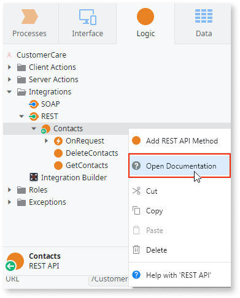
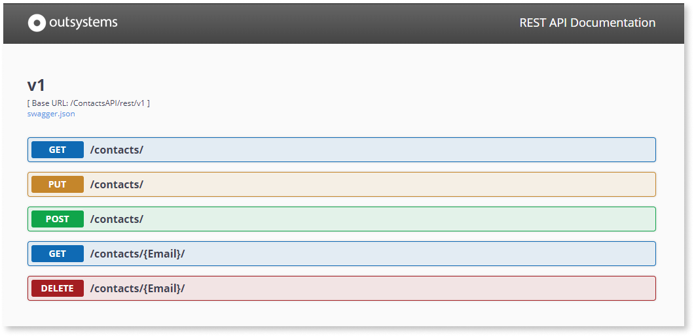
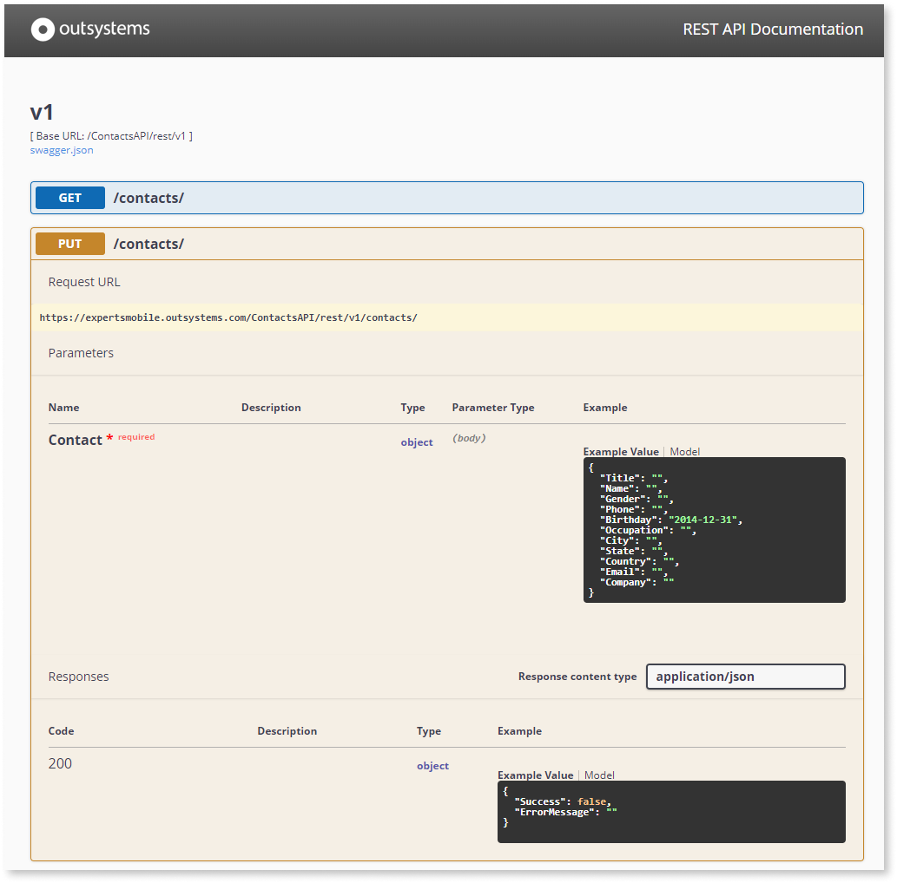

# Document an exposed REST API

Adding documentation to your REST API is essential as it helps developers to integrate their applications with your system.

OutSystems facilitates documenting your REST API by automatically generating the documentation when you publish the module. The platform generates the documentation from the properties of the REST API, the REST API methods, and their parameters. Subsequent changes to the exposed REST API (for example, when endpoints or parameters and added or changed) are automatically updated in the generated documentation.

Do the following:

1. In Service Studio, make sure that your REST API methods and their parameters have their "Description" property filled in. You can use [Markdown](http://daringfireball.net/projects/markdown/syntax) in the description to format the text.

1. Publish the module.

OutSystems publishes the documentation under the base URL of the REST API. To open it do the following:

1. In Service Studio, right-click the tree element of your REST API.

1. Choose **Open Documentation**.

    

The resulting documentation is a standard swagger. You can see a [live example of a Contacts REST API here](https://expertsmobile.outsystems.com/ContactsAPI/rest/v1/).

By expanding each of the endpoints, you'll be able to see details, like the request URL, parameters, examples, and responses:

