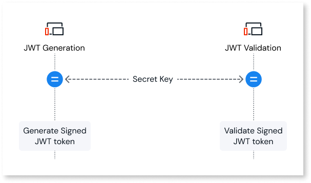
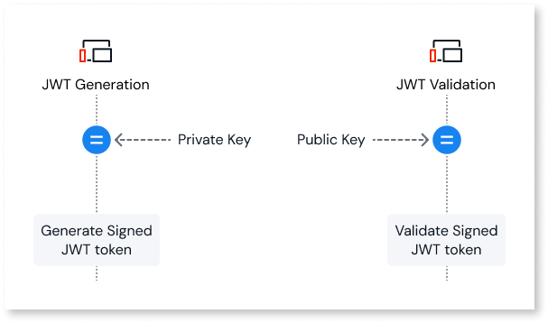

# Key management and JSON Web Keys (JWK)

To validate [JWT signatures](token-based-auth-expose-dev-pattern.md#JWT-structure), O11 exposed REST APIs need access to the appropriate cryptographic keys. Use **JSON Web Keys (JWK)** to represent these keys in a standard JSON format.

When you design key management for token-based authentication with JWTs, choose between symmetric and asymmetric signing.

## Symmetric (HMAC)

This method uses a single shared secret:

* The same secret key signs and validates tokens.
* Simpler to set up but requires sharing the secret with every API that validates tokens.
* Best suited for peer-to-peer scenarios where there are only a few trusted components.
* Typically used when only trusted server-side components validate tokens. The shared secret must never leave secure server-side storage.

## Asymmetric (RSA or EC)

This method uses a public/private key pair:

* The token issuer signs with a private key.
* APIs validate signatures with the corresponding public key.
* Better for multi-tenant or multi-consumer environments and for rotating keys without redeploying all APIs.
* Recommended when untrusted clients (such as browser or mobile apps) need to verify that a token hasn't been tampered with. Expose only the public verification key to those clients.

## JWK best practices

When you use JWKs to represent keys, follow these additional practices.

* **Use JWKs for key representation and rotation**
    * Store keys using the JWK format, either locally or exposed through a JWK endpoint.
    * Plan for **key rotation**:
        * Publish new keys alongside existing ones.
        * Allow APIs to accept tokens signed with both old and new keys during a transition period.

* **Separate keys for tokens and claims**
    * Use different JWKs for:
        * **Signing tokens** used for authentication and authorization.
        * Any keys you might use to encrypt or sign additional claims or payloads.
    * Never expose token-signing keys inside token claims or other user-visible structures. This separation reduces the blast radius if one key is compromised.

The exact storage mechanism for keys in O11 depends on your architecture. Common options include the following approaches.

* **Secret Site Properties** (Platform Server 11.25.0 and later): Store keys securely in Site Properties marked as secrets.
* **Configuration modules**: Store keys in encrypted entities or Site Properties.
* **External identity provider integration**: Retrieve keys from your identity provider's JWK endpoint.
* **Forge components**: Use community-supported components that abstract JWK parsing and validation logic.

For JWT token handling in O11, you can use the community-supported [JWT Token](https://www.outsystems.com/forge/component-overview/1853/jwt-o11) Forge component. This component isn't officially supported by OutSystems.

