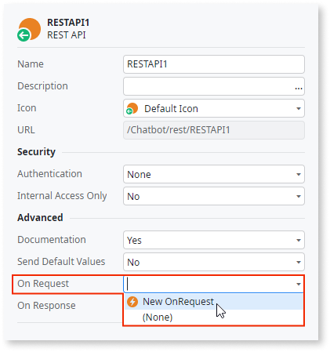
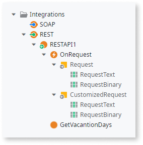

# Preprocess REST API Requests

OutSystems allows you to run logic before executing each request of an exposed REST API.

For that, do the following:

1. In the **Logic** tab, open the **Integrations** folder. 

1. In the REST API, set the property "On Request" to `New OnRequest`. 

    

1. Open the "OnRequest" callback action that is now available under the REST API. 

1. Design the logic to preprocess the request. 

    

    You can get the text of the request by accessing the "RequestText" attribute of the "Request" input parameter or its binary contents by accessing the "RequestBinary" attribute.

    Make sure to set the "CustomizedRequest" output to the request after your preprocessing.

Once defined and configured in the REST API, the "OnRequest" callback will be executed for **all methods** exposed by the REST API.
