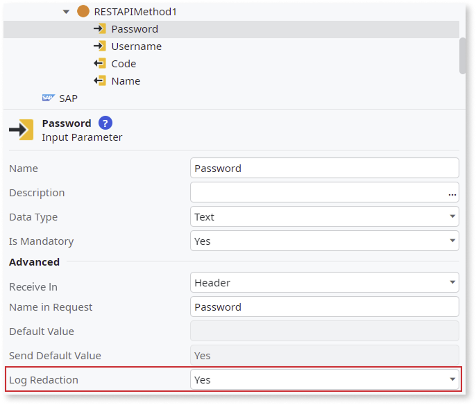
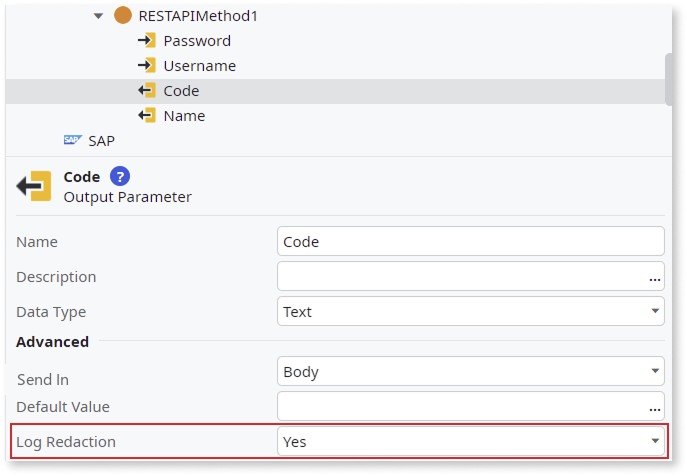
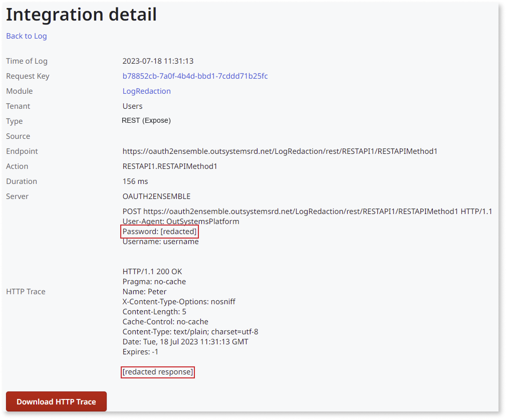

# Redacting information from REST API logs

When you set the [logging level](https://success.outsystems.com/documentation/11/extensibility_and_integration/set_the_logging_level_of_rest_and_soap_integrations/)
of a REST API to **Full**, OutSystems logs input and output parameter values. If
those values include sensitive data, use log redaction to hide them.

Log redaction prevents sensitive information from appearing in an exposed REST
API’s logs. You can redact input and output parameter values sent in the
header, body, or URL, and received in the header or body.

For example, if a request includes a username and password and the response
returns an access code, redact the **Password** input parameter and the
**Code** output parameter.

To redact the values of an input parameter, follow these steps:

1. In Service Studio, open the module that contains the exposed REST API.

1. In the element tree, expand the REST API, and then expand the REST API
   method that contains the input parameter you want to redact.

1. Select the input parameter, and set **Log Redaction** to **Yes**.

    

To redact the values of an output parameter, follow these steps:

1. In Service Studio, open the module that contains the exposed REST API.

1. In the element tree, expand the REST API, and then expand the REST API
   method that contains the output parameter you want to redact.

1. Select the output parameter (for example, **Code**), and set **Log
   Redaction** to **Yes**.

    

After you call the method, the integration logs show the redacted values.

In the logs, the **Password** and **Code** values appear as `[redacted]`.
