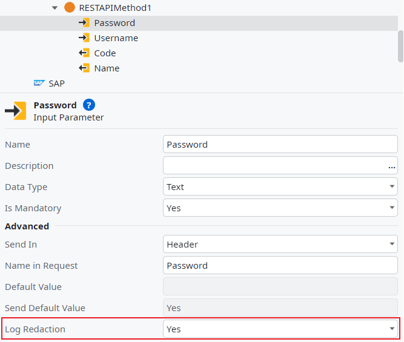
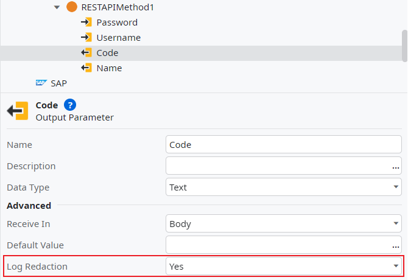
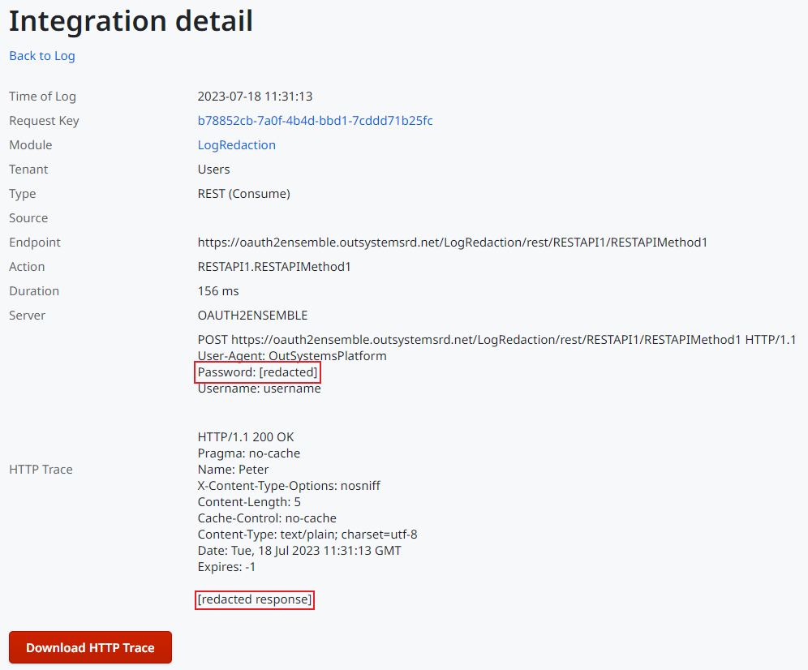

# Redacting information from REST API logs

When [setting the logging level](https://success.outsystems.com/documentation/11/extensibility_and_integration/set_the_logging_level_of_rest_and_soap_integrations/) of a REST API to **Full** the input and output parameter values sent/received are shown up in the logs. Nonetheless, in some cases, you may not want some values of the parameters to be displayed.

Log redaction allows you to redact sensitive information from a consumed REST API’s logs. Since sensitive information may be transmitted through inputs and output parameters it is possible to redact both input and output parameters sent in the Header, Body or Url and received in the Body or Header respectively. 

For instance, imagine if you have an API that sends a username and password as input parameters and receives a code which gives privileged access to a specific resource as output parameter. In that case, you may want to redact the Password input parameter and the code output.

To redact the values of a given Input Parameter from the logs, do the following:

1. In Service Studio, open the module containing the consumed REST API element.

1. In the element tree, expand the consumed REST element, and then expand the
   element for REST Method with the input parameter you want to redact from the
   logs.

1. Select the input parameter you wish to redact, and set its **Log Redaction**
   property to **Yes**.

    

Use the following steps to redact the values of a given Output Parameter from the logs:

1. In Service Studio, open the module containing the consumed REST API element.

1. In the element tree, expand the consumed REST element, and then expand the element for REST Method with the input parameter you want to redact from the logs.

1. Select the output parameter you wish to redact (in this case Code) , and set its **Log Redaction property** to **Yes**.

    

With this configured, performing a request at runtime the resultant logs will look like shown below. 

You can see that it’s not possible to see the values of the Password and the Code which meant they are both shown as **redacted**.
