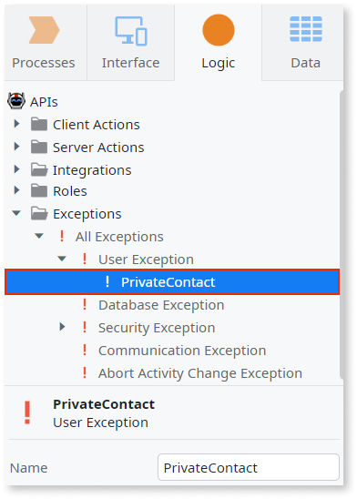
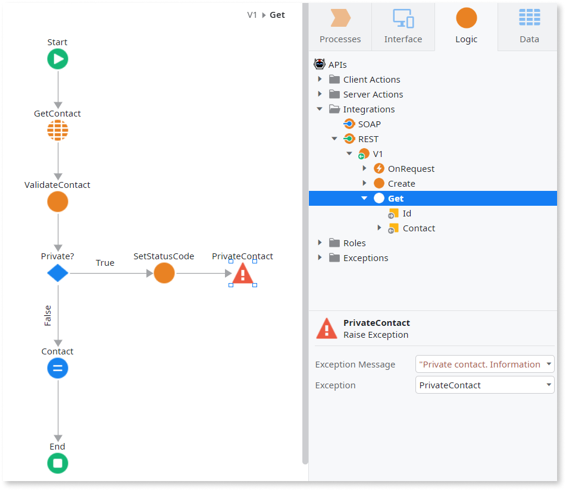

# Throw a Custom Error in an Exposed REST API

When a REST API method runs into an error, it's useful to send a meaningful error message to the client about what happened. Some problems are automatically handled by OutSystems, but you have the possibility to add custom error handling to your logic.

## Built-in error handling

When OutSystems receives a REST API request, it checks if the request is valid. If the **request isn't valid**, OutSystems performs the following:

1. Sets the [HTTP status code of the response](<../../../ref/integration-with-systems/rest-apis/exposed-rest-api/built-in-http-status-codes.md>) according to the type of the issue.
1. Adds an error message to the response body for each issue detected in the validation step.
1. Adds the HTTP status code to the response body.
1. Sends the response immediately to the caller, without processing the action flow defined for that request.

Example of a response body with errors:

```javascript
{
    "Errors": [
        "The 'Id' URL parameter is missing in the request.",
        "The request body is missing."
    ],
    "StatusCode": 400
}
```

If the REST API request is valid, OutSystems starts executing the action flow of the REST API method. If an **unhandled exception** occurs during the execution of the REST API method, the built-in error handler catches the exception and performs the following:

1. Rolls back any modification made to the database.
1. Sets the HTTP status code of the response to 500 – Internal Server Error.
1. Adds the error message of the raised exception to the response body.
1. Adds the HTTP status code 500 to the response body.
1. Sends the response to the caller.

## Throw a custom error

When developing your exposed REST API you may need to throw your own custom errors, different from the [built-in errors](<../../../ref/integration-with-systems/rest-apis/exposed-rest-api/built-in-http-status-codes.md>).

To throw a custom error in your REST API, do the following:

1. Create a User Exception for the custom error you want to throw.  

    

1. Go to the flow of the REST API method or the callback (such as OnAuthentication or OnRequest) where you want to throw the error and add a Raise Error element.

1. Set the Exception property to the User Exception you have created.

1. Set the Exception Message property to your custom error message.

1. If you want to send a custom error code, [set the HTTP Status Code of the response](<change-the-http-status-code-of-a-rest-api.md>) with your custom value. Otherwise, OutSystems returns an HTTP 500 status code.

    
