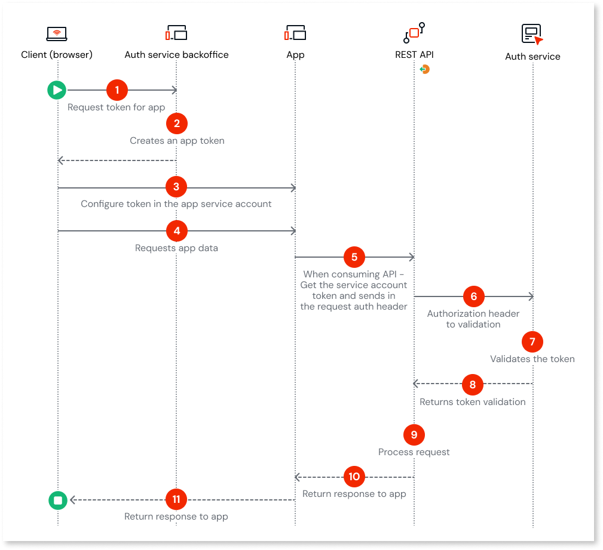
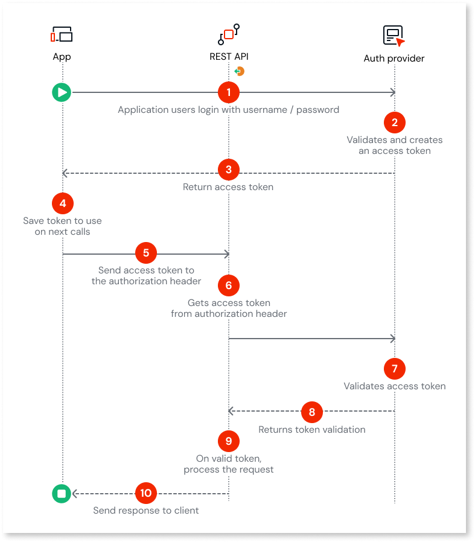
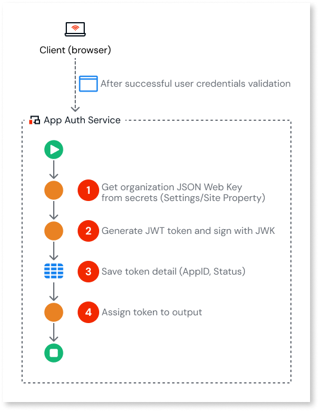
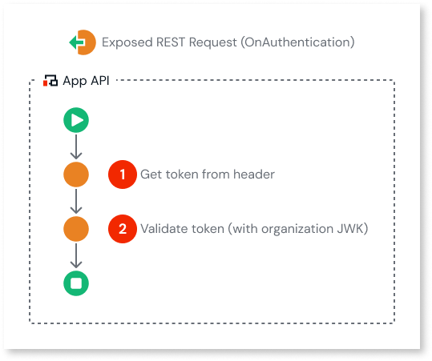

# Token-based authentication for exposed REST APIs

<!-- TODO: Replace the following paragraph with this text once logic interoperability is published:
When you expose business logic through REST APIs in OutSystems 11, you must protect your endpoints against unauthorized access. For logic interoperability between O11 and ODC and for other external integrations, **token-based authentication with JSON Web Tokens (JWT)** gives you a flexible way to authenticate callers and enforce authorization on every request.
-->
When you expose business logic through REST APIs in OutSystems 11, you should protect your endpoints against unauthorized access. **Token-based authentication with JSON Web Tokens (JWT)** gives you a flexible way to authenticate callers and enforce authorization on every request.

This article describes a **development pattern** for securing exposed REST APIs in O11 with JWT-based tokens. It focuses on what you need to design and validate rather than on specific implementation in Service Studio.

For more information about setting up custom authentication in Service Studio, refer to [Add Custom Authentication to an Exposed REST API](add-custom-authentication-to-an-exposed-rest-api.md).

<div class="info" markdown="1">

If you prefer to start from a prebuilt accelerator instead of implementing the pattern from scratch, consider using the [**O11 Service Account Manager – Secure Token Auth for ODC**](https://www.outsystems.com/forge/component-overview/23018/o11-service-account-manager-server-o11) Forge component (OutSystems 11, server-side).

This Forge component is a community-provided accelerator and **isn't officially supported by OutSystems**. Review the source code, perform a security assessment, and validate that it meets your organization's requirements before using it in production.

</div>

## When to use this pattern

Use this pattern when:

* You expose REST APIs from O11 that are consumed by:
    <!-- * ODC apps as part of logic interoperability. -->
    * Other internal systems that require strong authentication and authorization.
    * External partners that mustn't access your APIs with long-lived credentials.
* Your security architecture team requires:
    * Short-lived tokens instead of long-lived passwords or API keys.
    * Centralized authentication and authorization policies.
    * Clear separation between the component that issues tokens and the APIs that validate and enforce them.

## Choosing the right token flow

There are different ways to obtain tokens depending on whether you identify a user or an application:

| Scenario | Recommended flow | What it validates |
| :--- | :--- | :--- |
| **Only applications** access your API (machine-to-machine) | **Service account** | App identity |
| **Users** access your API via an application | **Credentials + Service account** | User credentials + App identity |
| **Users** access your API directly | **Credentials only** | User credentials only |

<div class="info" markdown="1">

The OutSystems platform (Platform Server 11.23.1 and later) includes built-in OAuth 2.0 client credentials flow support. For more details, refer to [Use OAuth 2.0 client flow authorization](../consume-rest-apis/rest-oauth2-authorization.md).

</div>

### Service account token flow

The service account token flow is the following:



1. **Request token**: The user requests a token for the app from the Auth Service Backoffice.
1. **Create token**: The Auth Service Backoffice creates an app token.
1. **Configure app**: The user configures the token in the client application's service account settings. This ensures the app can authenticate itself.
1. **Request data**: The user interacts with the app to request data (for example, clicking a "View Report" button).
1. **Call API**: The app retrieves the service account token and sends it in the `Authorization` header to the REST API.
1. **Validate request**: The REST API sends the `Authorization` header to the Auth Service for validation.
1. **Verify token**: The Auth Service validates the token.
1. **Return validation**: The Auth Service returns the validation result to the REST API.
1. **Process request**: The REST API processes the request.
1. **Return response**: The REST API returns the response to the app.
1. **Show data**: The app returns the response to the user.

### Credential-based token flow

In a credential-based flow, the client application authenticates on behalf of the user:



1. **Request login**: The app users login with username and password.
1. **Create token**: The auth provider validates and creates an access token.
1. **Return token**: The auth provider returns the access token to the app.
1. **Store token**: The app saves the token to use on next calls.
1. **Call API**: The app retrieves the service account token and sends it in the `Authorization` header to the REST API.

    ```http
    Authorization: Bearer <access_token>
    ```

1. **Validate request**: The REST API sends the `Authorization` header to the Auth Service for validation.
1. **Validate token**: The auth provider validate access token.
1. **Return validation**: The auth provider returns the token validation to the server API.
1. **Process request**: The server API, on valid token, process the request.
1. **Return response**: The server API sends the response to the app.

Different projects can implement the authentication side in different ways (externally with access tokens, or internally with JWT or custom tokens).

## JWT structure and responsibilities

This section explains how a JWT is structured and which responsibilities belong to the token issuer and to the exposed REST API.

### JWT structure {#JWT-structure}

A JWT is a compact JSON-based token that includes information the API uses to authenticate and authorize requests. The token has three base64url encoded parts, separated by dots (`Header.Payload.Signature`):

* **Header**: Identifies the signing algorithm and token type, for example:

  ```json
  {
    "alg": "HS256",
    "typ": "JWT"
  }
  ```

  In this example, `"alg": "HS256"` stands for the HMAC SHA-256 symmetric signing algorithm.

* **Payload (claims)**: Contains statements about the subject and context, for example:

  ```json
  {
    "sub": "user-or-client-id",
    "aud": "your-o11-api",
    "iss": "your-token-issuer",
    "exp": 1735689600,
    "scope": "customers.read",
    "tenant": "acme"
  }
  ```

* **Signature**: Cryptographic signature over the header and payload that protects integrity and authenticity.

  Example of a symmetric HMAC SHA-256 signature:

  ```text
  HMACSHA256(
    base64UrlEncode(header) + "." +
    base64UrlEncode(payload),
    secret
  )
  ```

### Responsibilities of the token issuer and API

The pattern splits responsibilities between the **token issuer** and the **O11 exposed REST API**:

* Token issuer:
    * Authenticates the user or client.
    * Assembles the claims required by your security architecture.
    * Signs the token with a private key or shared secret.
    * Applies **short token lifetimes** and rotation policies.
* O11 exposed REST API:
    * Validates the signature and signing algorithm.
    * Verifies standard claims:
        * `iss` (issuer) is trusted.
        * `aud` (audience) matches this API or logical API group.
        * `nbf` (Not Before): Specifies the earliest point in time when the token can be accepted. Think of it as a "do not open until" stamp.
        * `exp` (Expiration Time): This claim specifies the time after which the token must not be accepted.
        * Together, `nbf` and `exp` define the valid window for the token. The token is only considered valid if the current time is on or after the `nbf` time and before the `exp` time.
    * Applies business-specific checks:
        * Scopes or roles in the token are allowed to execute the requested method.
        * Tenant or customer identifiers match the request context.

Ensure the token payload contains only the minimum claims necessary to make authorization decisions. Avoid putting sensitive data directly in the token.

Even though clients can base64-decode a JWT, ensure they don't treat the claims as trusted data unless they can validate the token signature with the appropriate key. In particular:

* Don't rely on client-side checks alone to enforce access control; always validate the token and its claims on the server side.
* Avoid putting critical or sensitive information in signed but unencrypted tokens, especially when tokens are accessible to browser or mobile code.
* If you must transmit sensitive data inside a token, use an encrypted JWT (JWE) in addition to a signature, and keep validation and decryption server side.

## Key management and JSON Web Keys (JWK)

For detailed guidance on designing and managing JWT signing keys for this pattern, refer to [Key management and JSON Web Keys (JWK)](key-management-and-json-web-keys.md).

## Applying the pattern in O11 exposed REST APIs

This pattern separates two roles, similar to a hotel where you show identity at the front desk (Token Issuer) to get a room key, and later only present the key at the room door (Protected API).

* **Token issuer (App Auth Service)**: Authenticates the client and issues a token.
* **Protected API (Exposed REST API)**: Validates the token on every request before executing any logic.

### App Auth Service: issuing tokens

The App Auth Service acts as the "front desk". It authenticates the client and issues the token.



1. **Get Organization JSON Web Key from Secrets**: Retrieve the signing key (for example, from a secure Site Property or an encrypted entity).
1. **Generate JWT token**: Use a JWT action to create the token payload with required claims (sub, aud, exp) and sign it using the retrieved key.
1. **Save token detail**: Store relevant token metadata (such as AppID and Status) in an entity for tracking or revocation purposes.
1. **Assign token output**: Return the generated signed token to the caller.

### Exposed REST API: validating tokens

The exposed REST API acts as the "room door". It validates the token on every request. In O11, exposed REST APIs support a request pipeline where you can plug in this logic using the **OnAuthentication** callback. For the exposed REST API, you must set **Authentication** to `Custom`.

 The exposed REST request (OnAuthentication) logic is the following:



1. **Get token from header**: In the `OnAuthentication` action, read the `Authorization` header from the incoming HTTP request and extract the token value (removing the `Bearer` prefix).

    **Implementation tip:** Use `GetRequestHeader` from the `HTTPRequestHandler` extension to read the Authorization header:

    ```
    HeaderValue = GetRequestHeader("Authorization")
    Token = Replace(HeaderValue, "Bearer ", "")
    ```

1. **Validate token**: Verify the token signature using the organization's public key or secret. Check that claims like `iss`, `aud`, and `exp` are valid. If validation fails, raise an exception to stop the request.
1. (Optionally) **Apply authorization rules**: Map token claims to permissions required by the REST method.

### Error handling

When token validation fails, the API should return an appropriate HTTP status code:

* **401 Unauthorized**: Token is missing, expired, or has an invalid signature.
* **403 Forbidden**: Token is valid but lacks required scopes or permissions.

In O11, raising an exception in `OnAuthentication` automatically returns HTTP 401. For custom status codes, use `SetStatusCode` from the `HTTPRequestHandler` extension before raising the exception. For more details about defining custom authentication logic, refer to [Add Custom Authentication to an Exposed REST API](add-custom-authentication-to-an-exposed-rest-api.md).

## Security best practices for JWT token-based APIs

When you implement this pattern, apply the following security best practices:

* **Use short token lifetimes**
    * Prefer access tokens with lifetimes measured in minutes, not hours or days.
    * Combine short-lived access tokens with refresh tokens when the identity provider supports them.
    * Avoid issuing long-lived tokens that effectively behave like passwords.

* **Limit token scope and claims**
    * Include only the information needed to authorize calls, such as user or client identifier, audience, scopes, and tenant.
    * Avoid sensitive personal or business data in the payload; tokens are usually only base64url encoded, not encrypted.

* **Plan for revocation**
    * Revoke tokens proactively when:
        * A user logs out or a session ends.
        * A password or second factor changes.
        * Suspicious activity is detected (for example, impossible travel or unusual device).
    * Consider maintaining a short-lived deny list for revoked tokens when your threat model requires it.

* **Protect tokens in transit and at rest**
    * Always expose REST APIs over HTTPS, and don't accept plain HTTP. In O11, configure **HTTP Security** to `SSL/TLS` in the exposed REST API properties.
        * Use [AI Mentor Studio](../../../monitor-and-troubleshoot/manage-tech-debt/code-patterns/ref-code-patterns.md#exposed-rest-services-are-not-secured) to scan for exposed REST services without proper security.
    * If you log or store tokens anywhere, mask them in logs and encrypt them before persisting to prevent leakage. In O11, use an application-level encryption mechanism such as the `Encrypt` action from the **CryptoAPI** Forge component so that you store only ciphertext in the database. Decrypt any stored values only inside trusted server-side logic when strictly needed.

    <div class="info" markdown="1">

    The **[CryptoAPI](https://www.outsystems.com/forge/component-overview/437/cryptoapi-o11)** Forge component is community-supported and **not officially supported by OutSystems**. Perform a security audit before using in production. For compliance-critical scenarios, refer to [Implement encryption and decryption for HIPAA compliance](../../../building-apps/data/hipaa/intro.md).

    </div>

* **Defend against replay attacks**
    * Combine short token lifetimes with server-side checks where appropriate.
    * For high-risk operations, consider additional checks based on device, IP, or context.

## Related resources

* [Expose REST APIs](intro.md)
* [Add Custom Authentication to an Exposed REST API](add-custom-authentication-to-an-exposed-rest-api.md)

<!-- TODO: Add link to the ODC "Token-based authentication pattern for consumed REST APIs" article once it's available in the ODC documentation. -->
