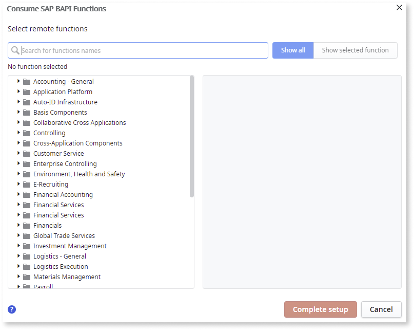
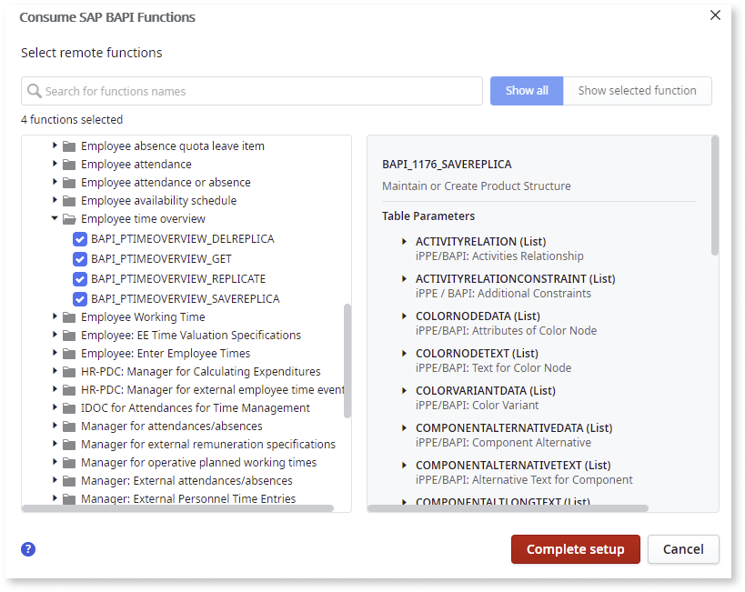

# Integrate with a SAP System

OutSystems allows you to fetch or update data in a SAP system and use it in your applications.

## Prerequisites

* Your infrastructure is associated with an [OutSystems Edition](https://www.outsystems.com/pricing-and-editions/) that isn't the Free Edition.
* For self-managed infrastructures, SAP Connector Libraries must be installed. See the installation checklist of your [Platform Server version](https://www.outsystems.com/Downloads/search/Platform+Server/11/) for further instructions.

## Create a connection to an SAP system from your application

1. On the **Logic** tab, open the **Integrations** folder.

1. Right-click **SAP** and select **Consume SAP Remote Functions (BAPI)**.

    A window to configure the SAP connection is displayed.

1. Fill in **Connection details** and **Login** parameters of your SAP system.

    These will be the default credentials of your SAP connection, which can be redefined later.

    

1. Click **Connect to choose functions**.

    Your connection details and login parameters are tested:

    1. If the connection is successful, you are redirected to the **Select remote functions** screen.

        

    1. If your connection fails, an error dialog is displayed. You can expand the dialog to find out more about what's causing the error.

        

## Import SAP remote functions

Once you've established a connection to SAP, you can now import SAP functions to use in your application. The remote functions are grouped by business use case and SAP functionality.

1. On the **Select remote functions** screen, select the SAP functions you want to use in your app.

    Clicking on the function name displays the description, input, and output parameter details on the right-hand panel.

    

1. Click **Complete setup**.

    When you complete the setup, the following is created:

    * Creates the SAP connection you have configured

    * Creates the actions for the remote functions you have selected

    * Creates the Structures to hold the parameters

    

On the **Logic** tab, go to **Integrations** > **SAP**. You can now use the newly created actions in your application the same way you use any Server Action.

### SAP Remote Functions Flow

When a SAP Remote Function is called from your OutSystems application, the following flow is executed:

1. **OnBeforeConnection():** This callback allows you to implement different SAP authentication methods using the [SAP Extensibility API](<../../ref/apis/sap-extensibility-api.md>), such as Logon Tickets or certificates.
1. **Connect to SAP & Begin Context:** The connection to SAP is established using the default credentials (if no different authentication is defined), and a context for calling the SAP remote function is started in SAP.
1. **OnBeforeCall():** This callback allows you to customize the values to be sent to SAP.
1. **Call SAP Remote Function:** Executes the remote function in the SAP System.
1. **OnAfterCall():** This callback allows you to customize the values returned by SAP.
1. **Commit/Rollback & End Context:** The changes executed in the SAP system are committed and the context in SAP is ended. If an error occurs, changes are rolled back.

To call multiple SAP remote functions and have all changes committed only at the end, use [SAP Stateful Calls](<execute-sap-stateful-calls.md>).

### Authentication

When integrating with SAP, by default, OutSystems uses the credentials you provided when you created the connection to the SAP system. These credentials are used for all SAP remote functions defined under that SAP connection. If you want to use distinct credentials for specific SAP remote functions, you can create a new connection to consume those functions.

You can also use different credentials using one of the following authentication methods:

* **Configure a different connection by environment:** For each SAP Connection in your module, you can [configure a different connection at runtime](<configure-a-sap-connection-at-runtime.md>), which overrides the default connection. This allows your application to use specific SAP systems in certain environments, without having to change or republish the module.

* **Dynamic Login:** Specify the authentication credentials at runtime through the application logic. All SAP remote functions under the connection will require user credentials. A possible use case is, for example, when modifying data in the SAP system. To implement dynamic login, select **Add Dynamic Login** from the context menu of the SAP Connection.

* **Custom:** Use [SAP Extensibility API](<../../ref/apis/sap-extensibility-api.md>) to implement other authentication methods, for example, SAP Logon Tickets or certificates. This method uses the 'OnBeforeConnection()' callback to customize the connection.
