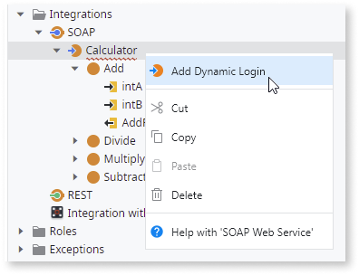

# Configure Web Service Authentication

When consuming SOAP Web Services, OutSystems doesn't use any type of authentication by default.

There are several ways to specify the service authentication method and user credentials:

Configure Basic Authentication in Service Studio
:   In Service Studio configure the service "Authentication" property to `Basic Authentication` and specify user credentials (username and password). OutSystems uses these credentials throughout all your infrastructure environments, unless overridden in Service Center (see below).

Use Dynamic Login in Service Studio
:   Specify the authentication credentials at runtime in your application logic. After setting up Dynamic Login in your SOAP Web Service in Service Studio, all its methods have input parameters for specifying user credentials (username and password).  

   To add dynamic login capabilities to your consumed SOAP Web Service, select "Add Dynamic Login" from the context menu of the SOAP Web Service element. This option is only available when the SOAP Web Service's "Authentication Type" property value is different than `(None)`.

   

Configure a different endpoint by environment in Service Center
:   In Service Center you can [configure a different endpoint URL or user credentials at runtime](<configure-runtime.md>) for each consumed SOAP Web Service in your module, overriding the default endpoint and user credentials defined in Service Studio.  
    Note: You can't change the authentication type, only the endpoint URL and the user credentials.

Use advanced extensibility to set up client certificate authentication
:   Follow the instructions provided in the [client certificate example](<./extensibility-use-cases/certificate.md>) to learn how you can perform SOAP web service authentication using a client certificate.
