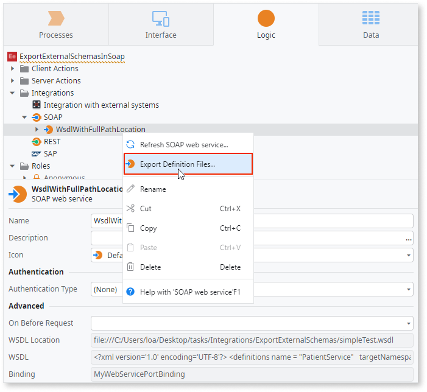
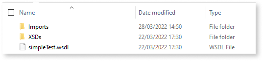

# Export definition files in a SOAP web service

Consuming a SOAP Web Service in **Service Studio** is generally a seamless and trouble-free experience. There are cases, however, when developers want more information about a particular web service or need to make some modifications in order to make it conform to **OutSystems** requirements, such as:

* An unsupported SOAP use case in the service definition
* A pattern that leads to an internal error in **Service Studio** or in the **Platform Server**
* An XML response that is not compliant with the service definition

A SOAP Web Service is defined by a WSDL, a Web Service Description Language .xml file. A WSDL may reference other WSDL files and schema files (.xsd files). This article describes how to use the SOAP **Export Definition Files** option of **Service Studio** to download all of the files of a consumed SOAP web service.

## Examining local SOAP WSDL files

SOAP web services are generally consumed by specifying the URL of the Web Service definition (WSDL), as explained in [Consume a SOAP Web Service](https://success.outsystems.com/Documentation/11/Extensibility_and_Integration/SOAP/Consuming_SOAP_Web_Services/Consume_a_SOAP_Web_Service). However, a developer may not have access to the web service for a number of reasons, including:

* The user deleted the files
* The developer does not have internet access
* The developer no longer has access to a private network where the service is available

A developer who doesn’t have access to the web service can use the SOAP **Export Definition Files** option to examine the SOAP web service in order get more information about how it works, as described in the section below.

### Exporting definition files { #exportingdefinitionfiles }

1. In the Logic tab, right-click the consumed SOAP service and select **Export Definition Files…** from the context menu.

    

1. Choose a folder to place the definition files. Aside from the .WSDL file itself, you may see an XSDs folder with schema files and an Imports folder with imported WSDL files.

    

1. Examine the files using a text editor. When you are done you may continue to use the SOAP web service in the design of your app.

When you export definition files to your local drive all schema locations are converted from URLs to relative paths.

For example, the original SOAP definition file might include the following code for the schema location:

```xml
    <xs:schema targetNamespace="http://example/simpleTest">
        <xs:import namespace="http://example/SchemasimpleTest" schemaLocation="http://example/simpleTest?xsd" />
```

After the export the locations have been converted to relative paths, as in the schema location below.

```xml
    <xs:schema targetNamespace="http://example/simpleTest">
        <xs:import namespace="http://example/SchemasimpleTest" schemaLocation="XSDs\simpleTest.xsd" />
```

## Unsupported use cases

When you import a SOAP Web Service, you receive immediate feedback if it has an unsupported feature or use case. Depending on the error, it is often possible to make changes to the definition files in order to use it as desired.

See [Unsupported SOAP Use Cases](https://success.outsystems.com/Documentation/11/Extensibility_and_Integration/SOAP/Consuming_SOAP_Web_Services/Unsupported_SOAP_Use_Cases) for more information.

<!--See Enabling Service Studio OSTraces for SOAP web services’ consumption for additional information about troubleshooting more complex issues with SOAP web services.-->
