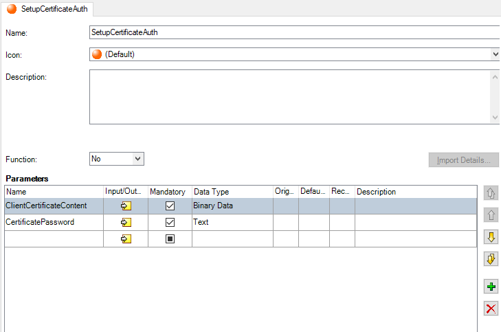

# Authenticate using a client certificate

In this example scenario we will add support for authenticating SOAP requests using a client certificate.

**Notes:** 

* The binary contents of the client certificate can be retrieved in several ways: from a disk file (for example, a `*.pfx` file), directly from the machine certificate store, from the database, from a blob on cloud storage, etc. The extension action presented in this example assumes that the binary data of the certificate is already available in an OutSystems application, such as in a local variable or as an output parameter of a function call.

* If the client certificate you're using was signed by an intermediate CA (Certificate Authority) and not a root CA, **you must install** the certificate for this intermediate CA in every front-end server of the environment. The servers must contain the certificates for every CA in the certificate chain, from intermediate CAs to the root CA. To request the installation on OutSystems cloud environments check [this document](https://success.outsystems.com/Support/Enterprise_Customers/Maintenance_and_Operations/Requesting_to_install_client-side_certificates_on_OutSystems_cloud) and for self-managed environments follow [these instructions](https://success.outsystems.com/Support/Enterprise_Customers/Maintenance_and_Operations/Installing_client_side_certificates_on_on-premises_environments) instead.

Do the following:

1\. In Integration Studio create an extension and define an action that will set up the client certificate authentication.  

In the following example, we defined an action in Integration Studio called "SetupCertificateAuth", with a "ClientCertificateContent" input parameter of type Binary Data, and a "CertificatePassword" input parameter of type Text.



2\. Click 'Edit Source Code .NET'. In Visual Studio .NET, set the project target framework and add a reference to the `System.ServiceModel` assembly.  

3\. Enter the code below, replacing the `MssSetupCertificateAuth` function placeholder that Integration Studio created for you:  

```csharp
// required 'using' statements at the beginning of the file
using System.Security.Cryptography.X509Certificates;
using System.ServiceModel;
using System.ServiceModel.Channels;
using OutSystems.SOAP.API;

/* ... */

// replace the 'MssSetupCertificateAuth' function placeholder with the following code
public void MssSetupCertificateAuth(byte[] ssClientCertificateContent, string ssCertificatePassword) {
    ISOAPClient client = SoapRequest.GetCurrentClient();

    // configure binding to accept certificates
    var binding = client.Endpoint.Binding;

    if (binding is BasicHttpBinding) {
        ((BasicHttpBinding)binding).Security.Transport.ClientCredentialType = HttpClientCredentialType.Certificate;
    } else if (binding is CustomBinding) {
        var httpsElement = ((CustomBinding)binding).Elements.Find<HttpsTransportBindingElement>();
        if (httpsElement != null) {
            httpsElement.RequireClientCertificate = true;
        }
    }

    // add certificate to the client
    var cert = new X509Certificate2(ssClientCertificateContent, ssCertificatePassword);
    client.ClientCredentials.ClientCertificate.Certificate = cert;
} // MssSetupCertificateAuth
```

4\. Quit Visual Studio .NET and, back in Integration Studio, publish the extension by clicking the "1-Click Publish" toolbar icon or by pressing `F5`.

5\. In Service Studio, add a reference to the "SetupCertificateAuth" action of your extension in your application module.  

6\. In the flow of the SOAP callback of your SOAP Web Service (the flow of "OnBeforeRequestAdvanced"), drag the "SetupCertificateAuth" action to the flow. 

7\. Provide the binary contents of the certificate in the "ClientCertificateContent" parameter and the certificate password in the "CertificatePassword" input parameter.  
_Note:_ The certificate used to authenticate the client must include a private key, and will likely be protected by a password.

8\. Publish the application module and test the application, checking that the requests made to the consumed SOAP Web Service are correctly authenticated with the provided client certificate.
