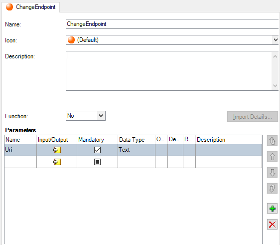

# Change service endpoint at runtime

In this example scenario we will add support for changing the SOAP web service endpoint at runtime.

Do the following:

1\. In Integration Studio create an extension and define an action that will handle the endpoint change.  
In example below we defined an action in Integration Studio called "ChangeEndpoint", with a "Uri" input parameter of type Text.



2\. Click 'Edit Source Code .NET'. Set the project target framework and add a reference to the `System.ServiceModel` assembly.  
Enter the code below, replacing the `MssChangeEndpoint` function placeholder that Integration Studio created for you:  

```csharp
// required 'using' statements at the beginning of the file
using System.ServiceModel;
using OutSystems.SOAP.API;

/* ... */

// replace the 'MssChangeEndpoint' function placeholder with the following code
public void MssChangeEndpoint(string ssUri) {
    var client = SoapRequest.GetCurrentClient();
    client.Endpoint.Address = new EndpointAddress(ssUri);
}
```

3\. Quit Visual Studio .NET and, back in Integration Studio, publish the extension by clicking the "1-Click Publish" toolbar icon or by pressing `F5`.

4\. In Service Studio, add a reference to the "ChangeEndpoint" action of your extension in your application module.  

5\. In the flow of the SOAP callback of your SOAP Web Service, i.e. the flow of "OnBeforeRequestAdvanced", drag the "ChangeEndpoint" action to the flow and enter the desired web service endpoint value in the "Uri" input parameter.

6\. Publish the application module and test the application, checking that the endpoint is correctly set at runtime.
