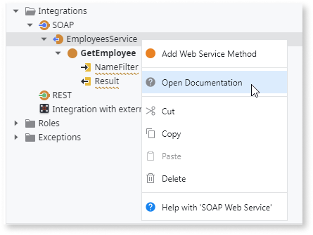

# Document an Exposed SOAP Web Service

Adding documentation to your SOAP Web Service is essential as it helps developers to integrate their applications with your system.

OutSystems facilitates documenting your SOAP Web Service by automatically generating the documentation when you publish the module. The documentation text is based on the "Description" property of the SOAP Web Service and its methods.

Do the following:

1. Fill in the "Description" property of the SOAP Web Service and the SOAP Web Service Methods.
1. Publish the module.

After publishing, the documentation is available under the module URL at `<ModuleName>/<WebServiceName>.asmx`.

To open the SOAP Web Service documentation, right-click the tree element of your SOAP Web Service in Service Studio and select **Open Documentation**.

Note: The description of the Input and Output Parameters of the Web Service Methods is not used for documentation purposes.
