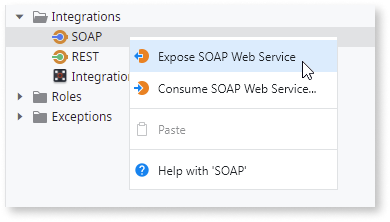
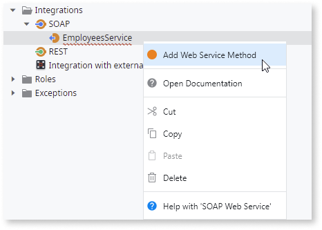

# Expose a SOAP Web Service

To expose a SOAP Web Service, do the following:

1. In the **Logic** tab, open the **Integrations** folder.

1. Right-click the SOAP element and select **Expose SOAP Web Service**.

    

1. Set the name of your SOAP Web Service and the remaining properties.

1. If you want to set a specific namespace for your SOAP Web Service, set it in the "Web Services Namespace" property of the module.

1. Right-click your new SOAP Web Service and select **Add Web Service Method**.

    

1. Set the name of your method.

1. Design the logic of your Web Service Method.

When you publish your module, the following happens:

* The actions of exposed SOAP Web Services are translated into methods in the WSDL, with the same name and description.
* The data types used by these actions are [mapped into XML data types](<../../../ref/integration-with-systems/soap/exposed-soap/mapping-outsystems-to-xml.md>) in the WSDL.

Also:

* Your exposed SOAP Web Service and its documentation will be available at:  
    `http://<hostname>/<ModuleName>/<WebServiceName>.asmx`

* The WSDL of the exposed SOAP Web Service will be available at:  
    `http://<hostname>/<ModuleName>/<WebServiceName>.asmx?WSDL`

* The SOAP Web Service will be exposed using a document/literal WSDL with both SOAP 1.1 and SOAP 1.2 bindings.
