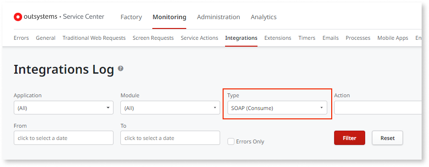
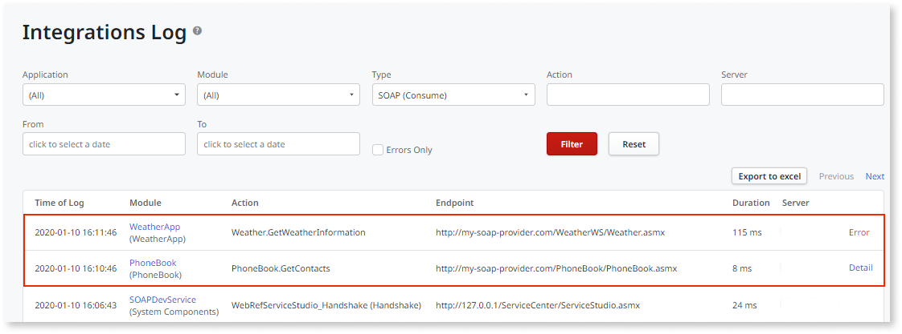

# Troubleshoot a SOAP Web Service

OutSystems keeps track of all requests and responses of both exposed and consumed SOAP Web Services in your application. These log entries can be viewed in the OutSystems environment management console (Service Center).

You can configure the detail level of the logs that OutSystems keeps for each consumed SOAP Web Service, for example increasing the logging level of a given SOAP Web Service while troubleshooting an issue. Check [Set the logging level of REST and SOAP integrations](../log-levels-set.md) for more information.

## View SOAP Web Service Logs

To access the logs of your SOAP Web Service, do the following:

1. Go to the Service Center management console of your OutSystems environment.

1. Go to the **Monitoring** section and select **Integrations**.

1. In **Type**, filter the logging you want to see: `SOAP (Consume)` or `SOAP (Expose)`.

    

1. Click **Filter**.

1. To see the details of a log entry click on the **Detail** link (or, if there was an error, on the **Error** link) displayed on the right to get detailed information.

    
