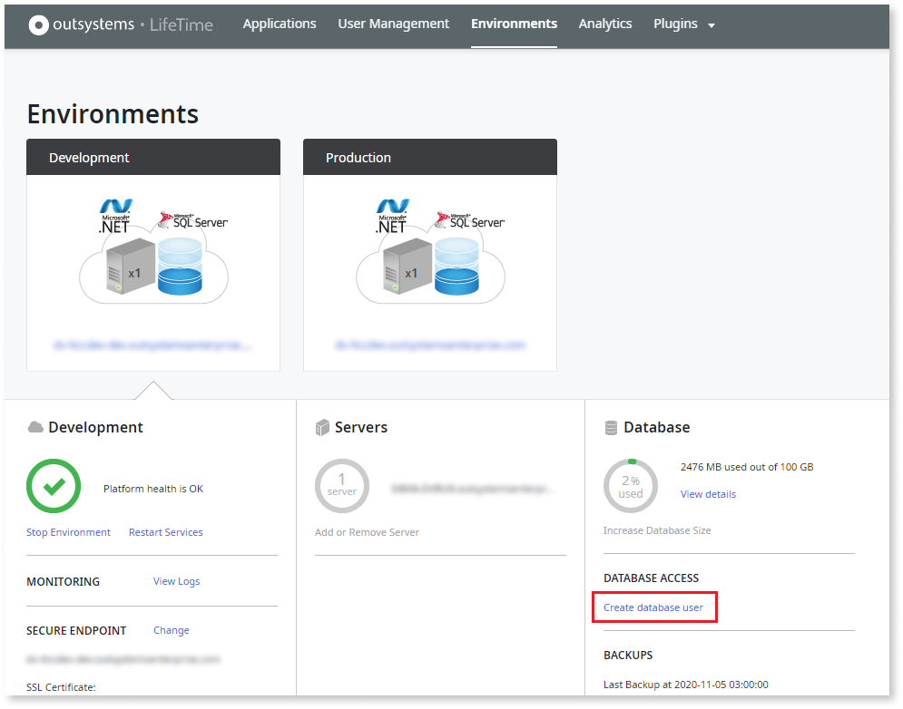
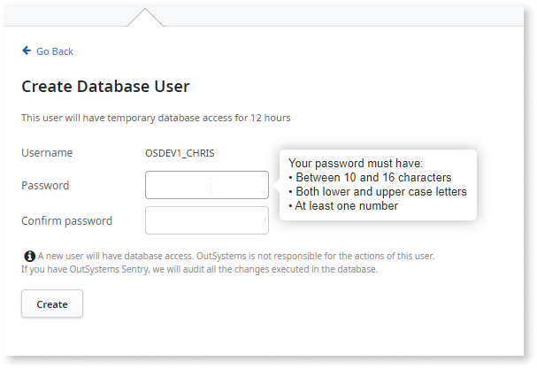
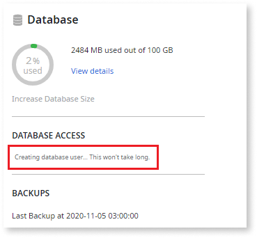
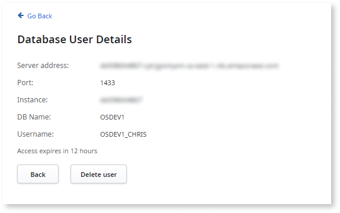

# Access the database of your OutSystems Cloud

This topic details how you request direct access to the OutSystems Cloud databases of your subscription using OutSystems 11.

Check in the [Service changes available upon request](https://www.outsystems.com/legal/success/cloud-services-catalog/) if the Direct database access service is available for your OutSystems Cloud edition.

## Direct database access to your OutSystems Cloud

To accommodate the need for reading or altering data directly in the database, such as advanced integration scenarios or troubleshooting needs, you may request direct access to your OutSystems Cloud databases.

You can request database access in two different ways:

* Using a **temporary** database user
* Using a **permanent** database user

You can then use tools such as SQL Server Management Studio or Oracle SQL Developer to access the database. You can use any tool that's compatible with the database management system.

The direct database access user does not have backup privileges.

### Temporary database user

Temporary database users are only available on OutSystems Cloud running **LifeTime Management Console 11.7.5 or later**.

Temporary users are perfect for ad-hoc troubleshooting tasks. Being nominal and temporary, they're the most secure option, ensuring that only legitimate users can carry on with this privileged access to data.

You can request a temporary database user in **self-service** through the LifeTime console and therefore this database access is immediately available when you need it. OutSystems creates a database user, with [read and write](#read-write) credentials, that's valid for **12 hours**.

OutSystems establishes the connectivity from your private network to the database through **network tunneling**. Therefore, you must have a [VPN](../../setup-infra-platform/setup/vpn/vpn-support.md) or [AWS Transit Gateway](../../setup-infra-platform/setup/connect-tgw/connect-tgw.md) connection already in place for your OutSystems Cloud.

### Permanent database user

Permanent users are a valid option for integration with other systems when you need automated and regular data synchronization with the OutSystems Cloud database.

For permanent database users, OutSystems allows you to connect in two different ways:

* Connect to the database server from **any IP address of your private network**. You must establish this connection through [VPN](../../setup-infra-platform/setup/vpn/vpn-support.md) or [AWS Transit Gateway](../../setup-infra-platform/setup/connect-tgw/connect-tgw.md).

* Connect to the database server from a set of public static IP addresses, allowlisted on the OutSystems side.

OutSystems can provide you with one [read-only](#read) and one [read and write](#read-write) credentials per environment, according to your needs.

To request a permanent database user, you must [contact OutSystems Support](https://www.outsystems.com/tk/redirect?g=A82EA0CB-B101-4F08-BCFB-77559EF63801).

### Having temporary and permanent users simultaneously

In case you need to have simultaneously a **temporary** and a **permanent** database user, the **permanent database user** must connect to the database server from **any IP address of your private network**, through VPN or AWS Transit Gateway. Once OutSystems establishes a network tunnel from your private to OutSystems Cloud, it’s not possible to keep your public static IP addresses allowlisted on the OutSystems side.

## Request a temporary database user

### Before you begin

To request a **temporary database user**, make sure that:

* Your LifeTime Management Console on OutSystems Cloud is running on version 11.7.5 or later.

* A [VPN](../../setup-infra-platform/setup/vpn/vpn-support.md) or [AWS Transit Gateway](../../setup-infra-platform/setup/connect-tgw/connect-tgw.md) connection is already in place for your OutSystems Cloud.

* If you already have a **permanent user** accessing a database of your OutSystems Cloud, that user connects from **any IP address of your private network**, through VPN or AWS Transit Gateway. OutSystems can't keep your public static IP(s) allowlisted in OutSystems Cloud.

* You have the **Administrator** role in LifeTime.

### Request the temporary user

To request a **temporary database user**, do the following:

1. In your LifeTime console (`https://<lifetime_env>/lifetime`), go to the **Environments** area.

1. Select the environment for which you want to request the database access.

1. Under the **DATABASE ACCESS** section, click the **Create database user** link.

    

1. Choose a password for the new temporary user and confirm it. The password can't contain the following characters: `"`, `'`, and `;`. Make sure you store this password, as it won't be possible to retrieve it.

    

1. Click the **Create** button. Wait some seconds for the user creation.

    

This operation creates a nominal database user for the IT user that's currently logged in LifeTime, with [read & write](#read-write) credentials. This database user is valid for 12 hours.

Once having the user created, the link **Database user details** becomes available under the **DATABASE ACCESS** section. Click that link to see the details of the database user:

As OutSystems doesn’t store the password of this database user, in case you forget the user password, you must delete the current user and create a new one.

### Delete a temporary database user

To delete a **temporary database user**, do the following:

1. In your LifeTime console (`https://<lifetime_env>/lifetime`), go to the **Environments** area.

1. Select the environment for which you want to delete the database user.

1. Under the **DATABASE ACCESS** section, click the **Database user details** link.

1. Click the **Delete user** button.

## Request a permanent database user

### Before you begin

To request a **permanent database user**:

* You must be a **company administrator** or an **infrastructure administrator** for your [company's account](https://www.outsystems.com/tk/redirect?g=5bd7f106-3784-4821-a603-0ad0c0fd8f82).

* In case you plan to request temporary database users also, your permanent database user must connect to the database server from **any IP address of your private network**, through VPN or AWS Transit Gateway. It isn't possible to establish a network tunnel from your private network and allowlist your static IP(s) in OutSystems Cloud at the same time.

### Request the permanent user

To request a permanent database user, [open a support case](https://www.outsystems.com/tk/redirect?g=A82EA0CB-B101-4F08-BCFB-77559EF63801). Make sure you include the following information in the support case description:

* Identify the **environments** to which you require database access, by providing either their name or their address.

* Specify whether you require **read-only** or **read and write** access.

* Indicate **how you want to connect** to the database:

    * Via VPN - You can request a new VPN or use one that’s already active.

    * Via AWS Transit Gateway - If you are already connecting to your OutSystems Cloud using this service.

    * IP allowlisting - Indicate the public static IP(s) allowed to connect. Choose this option only if you aren't planning to request temporary database users.

* Provide a contact number that can receive the SMS to retrieve the password.

Following up on your support case, OutSystems:

* Establishes the connectivity according to your chosen preference - via VPN, AWS Transit Gateway, or IP allowlisting.

* Provides you a file with the database address and username, and communicates the password via SMS.

## Granted permissions

Depending on your database management system, check below the permissions granted for **read-only** or **read and write** set of credentials.

### Read-only credentials {#read}

For SQL Server:

* SELECT over all database tables and views
* SHOWPLAN
* VIEW DATABASE STATE
* VIEW SERVER STATE

For Oracle:

* SELECT over all database tables and views
* SELECT ANY DICTIONARY

All database tables and views include all OutSystems tables (both metamodel tables and application tables), and the database management system tables.

### Read and write credentials {#read-write}

Read and write database credentials grant all the permissions of read-only and add the below credentials.

For SQL server:

* INSERT, UPDATE, DELETE on application tables

For Oracle:

* INSERT, UPDATE, DELETE on application tables

**Application tables** - Tables created by the Platform Server when you create entities in Service Studio. These tables use the prefix OSUSR.
