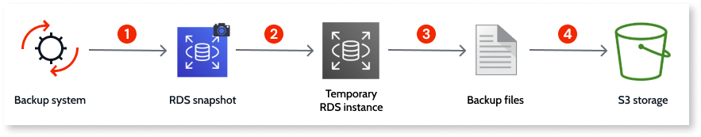

# Long-term backup retention for OutSystems Cloud

OutSystems long-term backup retention (LTBR) requires the subscription of an add-on. Please contact your OutSystems account team for more information.

LTBR service is currently available for OutSystems Cloud infrastructures with a SQL Server database.

OutSystems long-term backup retention (LTBR) enables organizations in highly regulated industries to retain data for much longer than the OutSystems Cloud [default retention period](temporary-access-database-backup.md). This add-on provides backup retention from 1 to 10 years with on-demand data access, so you can meet mandatory compliance and audit requirements without building custom, third-party workarounds.

## How it works

The LTBR service backs up your OutSystems Cloud production database, which runs as an [Amazon RDS](https://aws.amazon.com/rds/) instance, and provides access to the restored backups on your request.

This service backs up the production database only. The following are **not included**:

* Application code, platform configurations, and runtime files
* Remaining OutSystems Cloud environments, such as development or QA

The following diagram shows how the long-term backup retention pipeline works. Find below the description of each step.

1. On a monthly basis, OutSystems automatically takes an RDS snapshot of your production database.

1. A temporary RDS instance is spun up from that snapshot. Because this is an infrastructure-level operation, it has zero impact on your live production database performance.

1. A [native backup](https://docs.aws.amazon.com/AmazonRDS/latest/UserGuide/SQLServer.Procedural.Importing.html) runs on the temporary RDS instance to produce full backup files (`.bak` files).

1. These backup files are then moved to secure, isolated, and tamper-proof [S3 storage](https://aws.amazon.com/s3/), where they are retained for your contracted retention period. Recent backups stay in optimized storage for faster retrieval.

Once the contracted retention period ends, the data is automatically deleted.

## Requesting access to a backup

To request access to a backup [open a support case](https://www.outsystems.com/tk/redirect?g=A82EA0CB-B101-4F08-BCFB-77559EF63801), indicating the **single target month** you want to retrieve.

The LTBR service includes 4 retrievals per year.

## Accessing the requested backup

OutSystems provisions a temporary, isolated RDS instance loaded with your stored backup. Consider the following when accessing the restored backup:

* Access can take up to 24 hours to provision, depending on the backup's age.

* You connect directly to this temporary RDS instance through a secure connection and load the required data into your own custom database, data warehouse, or S3 bucket.

* The temporary RDS instance has a lifespan of 1 month. After this period, the environment and all temporary access credentials are automatically decommissioned and purged.
