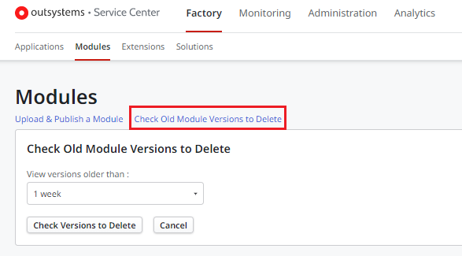

# Best practices for a tidy and clean environment

As your factory of applications grows, it consumes more resources (for example: disk space, database, etc.). It’s important that you keep your environments tidy and clean so it doesn’t slow down your devops performance. Although you can always improve the processing power and infrastructure capacity, this usually brings additional costs.

With a clean environment, you can eliminate a:

* Performance degradation in deployment and publishing.
* Slow down in your teams performance
* Negative impact to LifeTime and Service Center performance

This article explores the different types of operations that may be consuming unnecessary resources and guide you on different ways to clean it. Also, it addresses some other common issues that you should pay attention to and how to prevent these as much as possible.

## Module versions

Manage module versions is one of the most relevant actions as it has an impact on several tasks of the application development (open modules, adding/removing references, publish).

Each time you publish a module, it creates a new version in your environment. Versions are especially useful if you need to rollback to a previous stage of your development.
However, as the application continues to grow, if you keep a high publish rate, you’ll soon end up having hundreds or thousands of versions, and you may start experiencing some slowness on your daily development tasks.

Because of that, it's important in Development environments, to regularly clean up old module versions that you don’t need anymore. You can  delete old module versions directly via Service Center or using the DbCleaner API, that provides functionality for freeing up database space.

### Delete old Module versions using Service Center

1. Navigate to Service Center `https://<YOUR_ENVIRONMENT>/ServiceCenter`
1. Click on the Factory tab
1. Click on the Modules submenu option. Then click the Check Old Module Versions to Delete link
1. Choose the time period to delete, and click the Check Versions to Delete button
1. A list of the module versions displays (list limited to 100 records)
1. Proceed by clicking Delete Displayed Versions

### DbCleaner API

You can also implement your own solution, allowing a more flexible clean up of old modules, using the DbCleaner API actions:

* [ModuleVersion_ListOldest](https://success.outsystems.com/documentation/11/reference/outsystems_apis/dbcleaner_api/#moduleversion_listoldest): Returns a list of module versions that are stored in the database and that were published before the specified date and time. This action doesn't return the module version that's currently published nor module versions used in tagged versions of applications or solutions.
* [ModuleVersion_Delete](https://success.outsystems.com/documentation/11/reference/outsystems_apis/dbcleaner_api/#moduleversion_delete): Deletes the specified module version of the specified module from the database.
* [ModuleVersion_DeleteAll](https://success.outsystems.com/documentation/11/reference/outsystems_apis/dbcleaner_api/#moduleversion_deleteall): Deletes module versions that were published before the specified date and time. This action doesn't delete the module version that's currently published nor module versions used in tagged versions of applications or solutions.

In both cases, be aware that only the module versions not associated with tagged Application or Solution versions are deleted. This way, if you have the need to rollback the application to a previous version, it’s guaranteed that the code isn't lost.

## Solution versions

Solutions aggregate sets of modules in the environment. If you have created Solution versions that you don’t need anymore, you can delete them in Service Center.

1. Navigate to [Service Center](https://success.outsystems.com/Support/Enterprise_Customers/Licensing/Overview/How_to_access_your_OutSystems_Platform) (https://YOUR_ENVIRONMENT/ServiceCenter)
1. Click on the Factory tab
1. Click on the Solutions submenu option
1. Navigate to a specific Solution detail screen
1. In the Versions tab, select the version to delete
1. Proceed by clicking the Delete button

Once you delete the Solution version, you can then delete the module version associated with it, as described in the [Module versions](#module-versions) section.

## Application tagged versions

In case you are confident that you won’t need to rollback to a specific [tagged version](https://success.outsystems.com/documentation/11/managing_the_applications_lifecycle/deploy_applications/tag_a_version/), you can also delete application versions.
Since LifeTime Management Console Release Feb.2019, [LifeTime API v2](https://success.outsystems.com/documentation/11/reference/outsystems_apis/lifetime_api_v2/) provides a method to delete an application version if it's not “InUse”.

` DELETE /lifetimeapi/rest/v2/applications/{ApplicationKey}/versions/{VersionKey}/ `

A sample implementation of the API can be found in the Forge Component [Lifetime Tag Manager](https://www.outsystems.com/forge/component-overview/11095/lifetime-tag-manager).

Once you delete the tagged application version, you can then delete the module version associated with it, as described in the [Module versions](#module-versions) section.

## Temporary test Modules

While developing applications your team may need to create some temporary test modules, proof of concept (POC’s), and often deploy and test some Forge components.
All these modules are useful during the implementation phase, but soon they may become obsolete, and you will end up having unused code in your development environment.
It's a best practice, as part of a regular Factory management, to clean/delete these modules from the environment. You can delete the whole application or individual modules.

Delete Application

1. Navigate to [Service Center](https://success.outsystems.com/Support/Enterprise_Customers/Licensing/Overview/How_to_access_your_OutSystems_Platform) (https://YOUR_ENVIRONMENT/ServiceCenter)
1. Click on the Factory tab
1. Click on the Applications submenu option
1. Navigate to a specific Application detail screen
1. Proceed by clicking the Delete button

Delete Module

1. Navigate to [Service Center](https://success.outsystems.com/Support/Enterprise_Customers/Licensing/Overview/How_to_access_your_OutSystems_Platform) (https://YOUR_ENVIRONMENT/ServiceCenter)
1. Click on the Factory tab
1. Click on the Modules submenu option
1. Navigate to a specific Module detail screen
1. Proceed by clicking the Delete button

## Application data

Application data is basically all the information that's stored in the database Entities of your applications. This includes the data that you'll be adding during the unit testing as well as deleted Entities and Attributes of the data model.

### Test data

Especially in the development environment is common to have test/dummy data. This is the result of the developers’ tests during the development of different features. Although this data isn't critical for the application to run, it’s common that this data to grow and sometimes may even have some inconsistencies, being useful to clean it from time to time.
With OutSystems, you don’t need to have access to the database to perform these cleaning operations. Check [How to delete data from Entities](https://success.outsystems.com/documentation/how_to_guides/data/how_to_delete_data_from_entities/) to implement your own delete data logic.

### Entities and Attributes

When you delete Entities and Attributes in your applications, OutSystems doesn't delete the corresponding table or column in the database. Your data is safely stored just in case you want to rollback your application. If you feel that those entities and attributes are no longer used, then it’s a best practice to delete them, thus freeing database space. For that OutSystems provides the DbCleaner API methods:

* [Attribute_ListDeleted](https://success.outsystems.com/documentation/11/reference/outsystems_apis/dbcleaner_api/#attribute_listdeleted): Returns a list of attributes, with their information, that have been deleted from module’s meta model but are still physically present in the database.
* [Attribute_DropColumn](https://success.outsystems.com/documentation/11/reference/outsystems_apis/dbcleaner_api/#attribute_dropcolumn): Physically deletes the database table column associated to the specified entity attribute. If the entity attribute still exists in a module's meta model, the delete operation it's not performed.
* [Entity_ListDeleted](https://success.outsystems.com/documentation/11/reference/outsystems_apis/dbcleaner_api/#entity_listdeleted): Returns a list of entities, with their information, that have been deleted from module’s meta model but are still physically present in the database.
* [Entity_DropTable](https://success.outsystems.com/documentation/11/reference/outsystems_apis/dbcleaner_api/#entity_droptable): Physically deletes the database table associated to the specified entity. If the entity still exists in a module's meta model, the delete operation isn't performed.

## Processes

Business Process Technology (BPT) Processes can also be consuming unnecessary database space. It’s common that you launch some processes to test the functionality when you are developing.
To clean all the logged information of old processes, OutSystems provides the [BPT API](https://success.outsystems.com/documentation/11/reference/outsystems_apis/bpt_api/) methods:

* [Process_Delete](https://success.outsystems.com/documentation/11/reference/outsystems_apis/bpt_api/#process_delete): Deletes all the logged information of an instance of a top level Process, which must be either terminated or closed.
* [Process_BulkDelete](https://success.outsystems.com/documentation/11/reference/outsystems_apis/bpt_api/#process_bulkdelete): Deletes all the logged information of instances of top level Processes that have terminated or closed before the given date.

Add them as references on your application and invoke them to delete old instances.

In cases where large amounts of data is consistently generated in the database through the use of BPT processes, it may come to a point that remedial action is necessary to ensure smooth, continued functionality.For self-managed infrastructures using SQL Server, refer to [Reseeding identity values in BPT tables - SQL Server](https://success.outsystems.com/documentation/11/developing_an_application/use_processes_bpt/reseeding_identity_values_in_bpt_tables_sql_server/).

## Emails

Such as Processes, Emails can also be consuming unnecessary database space. This is especially relevant as emails can have attachments, sometimes quite big (>1MB).
To clean email information, OutSystems provides the [Emails API](https://success.outsystems.com/documentation/11/reference/outsystems_apis/emails_api/) so you can easily implement your cleaning mechanism.

## Logs

[Log information](https://success.outsystems.com/documentation/11/managing_the_applications_lifecycle/monitor_and_troubleshoot/logging_database_and_architecture/) reflects the lifecycle of accesses to applications by end users or external systems. There are two log types:

* Top-level logs (Screen, Integration, Mobile Request, Cyclic Job)
* Drill logs (Error, General, Integration, Extension)

The design of the log model aims to have minimal interference in the application runtime and even in the Development environment their impact is somehow controlled with the [rotation of the logs](https://success.outsystems.com/documentation/11/managing_the_applications_lifecycle/monitor_and_troubleshoot/logging_database_and_architecture/the_log_tables_and_views/).
Every week the Log Service truncates one of the weekly tables to clear space from the database and allow new logs to be inserted when the time for that table to be used again comes.

While delete logs isn't a supported action, from OutSystems 11 you can [store log data in a separate database](https://success.outsystems.com/documentation/11/setup_and_maintain_your_outsystems_infrastructure/setting_up_outsystems/keep_outsystems_log_data_in_a_separate_database/), reducing the impact that log-writing operations could have on running applications while application data is being accessed.

## Additional considerations

This article guides you across the multiple components that consume space on the database of the Development environment, explaining how you can clean unnecessary data, without the need to directly access the database itself.

While you can apply these best practices ad hoc, without limitations, you should also have in mind the maintenance plans of an on-premises installation type and that this shouldn't be just a one-time concern.

### Cloud vs On-Premises

While the **above clean-up options are valid on both installation types**, there are some additional actions that you can perform on-premises as you are the responsible to maintain the infrastructure.

If you have a development environment installed **on-premises**, besides having more flexibility with the database (allowing you to truncate data for example), you should also consider a regular maintenance of the file system of your servers. Refer to the [Guide to disk space usage and control on OutSystems servers](http://www.outsystems.com/goto/disk-space-usage-guide) to understand how to do it.

### Automate the clean-Up

The clean-up of the Development environment should be a regular concern, and not just an on-time task because you are experiencing some issues ("better safe than sorry").
With that in mind, a possible approach is to implement a periodic clean-up logic (using [OutSystems Timers](https://success.outsystems.com/documentation/11/developing_an_application/use_timers/create_and_run_timers/)), that can address the different components described in this article.

If you don’t want to create your clean-up solution from scratch, you can explore the components available on the OutSystems Forge. Search for “cleaner” or “database space” and you’ll find some different options from OutSystems Community members.

## Other common issues

Not every issue you have is data related. In this section you can find other common issues that you should make sure to have in control.

### Control LifeTime users

Over time, developers come and go to an from your team or organization. Without even noticing, you may end up at a point where you don’t even know which of your LifeTime Users are still there, which aren't, and which you should deactivate.

Thus, it's recommended that:

1. You implement a process for **Lifetime Users onboarding** for the team/organization (user creation, permissions settings, etc.) and another process for when the **users leave** or no longer need access. At that time, you should revoke or revise their permissions and roles or even deactivate them.

1. On a frequent basis (for example, every month), you should access the list of all active users and validate whether any of them shouldn't be there.

You can access the list of your users through the LifeTime of your environment, in the User Management tab. You can read more about user management in the [Manage IT Users page](https://success.outsystems.com/documentation/11/managing_the_applications_lifecycle/manage_it_users/).

### Keep your development environment updated

You should always keep your Development Environment (containing tools like Service Studio or Integration Studio) updated. The updates include patches to known issues, improve the stability of your software, and remove outdated features.

Also, you should guarantee that all your team members are using the same version of the Development Environment, since using different versions inside a team can lead to unexpected behaviors.

You can check the last stable version of the OutSystems development tools in the [OutSystems software downloads page](https://www.outsystems.com/downloads/).

### Keep all your Forge components and versions documented

With more than 3000 apps available on OutSystems Forge, you likely have several of these components installed in your environment. Most probably, you have dozens of them. Managing all these components all the time may be a huge pain.

Along the way, you release several versions of the apps, while the number of your business apps dependent on these components increases. In this situation, it becomes very difficult to update a component to the latest version, as it impacts several applications, and you begin to lose track of which applications are using a component.

So, it's extremely important to have all these different components documented with some relevant information, such as, but not limited to:

* Date of Installation
* Version installed
* Owner of that component - the person or team in your organization accountable for its lifecycle

This documentation allows you to have all the information about all the Forge components you have on your factory in one place. With it, it's very easy to know what you have, and what components and versions are out of date or even depreciated.

Following this process, it's also recommended that you keep your components updated as much as possible, to avoid upgrading the component with several major versions in it, which is always a harder process.

### Have a backup of your mobile repositories

With the growing number of mobile apps built with OutSystems, comes the increased use of mobile plugins, which allow you to easily add new features to your app without implementing them from scratch.

Almost every mobile plugin has its code hosted in an external repository like GitHub or BitBucket. It's a good practice to have backups of your code, **including code hosted outside your organization**, like these Plugins.

Implement a regular process to back up this code so that you don't become dependent on them, in case anything unexpected happens.

## Monitoring tips to control/alert housekeeping needs

Besides going through the actions that you may take to maintain your environment, preventing potential problems is the way to go. It's much easier and cheaper to know an issue is to about to occur before it occurs, as you can then act to prevent it.

Therefore, it's a good idea to keep track of what's happening in your factory. To do it, you can develop a set of automated reports that can warn you about the imminence of critical issues. Some examples are:

* **Size of the bigger applicational tables in your database** - Identify tables that are bigger than they should be so that you can act on it. For example, implement a strategy of [Data Archiving](https://success.outsystems.com/documentation/best_practices/architecture/data_archiving/) or even delete data you no longer need.

* **Size of the Log Tables** - The default rotation period of one week may not be adequate in your environment. Please take a look at [log tables and views](https://success.outsystems.com/documentation/11/managing_the_applications_lifecycle/monitor_and_troubleshoot/logging_database_and_architecture/the_log_tables_and_views/) to know more about the log tables and rotation period.

* **Size of the Email and Process Log tables** - While Log tables are rotated, Email and Process Logs aren't. These tables continue growing indefinitely. To avoid this untenable growth, please consider deleting older data. If you can’t delete it, archive that data in a separate table/database.

* **Tables not used anymore** - When deleting a Module, its physical tables aren’t deleted from the database. They're kept there to enable future rollbacks if necessary. However, if you are sure you won’t need the data from those Tables anymore, you can drop them both to keep your database smaller and to keep it tidy and clean.
Please note that if for any reason you need to deploy an app that was already deleted together with the Tables, the Tables will be recreated. The only thing you won’t recover is the data that was inside them.

Some components on the [Forge](https://www.outsystems.com/forge/) already have some of these housekeeping tasks implemented, while others also have some automated ones. The following table gives you guindance on Forge components with some out of the box housekeeping tasks:

Keep in mind that, as good practice, you should always validate if the components still have these features before using it. Also, note that it's the OutSystems community that develops these components, and they **are not** supported by OutSystems. If you want to know more about it, check the [Forge FAQs](https://success.outsystems.com/support/forge_components/forge_faqs/curating_projects/).

### Clean up log tables after upgrade to OS11

In OS11, log tables no longer live inside the same database catalog as all other tables. From the moment you upgrade, log information is written to a different catalog, leaving the old log tables with the data they had.

If you don't truncate those tables, they can keep consuming useless disk space from your database. You can truncate the tables by using a simple SQL query or by accessing directly to the database.
