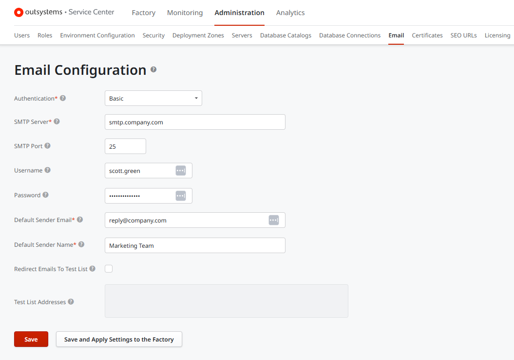
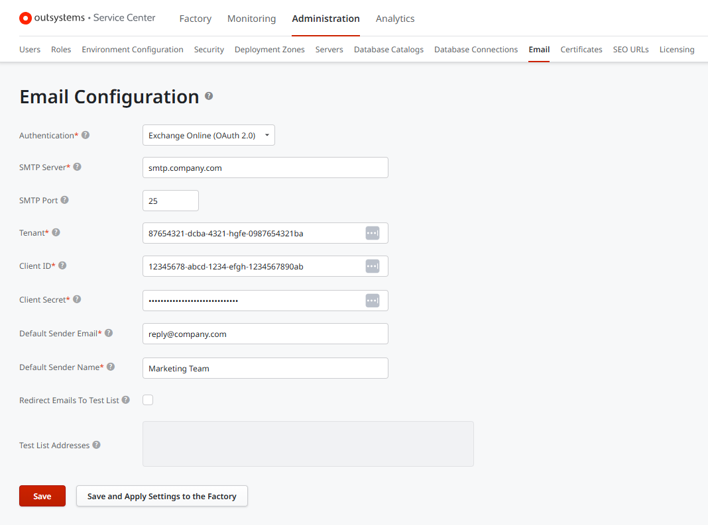
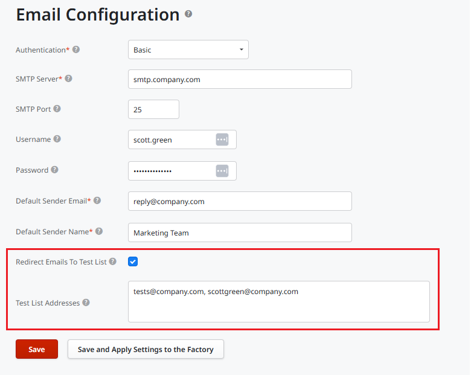
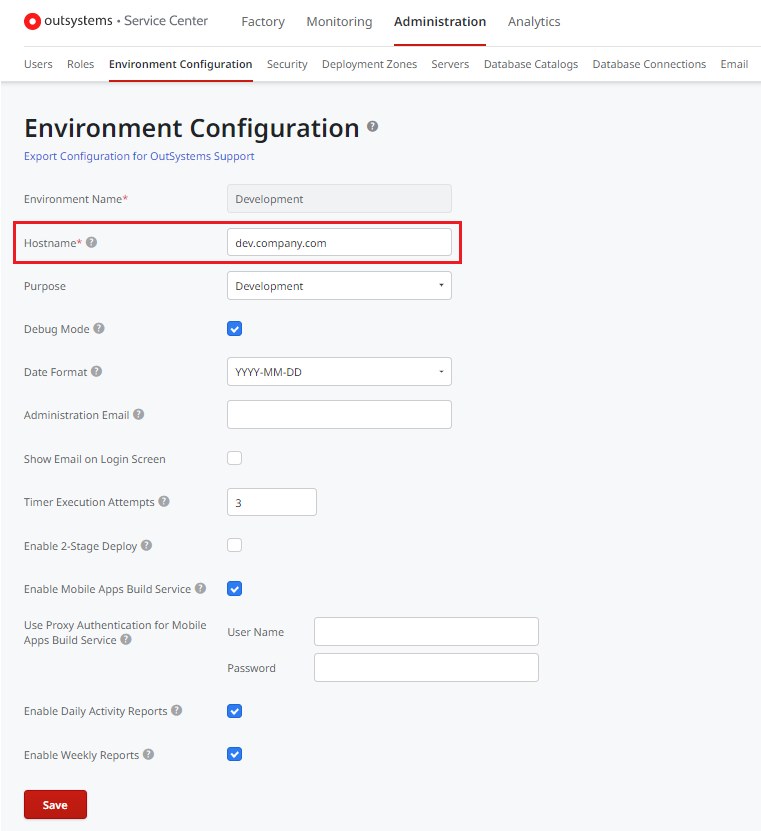

# Configure OutSystems to Send Emails

OutSystems lets you send emails from your apps via the Simple Mail Transference Protocol (SMTP). Configuring SMTP is an environment-wide configuration, so you can choose a different email provider for each environment.

## Configuring the SMTP server

To configure SMTP in the environment, follow these steps in **Service Center**:

1. Go to **Administration** > **Email**.
1. Enter the information about the SMTP server (for example smtp.gmail.com).
1. Click **Save**.

To check if the SMTP is properly configured, try sending an email from an existing application.

Not sure how to access Service Center? If your environment URL is `outsystems.example.com`, try visiting `outsystems.example.com/ServiceCenter` and entering you sign in information from the Service Studio IDE.

For the default sender email address or the actual from address, be sure to use your domain address (like example.com) or your email server domain name. OutSystems uses DMARC authentication, and adding *.outsystemsenteprise.com as the from field might cause email servers to flag your emails as spoofing.

### Configuring SMTP Authentication

OutSystems provides authentication mechanisms that can be selected by using the Authentication dropdown:

* **Basic:** Can be configured with or without a username and password, depending on your SMTP server.

* **Exchange Online (OAuth 2.0):** Provides a more secure authentication method and is the recommended alternative to Basic Authentication. This option was introduced to overcome the [Deprecation of Basic authentication in Exchange Online](https://learn.microsoft.com/en-us/exchange/clients-and-mobile-in-exchange-online/deprecation-of-basic-authentication-exchange-online).

Configuring OAuth 2.0 requires the following information, which must be obtained from your email provider (e.g. Azure Active Directory):

* **Tenant:** The ID of your organization's tenant/directory.
* **Client ID:** The application (client) ID of the provider with permissions to use Exchange Online.
* **Client Secret:** The application confidential key.

The Exchange Online (OAuth 2.0) authentication method is configured in Service Center and requires Platform Server 11.34.0 or later.

## OutSystems SMTP port options

OutSystems supports SMTP ports 25, 465, and 587. To avoid potential throttling issues with port 25,  OutSystems recommends using port 587 for encrypted email transmissions using SMTP Secure (SMTPS). Port 465 is also used sometimes for SMTPS. However, this is an outdated implementation, and port 587 should be used if possible.

## Redirecting emails when testing

When developing and testing, you need to ensure that no email gets sent to your customers by accident.

To redirect all emails to a list of test users, check the **Redirect Emails to Test List**. Add the email addresses to redirect the emails to, in the **Test List Addresses** field.

In this example, all emails sent from this environment are redirected to an internal mailing list, instead of their original address.
Note that all emails are redirected, including emails addressed using the CC and BCC fields.

## Configure the Environment Hostname

To ensure the links in your emails point to the right environment, be sure to set the environment hostname.

Navigate to the **Administration** tab and click **Environment Configuration**. Set the **Hostname** field with the domain name you want your users to navigate to.

