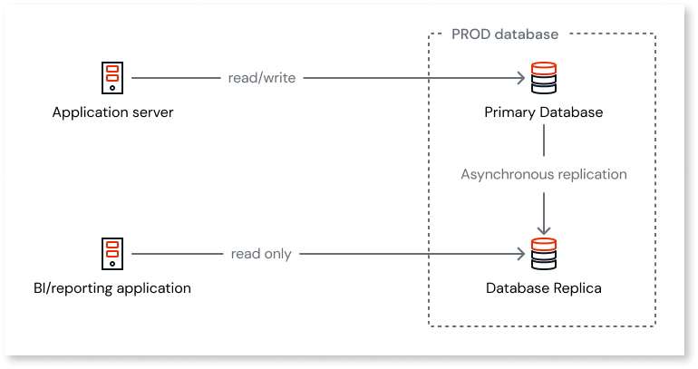
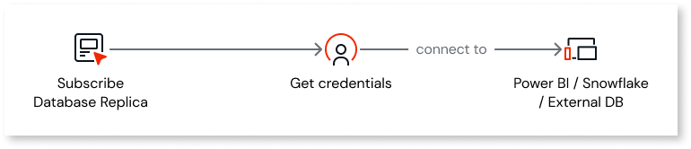

# Using Database Replica for reporting

<div class="info" markdown="1">

Database Replica is under a [Limited Availability (LA)](https://success.outsystems.com/support/release_notes/outsystems_product_releases/#limited-availability-la) program.

</div>

Database Replica allows you to establish direct access to data in an OutSystems 11 Cloud production database. It enables you to apply real-time business analytics to data without encountering performance issues and with minimal lag. Data is constantly updated to the replica and is seconds away from the main database. The amount of time it takes to update the replica depends not on the database size but on the changes made to the primary database.

You utilize your read-only credentials to access one replica per production database. With your read-only credentials, you access:

* Database tables created by the entities you define in Service Studio.

* System tables that list users and their roles.

See [Granted permissions](#granted-permissions).



## Requirements

Consider the following requirements for Database Replica:

* You must have an existing OutSystems 11 Cloud infrastructure.

* A subscription to Database Replica is required. Contact your Account Manager for provisioning.

* You must have the OutSystems Cloud high-availability option enabled. Users interested in obtaining the high-availability option should contact their account team for further assistance.

* Your primary database server must meet a minimum scalability requirement of Class 3.

## Request a Database Replica user

Subscribing to Database Replica provides access credentials. Use these credentials to connect to BI platforms like Power BI or create reporting dashboards in OutSystems apps using an [external database](../integration-with-systems/external-database/intro.md)



## Before you begin

To request a **Database Replica user**:

* You must be a **company administrator** or an **infrastructure administrator** for your company's account.

### Request a Database Replica user

To request a Database Replica user, open a support case. Make sure you include the following information in the support case description:

* Identify the **environments** where you require database access by providing their name or address.

* Indicate **how you want to connect** to the database:

  * Via VPN - You can request a new VPN or use one that's already active.

  * Via AWS Transit Gateway - If you already connect to your OutSystems Cloud using this service.

* Provide a contact number that can receive the SMS to retrieve the password.

Following up on your support case, OutSystems does the following:

* Establishes the connectivity according to your chosen preference - via VPN or AWS Transit Gateway.

* Provides you a file with the database address and credentials.

### Granted permissions

Only 2 read-only credentials are available with access to:

* ```OSUSR_*``` (business app tables)

* ```OSSYS_USER``` (Users system table)

* ```OSSYS_ROLE``` (Roles system table)

* ```OSSYS_USER_ROLE``` (Roles per User system table).
