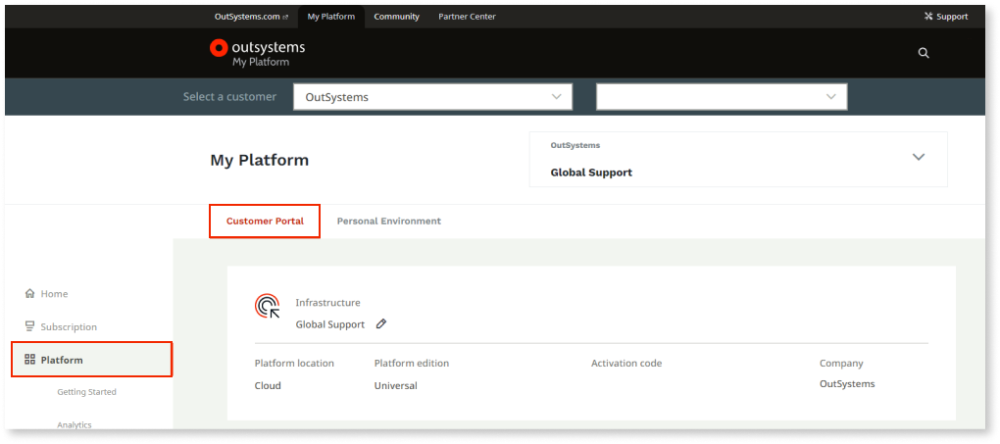
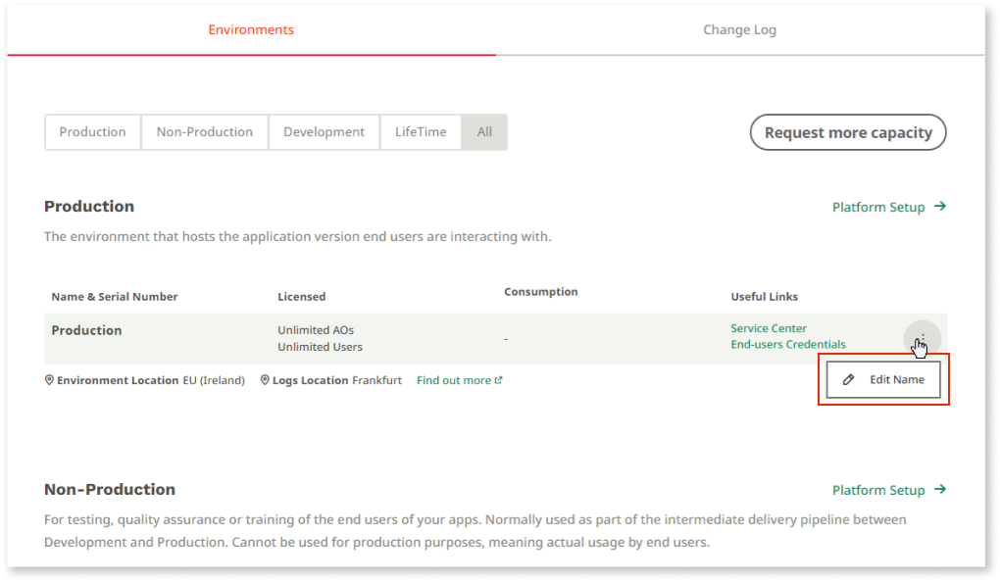
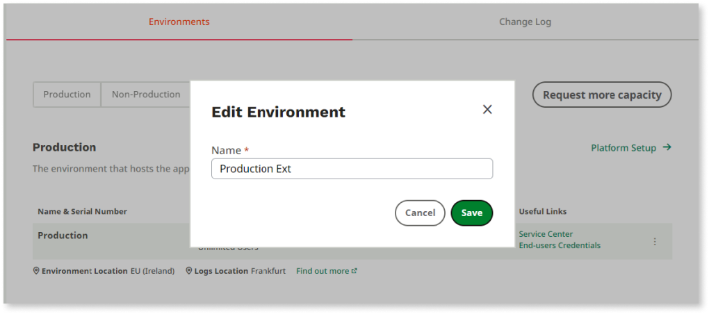
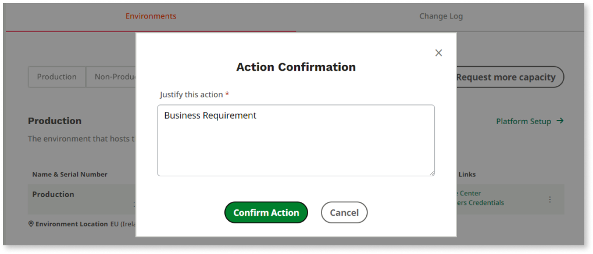
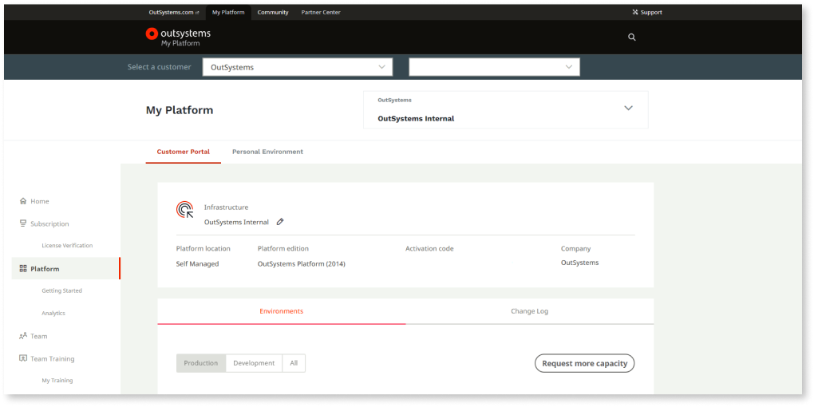
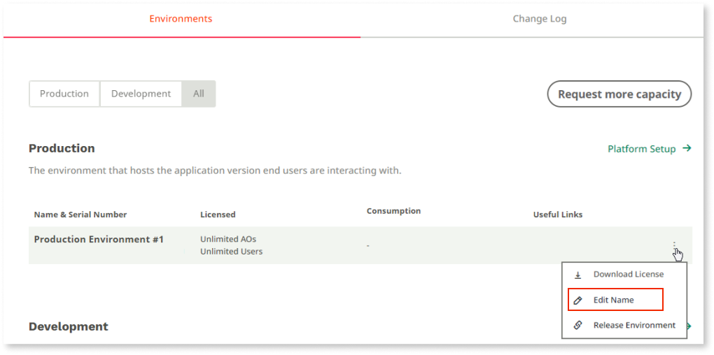
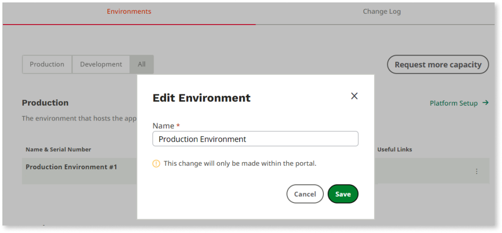
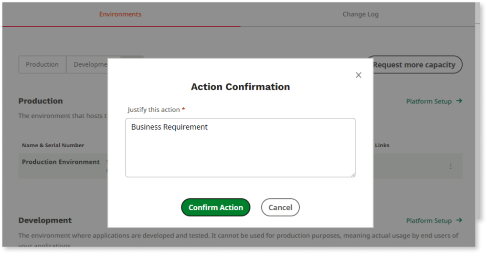
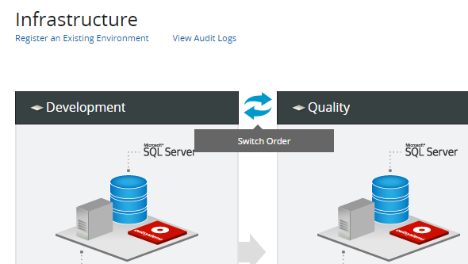

# Manage your OutSystems infrastructure

LifeTime is the centralized console for managing your OutSystems environments, applications, IT users, and security, covering the full application life cycle from development to deployment.

A typical OutSystems infrastructure comprises the following environments:

* **Development**: The environment where applications are initially developed and tested
* **Quality**: The environment where testers and business users experiment applications to perform quality assurance
* **Production**: The environment that hosts the application version end users interact with

You can manage your OutSystems infrastructure from the **INFRASTRUCTURE** tab of the LifeTime console (`https://<your_lifetime_server>/lifetime`).

## Set up the infrastructure

To execute the initial setup of your OutSystems infrastructure in LifeTime, follow the instructions in [Configure the infrastructure management console](../setup-infra-platform/setup/lifetime-configure.md).

## Add or remove environments

At any time, you can add or remove environments to your OutSystems infrastructure in LifeTime.

To add a new OutSystems environment to your infrastructure, do the following:

1. Click the **Register an Existing Environment** link.
1. Register your environment as described in [Configure the infrastructure management console](../setup-infra-platform/setup/lifetime-configure.md).

To remove one of your OutSystems environments from the infrastructure:

* On OutSystems Cloud, contact OutSystems Support to remove or unregister an environment.
* In a self-managed infrastructure, do the following:

    1. Click the **Edit Environment** link for the environment you want to remove.
    1. Click the **Unregister environment** link.

## Rename environments

The OutSystems Customer Portal is a centralized platform that provides you with a self-service hub that allows you to rename your environments. To access the Customer Portal, log into [OutSystems Community](https://www.outsystems.com/community) and go to **My Platform** > **Customer Portal**.

### Rename an environment on an OutSystems Cloud infrastructure

To rename an environment on an OutSystems Cloud infrastructure, follow these steps:

1. Log into the Customer Portal and select the **Platform** menu item.

    

1. On the **Environments** tab, select the **Edit Name** option for the environment you want to rename. 

    

1. In the **Edit Environment** popup, enter the new environment name and click **Save**. 

    

1. In the **Action Confirmation** popup, enter the reason for the change and click **Confirm Action**. 

    

The new environment name is updated in your Customer Portal and Lifetime.

### Rename an environment in an OutSystems self-managed infrastructure

To rename an environment on a self-managed infrastructure, follow these steps: 

1. Log into the Customer Portal and select the **Platform** menu item.

    

1. On the **Environments** tab, select the **Edit Name** option for the environment you want to rename. 

    

1. In the **Edit Environment** popup, enter the new environment name and click **Save**. 

    

1. In the **Action Confirmation** popup, enter the reason for the change and click **Confirm Action**. 

    

The new environment name is updated in your Customer Portal.

If you need assistance renaming your environment reach out to [OutSystems Support](https://www.outsystems.com/goto/contact-outsystems-support).

## Switch the environments order

In an OutSystems Cloud infrastructure, contact OutSystems support and request to change the order of deployment.

In a self-managed infrastructure, you can switch the order of two environments in the infrastructure using the **Switch Order** icon placed between those environments.

## Manage an environment

To manage an environment individually, use the links available in each environment:

* **Environment health**: To monitor the health of elements like timers, processes, or the status of the mobile apps build service. This link redirects to the Service Center console of the environment.
* **Configuration**: To configure the environment behaviors like the purpose of the environment in the infrastructure, date formats or building mobile apps. This link redirects to the Service Center console of the environment.
* **Environment security**: To configure security settings for applications, like HTTPS or Content Security Policy.
* **Edit environment**: To configure specific settings like the connection between the environment and LifeTime. You can enable or disable [maintenance mode](maintenance-mode.md) in an environment.
