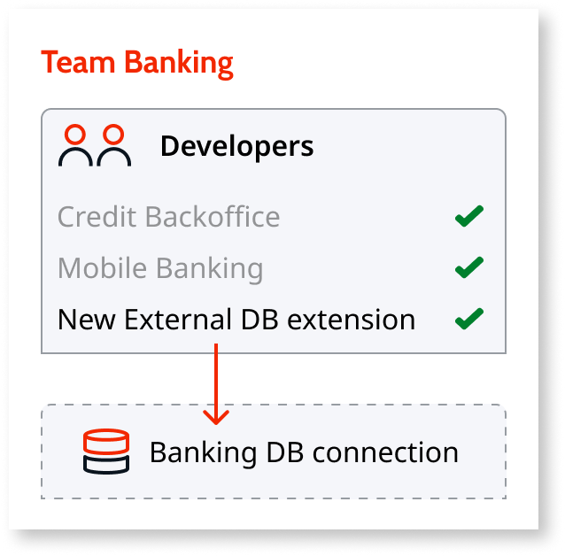
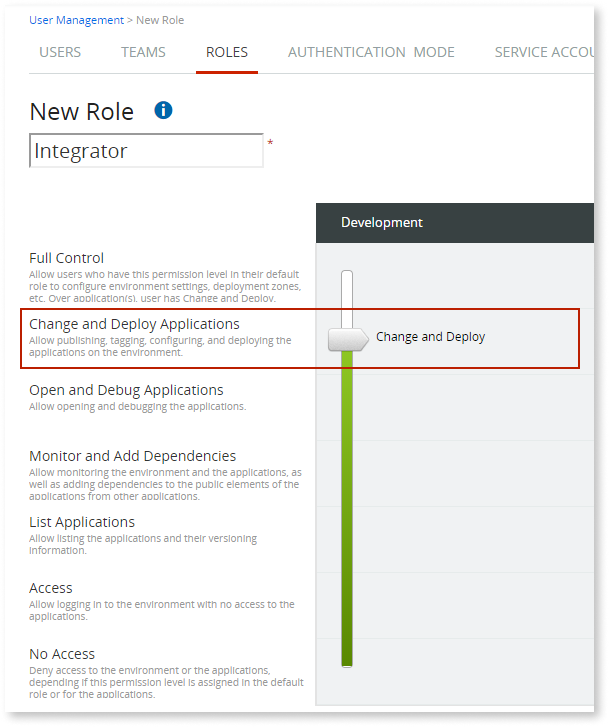
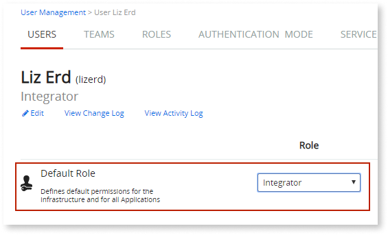
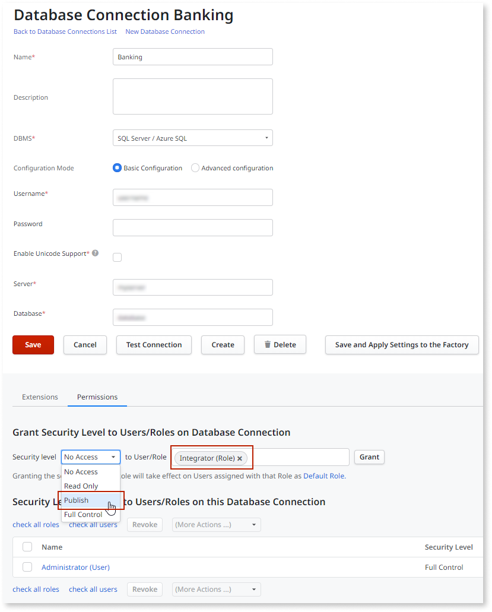

# Allow Integrations With External Databases

In this example, we want to allow one developer in the team to [create integrations with external databases](../../integration-with-systems/external-database/connect-external-db.md). This developer must be able to publish extensions, through Integration Studio, that use specific database connections. However, the developer must not be able to change the settings of the database connections.

To do this:

1. [Create a new role](create-an-it-role.md#create-a-new-role) that has the permission level **Change and Deploy Applications**.  

    

1. [Set the developer's default role](create-an-it-role.md#set-the-user-default-role) to the new role. Make sure you edit the user and set the user's **Default Role**.

    

    Assigning the new role to the user in a team or for a specific application doesn't grant the necessary permissions, as the default role takes precedence. If the permission level of the user's default role is lower than **Change and Deploy Applications**, the user will only be able to deploy changes that are limited to updating an existing entity's attributes or creating new attributes. Any other type of change will be restricted.

    

    

1. Go to the environment's Service Center console (`http://<your_environment>/ServiceCenter`) and select **Administration » Database Connections**.

1. Edit the database connection and grant the security level **Publish** to the role Integrator.  

    

Granting the security level **Publish** to the **Integrator** role on the database connection, allows the developers assigned with this role as **Default Role** to publish extensions, through Integration Studio, that use this database connection. This security level doesn't allow the developers to change the settings of the database connection.

Other developers will then be able to use those extensions to access the data on the external database.

Accessing the data on the external database through an extension requires that a user with the security level **Full Control** over the database connection [configures the extension in Service Center](../../integration-with-systems/external-database/connect-external-db.md#configure-the-extension-to-use-a-database-connection) to use the database connection.

