# Create and Assign Roles

OutSystems has two built-in roles that allow you to implement a simple security policy - **Developer** and **Administrator**.

However, if you need a more granular policy, you can [create additional roles](#create-a-new-role) to [assign to your IT users](#assign-roles-to-users).

Check the [permission model for IT users](about-permission-levels.md) to better understand how the different roles assigned to a user define the user’s permissions over the environments and the applications.

## Create a new role

To create a new role, do the following:

1. In your LifeTime console (`https://<lifetime_env>/lifetime`), go to the **USER MANAGEMENT** area.

1. Choose **ROLES** and click the **New Role** link.  

    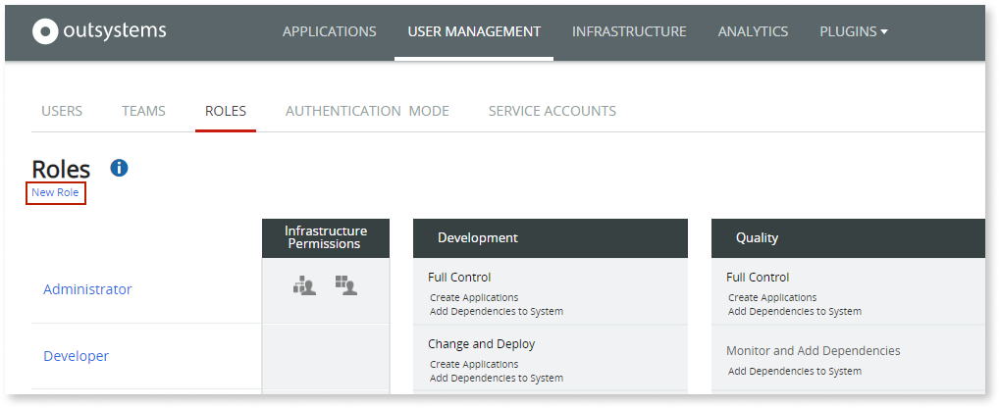

1. Fill in the Role Name.

1. Define the permissions that the new role will have over each environment:

    * Move the slider to choose the permission level over the environment and applications.

    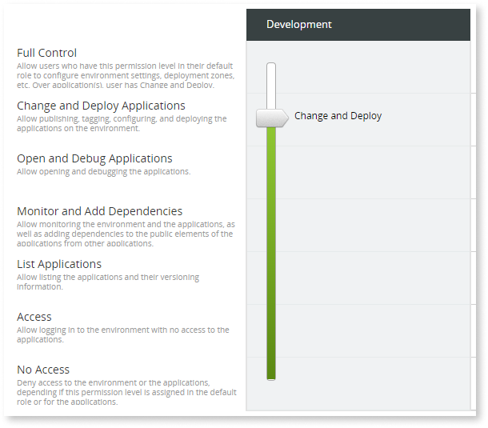

    * Set the toggle to define the specific permissions for the environment’s applications.

    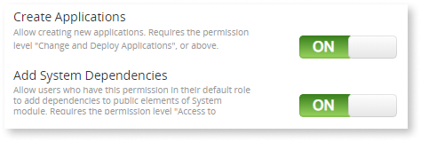

    * Set the toggle to define the infrastructure-wide permissions.

    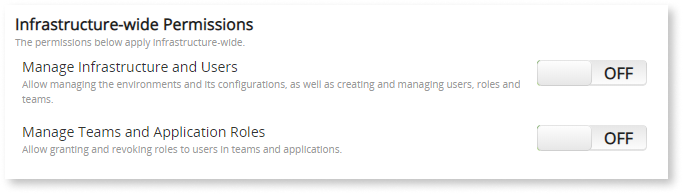

1. Click the **SAVE** button to create the role.

When you change the permissions of an existing role, LifeTime will propagate those changes asynchronously to the registered environments.

## Assign roles to users

You can assign **roles** to **users** in three different ways:

* [Set the user’s default role](#set-the-user-default-role)
* [Assign a role to a user in a team](#assign-a-role-to-a-user-in-a-team)
* [Assign a role to a user for specific applications](#assign-a-role-to-a-user-for-a-specific-application)

### Set the user default role

You set the Default Role of a user when [creating the user](create-an-it-user.md):

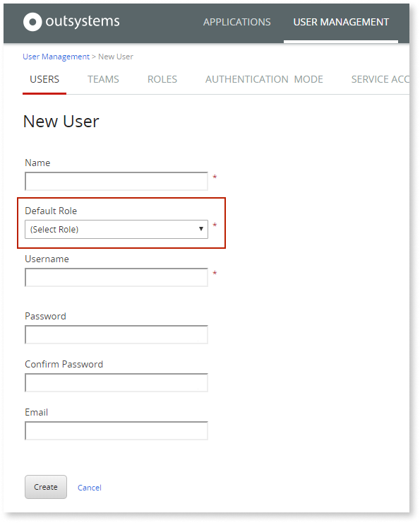

At any time, you can change the default role of the user in the user’s details page:

1. In the **USER MANAGEMENT** area, choose **USERS**.

1. Find the user you want to change from the list of users and click the Name of the user to go to the details page.

1. Change the user's Default Role in the Role dropdown.  

    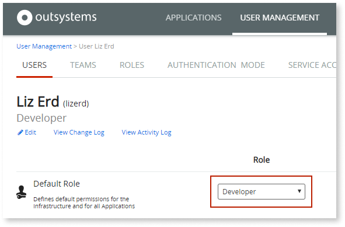

The change will be immediately saved.

### Assign a role to a user in a team

You specify the role of users in a team when you [add the users to the team](create-an-it-team.md#add-it-users-to-the-team):

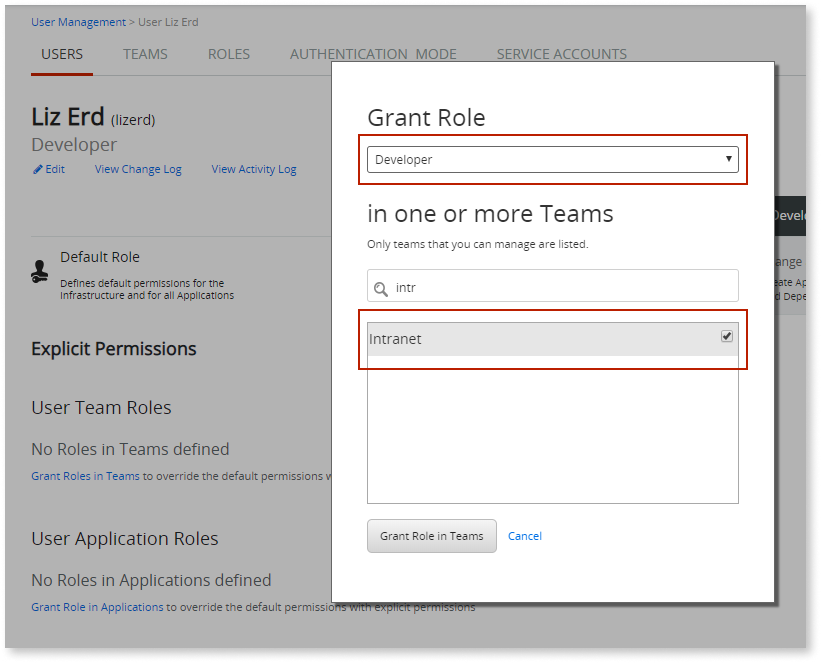

You can change the role of a user in the team either in the team’s screen or in the user's detail screen:

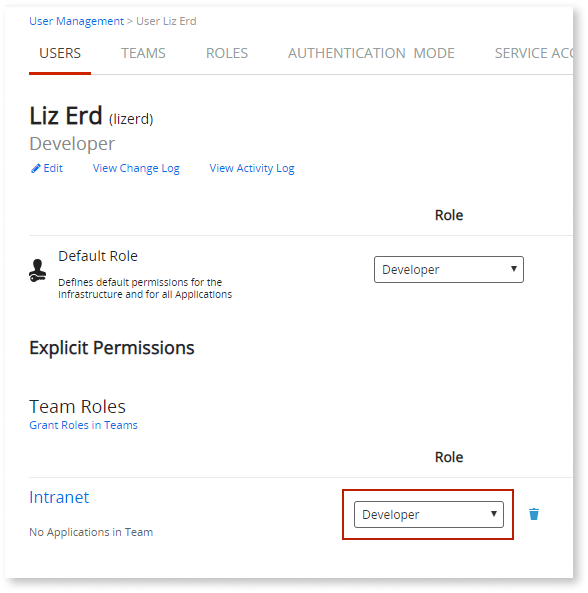

The change will be immediately saved.

### Assign a role to a user for a specific application

To assign a role to a user for a specific application, do the following:

1. In the **USER MANAGEMENT** area, choose **USERS**.

1. Find the user you want from the list of users and click the Name of the user to go to the details page.

1. Click the **Grant Role in Applications** link.  

    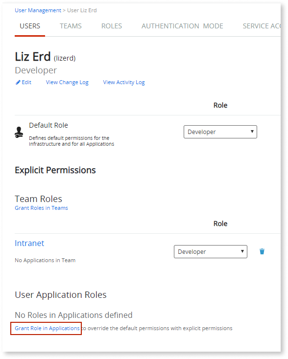

1. Choose the Role and the applications you want the user to have that role.  

    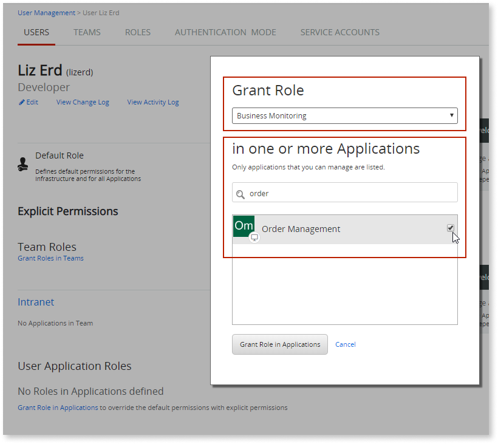

1. Click the **Grant Role in Applications** button.

To change the role that a user has over a specific application, change the role directly in the user’s screen. The change will be immediately saved:

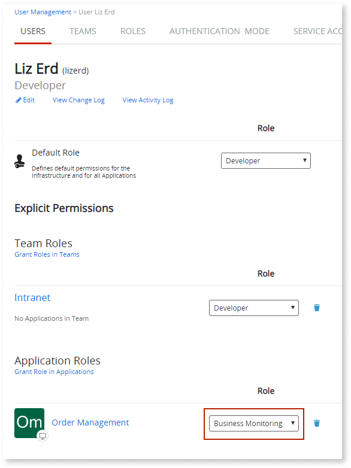

To revoke the role that a user has over a specific application, click the remove icon for that application in the user’s screen:

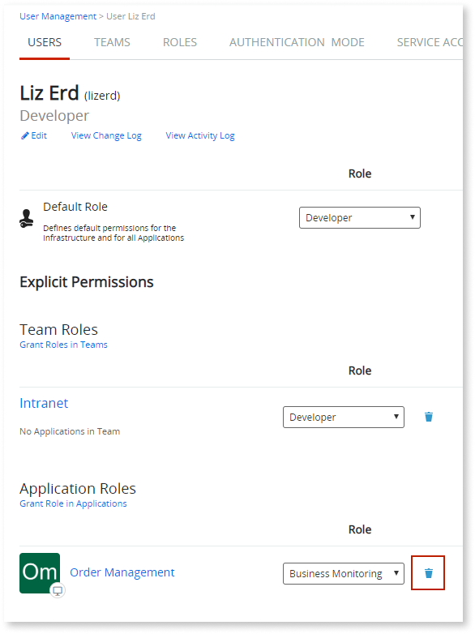
