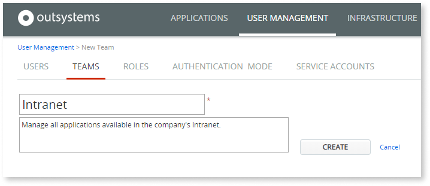
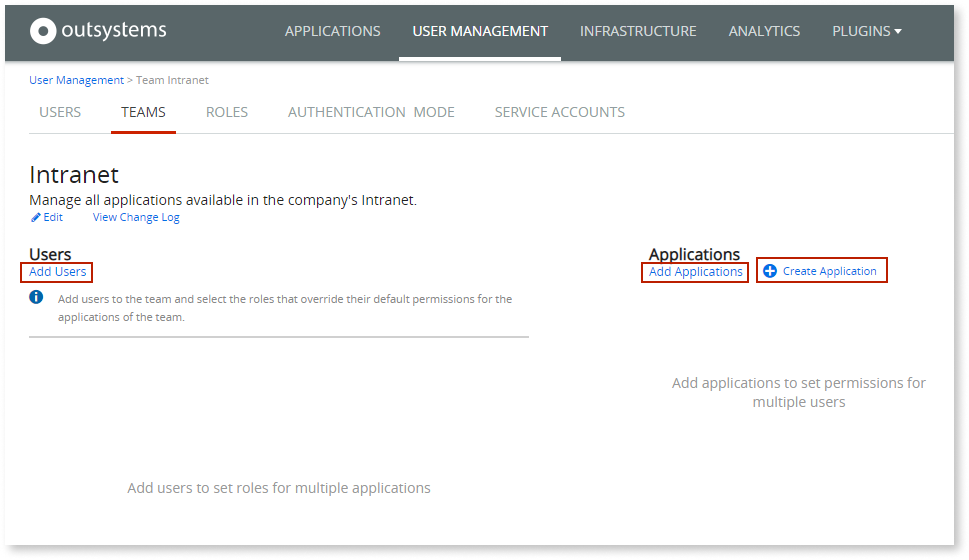
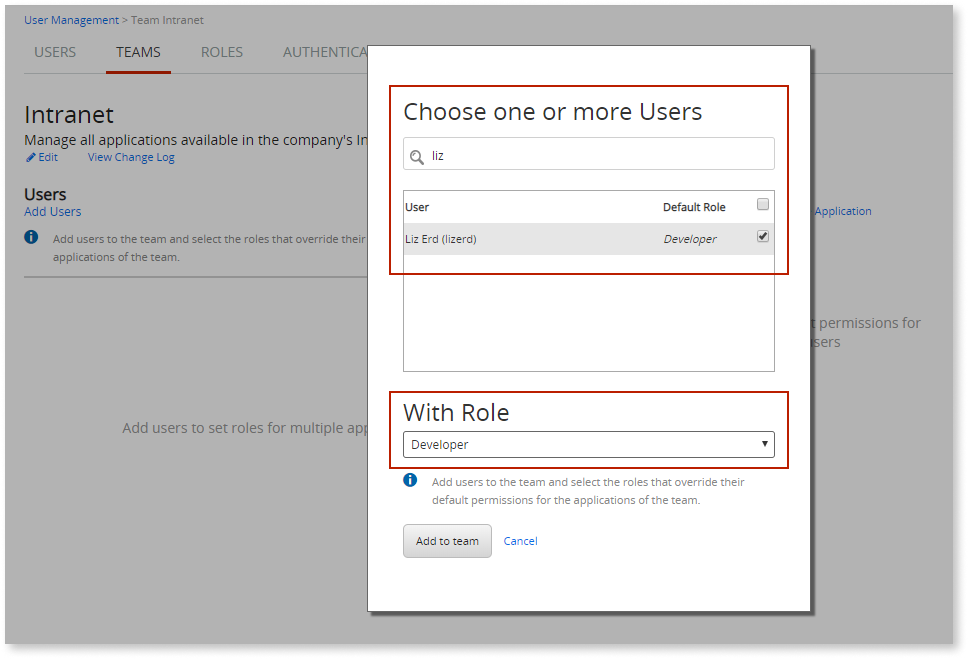
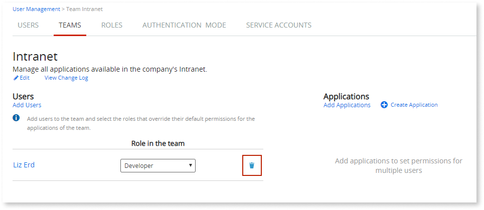
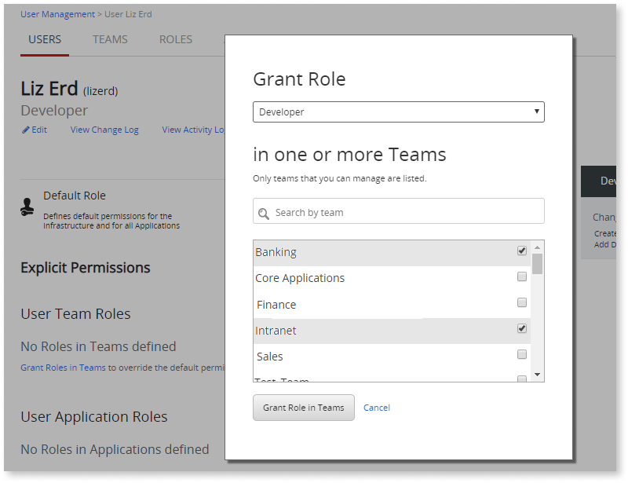
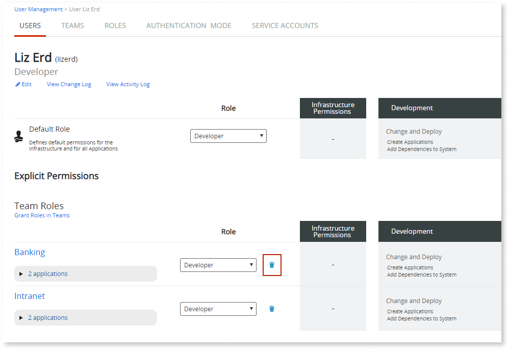
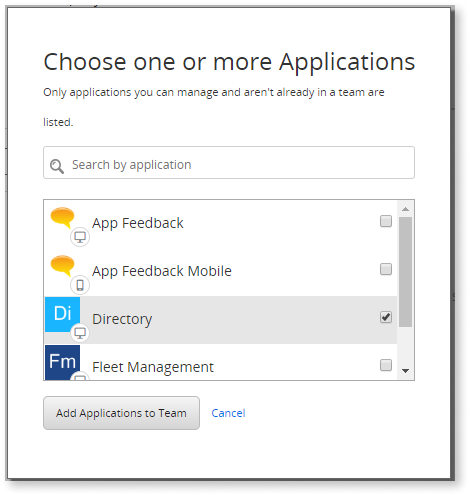
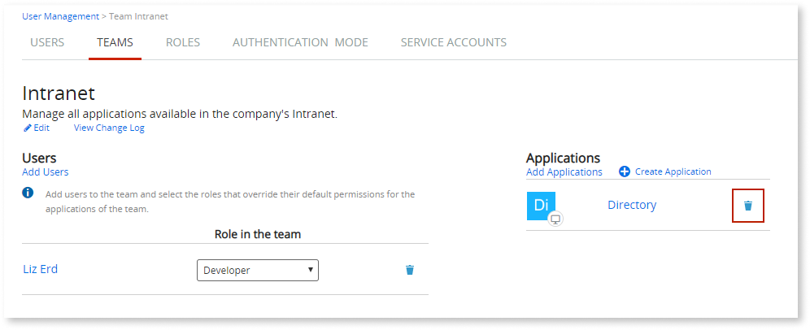
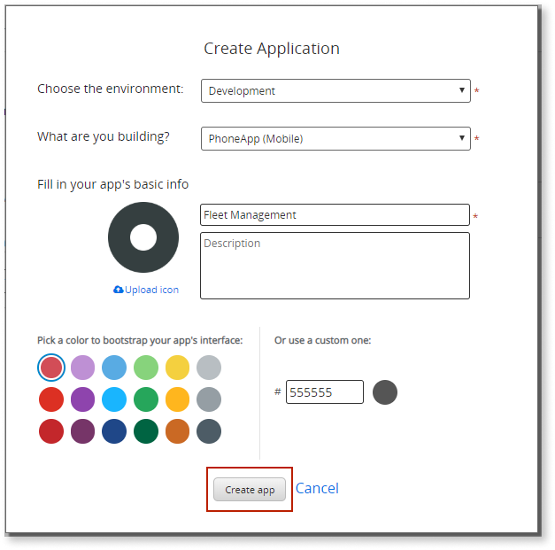

# Create an IT Team

Teams allow you to manage the permissions of a large number of IT users over the applications in your factory. This way, when new hires join an existing team in the company, you can manage their permissions over the team’s applications without having to grant permissions on each application individually.

## Create a new team

To create a team, do the following:

1. In your LifeTime console (`https://<lifetime_env>/lifetime`), go to the **USER MANAGEMENT** area.

1. Choose **TEAMS** and click the **New Team** link.

1. Fill in the team’s Name and Description.  

    

1. Click the **CREATE** button to create the team.

Now that the team is created, [add users](#add-it-users-to-the-team) and [applications](#add-applications-to-the-team) to the team. You can also [create new applications in the team](#create-a-new-application-in-the-team).

## Add IT users to the team

Adding users to a team will grant them a set of permissions over the team’s applications. As permissions are configured in roles, and you can assign different roles to each user within a team, you are able to have users with different permissions in the same team.

When you assign a role to a user in a team, that role overrides the default role of the user over the team’s applications. Check the OutSystems [permission model for IT users](about-permission-levels.md) to better understand which role should you grant your IT users by default and through a team.

### Add one or more IT users to a team

To add one or more users to the same team, do the following:

1. In the **USER MANAGEMENT** area, choose **TEAMS**.

1. Find the team you want from the list of teams and click the Name of the team to go to the details page.

1. Click the **Add Users** link.

1. Choose one or more users to add to the team and specify the role those users will have within the team.  

    

1. Repeat the previous step for the remaining users with other roles in the team.

To remove users from the team, click the remove icon for those users in the team’s screen:

### Add one IT user to several teams

If you need to add a user to several teams, you can do it in the user's detail screen:

1. In the **USER MANAGEMENT** area, choose **USERS**.

1. Find the user you want from the list of users and click the Name of the user to go to the details page.

1. Click the **Grant Roles in Teams** link.

1. Choose the teams and the role you want to assign the user in those teams.  

    

1. Click the **Grant Role in Teams** button.

To remove the user from one or more teams, click the remove icon for those teams in the user’s detail screen:

## Add applications to the team

Adding applications to a team allows you to grant the permissions over a set of applications to all users in the team, without having to grant permissions on each application individually.

To add an application to a team, do the following:

1. In the **USER MANAGEMENT** area, choose **TEAMS**.

1. Find the team you want from the list of teams and click the Name of the team to go to the details page.

1. Click the **Add Applications** link.

1. Choose the applications that users in this team will have access to. Notice that you will see only the applications that are not part of a team yet, as one application can only be part of a single team.  

    

1. Click the **Add Applications to Team** button.

To remove an application from the team, click the remove icon for that application in the team’s screen:

## Create a new application in the team

Creating a new application directly in the team automatically grants the users in the team with permissions over that application.

To create a new application in a team, do the following:

1. In the **USER MANAGEMENT** area, choose **TEAMS**.

1. Find the team you want from the list of teams and click the Name of the team to go to the details page.

1. Click the **Create Application** link.

1. Fill in the application details and click the **Create app** button.  

    

The IT users having **Change and Deploy Applications** permission level for the team now can use Service Studio to create modules in the new application.
