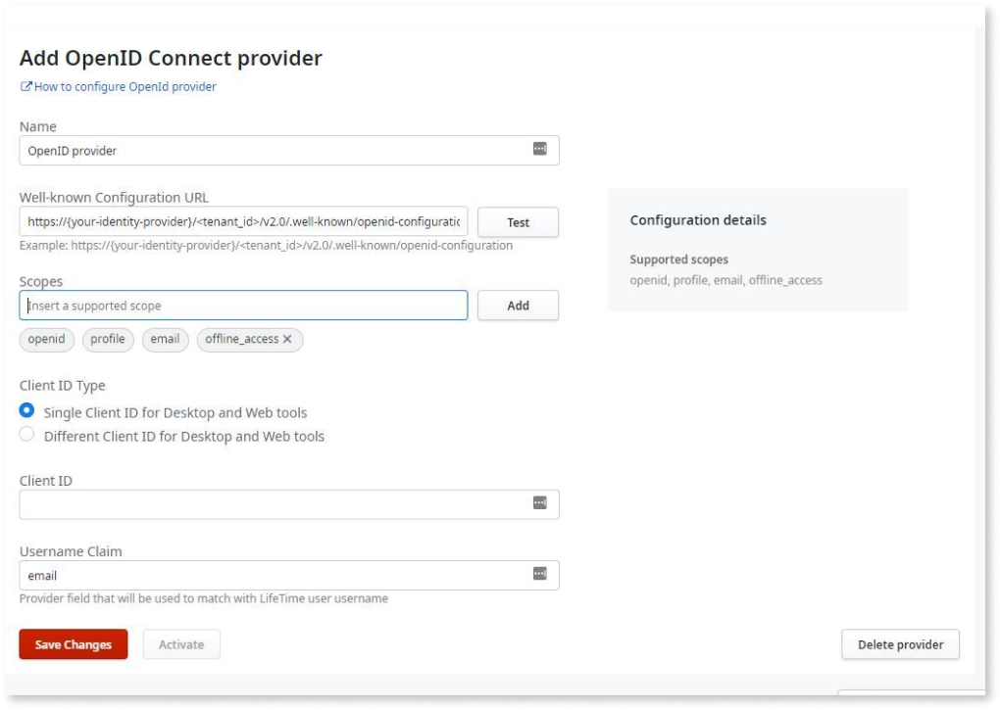

# Configuring LifeTime authentication

To configure the external provider (OIDC) in LifeTime, follow these steps:

1. Access the Lifetime console.

1. Go to **User Management** > **Authentication Settings** and click **Add OpenId Connect Provider**.

    

    If there’s no local administrator configured, a warning pop-up displays advising you to add a local administrator account before configuring the external provider. With the external provider activated, if the SSO login method fails, the local administrator can help unblock users by configuring the username and password for them.

1. Check the **Set administrator as local administrator** checkbox and click **Configure Provider**.

    

    The existing administrator is migrated and a local administrator is automatically created. For more information about creating a local administrator account, see [Adding a local administrator](#adding-a-local-administrator). 

1. Enter the following details according to the OIDC provider you are using:

    * **Name**: ID Provider

    * **Well-known Configuration URL**: OpenID Connect metadata document URI

        **Note**: Click the **Test** button to verify the well-known URL. This action will also add some recommended scopes required for OIDC connection in the future.

   * **Client ID Type**: Select one of the following:

        * Single Client ID for Desktop and Web tools

        * Different Client ID for Desktop and Web tools

            If you choose the **Use a different Client Ids for Desktop and Web tools** option, enter the following:

            * **Client ID for Desktop tools**: Native Application’s Client ID
           
            * **Client ID for Web tools**: Web Application’s Client ID

    * **Client ID**: Client ID for both desktop and web tools.
        
    * **Username Claim**: Claim used to match the username field of the user configured in LifeTime. By default, the claim is ``email``. For more information, see [Standard Claims](https://openid.net/specs/openid-connect-core-1_0.html#StandardClaims).
  
    

      
    For Microsoft Entra and OKTA you must use ``preferred_username`` as the **Username Claim** value.
         
    

       
    * **Scopes**: Clicking the **Test** button after you enter the well-known configuration URL fetches all the scopes supported and enabled in the identity provider. The scopes are displayed on the **Configuration details** section. Any required scope for the user authentication process can be added and saved for the configuration.
  
          
       **Note:** Please follow these guidelines when selecting values for scopes:
       
       * Select your value from the provided list of acceptable values in Configuration details section, ensuring that it matches exactly.
       
       * Avoid entering values that are not included in the provided list.
       
       * Pay attention to letter case (uppercase/lowercase) and formatting requirements if specified.
       
       Selecting values outside the provided list may result in errors or data inconsistencies.
       
        **Default Selected Scopes**:
          If the following scopes are supported by identity providers then they are added by default and cannot be removed:
       
        * openid
       
        * email
       
        * profile
       
         **Note**: If **offline_access** is supported and enabled in the Identity provider, this is also added by default. However, this scope can be removed if not needed.

       These scopes provide basic user information that is necessary for authentication and initial authorization.

       **Additional Scope Selection**:
                    In addition to the default selected scopes, users can add any other required scopes based on the settings of their identity provider. The additional scopes serve various purposes, such as obtaining a refresh token or accessing specific claim values used to uniquely identify users.

        **Recommended Additional Scopes**:
                    The following are some recommendations for additional scope selection based on commonly used identity providers:

         *  **Microsoft Entra**:
                    For Microsoft Entra, it is recommended to add the **offline_access** scope. This scope allows the application to request a refresh token, allowing it to obtain new access tokens without requiring user interaction.

         *  **Okta**:
                    For Okta, it is recommended to add the **offline_access** scope. This scope grants the application the ability to acquire a refresh token, ensuring seamless access token renewal without user involvement.
                        
         *   **AD FS**:
                    For AD FS, it is recommended to add the **allatclaims** scope. This scope requests the access token claims in the identity token.

        **Note**: The recommended additional scopes mentioned above are not exhaustive, and users should consult their identity provider's documentation for specific scope requirements.
       
        

 1. Click **Save Changes**.

 1. Click **Activate**.

    The **Activate OpenID Connect provider** pop-up is displayed. 

     * Enter the **Client Secret**.

     * Select the **Clear all local user’s passwords now (Recommended)** checkbox.

        For more information about clearing user’s passwords, see [Clearing built-in password credentials](#clearing-built-in-password-credentials).

     * Click **Activate and Log Out**. 

    

Once activated, you are logged out of the current session and redirected to the login page of the currently active OIDC provider login page.

**Note**: Once the OpenId Connect provider is activated, users  can no longer use the fallback built-in authentication mechanism. In the case of any issues with the external IdP, designated break-glass users, also known as local admins, can login using a username and password to deactivate the OpenID Connect provider and enable any alternative authentication mechanism.

**Note**: The identity provider cannot be edited once enabled. You must switch to a different authentication mechanism or create a new identity provider if you want to edit any fields such as client secret.

If an OpenId Connect provider is activated before the LifeTime upgrade, to gain access to the complete feature set, you must deactivate and reactivate the provider again. OutSystems recommends having at least one [local administrator added](#adding-a-local-administrator) before activating OIDC. To deactivate the existing OpenId Connect provider, the built-in authentication mechanism must be activated and then OpenId Connect provider must be reactivated. Note that the client secret is required when you activate the OpenId Connect provider.

## Deactivating the external identity provider

Only one external identity provider method can be active at a time. When you activate one authentication mechanism, you automatically deactivate the currently active external identity provider.

## Managing Users

The auto-provisioning of IT Users is not available. Therefore, you must create users manually even though OIDC providers can authenticate users regardless of their presence in LifeTime. The platform still requires that users exist in LifeTime so that they can be identified correctly when they successfully log in using the external IdP.

When creating a new user in LifeTime, if an external IdP configuration is active, it’s not necessary to enter a password. This is because the authentication happens on the external IdP side. This way, users are forced to use the IdP authentication. Apart from basic user information, such as name, email, and role, the user is identified by matching the LifeTime **username** with the **username claim** value of the external Idp.

### Adding a local administrator

If the external IdP is unavailable or has configuration errors, the local administrator is responsible for configuring user profiles. With the external IDP activated, only the local administrator can log into the platform using a username and password. 

You can create a local administrator before or after adding a new OIDC connection. It is recommended that you add at least one local administrator before activating an OIDC provider. This ensures that there is always a fallback authentication option for the user to log into the platform.

Local administrators are only able to log in to LifeTime.

To add a local administrator, follow these steps:

1. Access the LifeTime console.

1. Go to **User Management** > **Authentication Settings** and click **Add local administrator**.

    

1. Add the relevant details and click **Create**. 

    

Once you add the local administrator, you can log in using `<domain>/LifeTimeSDK/Internal_Login.aspx?`. 

### Clearing built-in password credentials

Once the OpenID Connect provider is activated, the fallback of using the built-in provider is no longer available. As the built-in user credentials are not going to be used, we recommend clearing the built-in user passwords. In the case of any issues with the external IdP, designated break-glass users, also known as local admins, can login using a username and password to deactivate the OpenID Connect provider and enable any alternative authentication mechanism.

* **Option 1**

    When activating the OIDC provider, in the **Activate OpenID Connect provider** pop-up, select the **Clear all local users passwords now (Recommended)** checkbox and click **Activate and Log Out**.

    

* **Option 2**

    If you don't clear the passwords when activating the OIDC provider, a warning message displays on the **Authentication Settings** screen. Click **Clear passwords now**.

    
  

