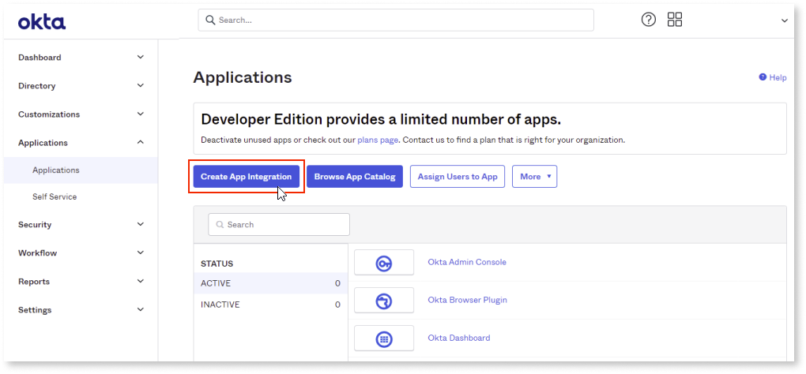

# Configuring Okta authentication

To configure Okta authentication, follow these steps:

1. [Create an application in the Okta portal for the OutSystems Consoles](#create-an-application-in-the-okta-portal-for-the-outsystems-consoles)

1. [Create an application in the Okta portal for the OutSystems Development Tool (Service Studio and Integration Studio)](#create-an-application-in-the-okta-portal-for-the-outsystems-development-tools-service-studio-and-integration-studio)

1. [Activate Okta configuration](#activate-okta-configuration)

## Create an application in the Okta portal for the OutSystems Consoles

1. Access the Okta administration portal.

1. Go to **Applications** > **Applications** and click **Create App Integration**.

    

1. On the **Create a new app integration** screen, select the following options and click **Next**.

    * **Sign-in method**: OIDC - OpenID Connect
    
    * **Application type**: Web Application

    

1. Complete the configuration with the following details and click **Save**.

    * **App integration name**: OutSystems Consoles

    * **Grant type**: Refresh token

    * **Sign-in redirect URIs**:

        * For each of the environments on your infrastructure (including Lifetime), add  a new URI for the Service Center login page:
        ``https://<YOUR_ENV>/ServiceCenter/CentralizedLogin_AuthCodeFlow_TokenPart.aspx``

    * **Sign-out redirect URIs**:

        * For each of the environments on your infrastructure (including Lifetime), add a new URI for the Service Center logout page: ``https://<YOUR_ENV>/ServiceCenter/CentralizedLogout_CallbackEndpoint.aspx``

    * **Controlled access**: Select the option that suits your requirements

        

1. From the **OutSystems Consoles** application integration screen, copy the **Client ID** and the **Client Secret** details.

    

     You need this information when configuring the provider in LifeTime. **The client secret won't be displayed again, so ensure you save it now.**

    

    

## Create an application in the Okta portal for the OutSystems Development Tools (Service Studio and Integration Studio).

1. Go back to the **Applications** screen and click **Create App Integration**.

1. On the **Create a new app integration** screen, select the following options and click **Next**:

    * **Sign-in method**: OIDC - OpenID Connect

    * **Application type**: Native Application

    

1. Complete the configuration details with the following details and click **Save**.

    * **App integration name**: OutSystems Development Tools

    * **Grant type**: Refresh token

    * **Sign-in redirect URIs**:

        * ``servicestudio://auth``

        * ``integrationstudio://auth``

        * ``servicestudiox11://auth``

        * ``https://experiencebuilder.outsystems.com/Authentication/OIDC_Callback``

        * ``https://workflowbuilder.outsystems.com/Authentication/OIDC_Callback``

        * ``https://integrationbuilder.outsystems.com/Authentication/OIDC_Callback``

        * ``https://aimentorstudio.outsystems.com/Authentication/OIDC_Callback``

        * For each OutSystems environment in your infrastructure (excluding LifeTime), add an Integration Manager’s URI:

            * ``https://<YOUR_ENV>/OSIntegrationManager/OIDC_Callback``

    * **Sign-out redirect URIs**:

        * ``servicestudio://auth``

        * ``integrationstudio://auth``

        * ``servicestudiox11://auth``

        * ``https://www.outsystems.com``

    * **Controlled access**: Select the option that suits your requirements

    

1. From the **OutSystems Development Tools** app integration screen copy the **Client ID**.

    **Note**: You’ll need this information later when you configure the provider in Lifetime.

    

## Configure Okta as OpenId connect provider in LifeTime

Follow the steps mentioned [here](external-idp-lifetime.md).