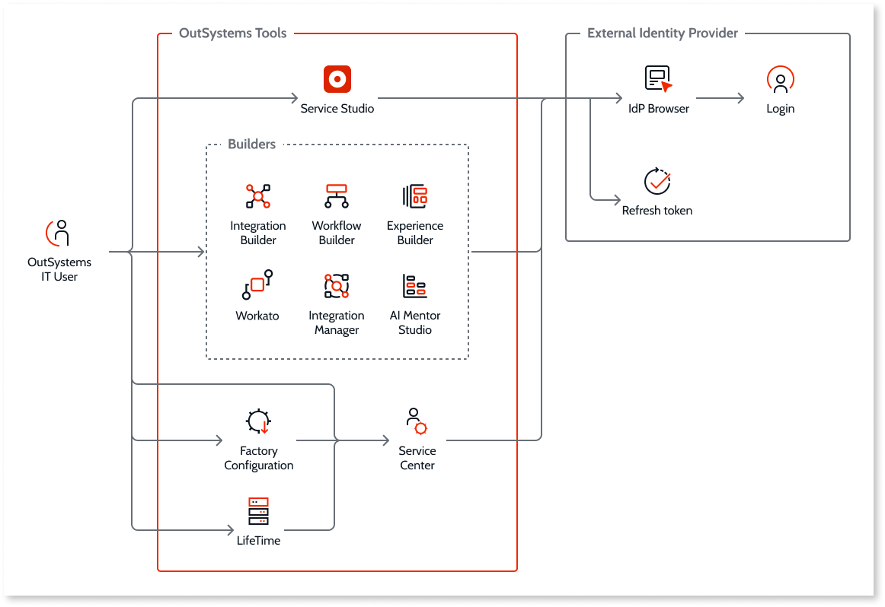
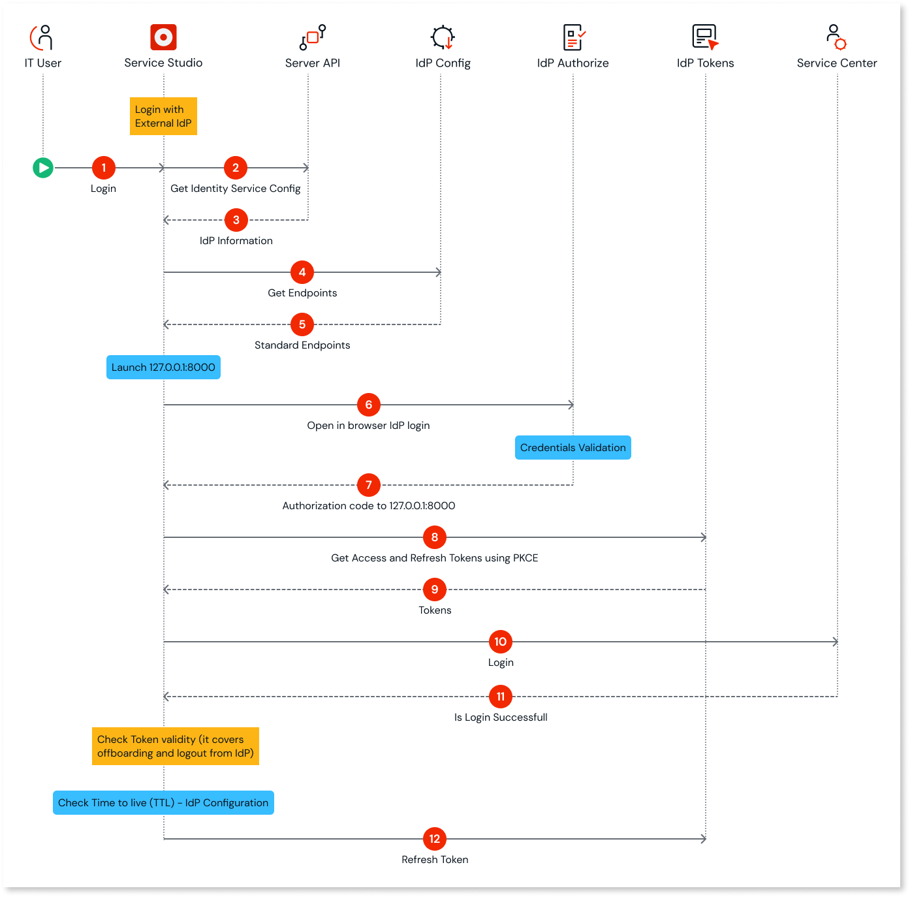
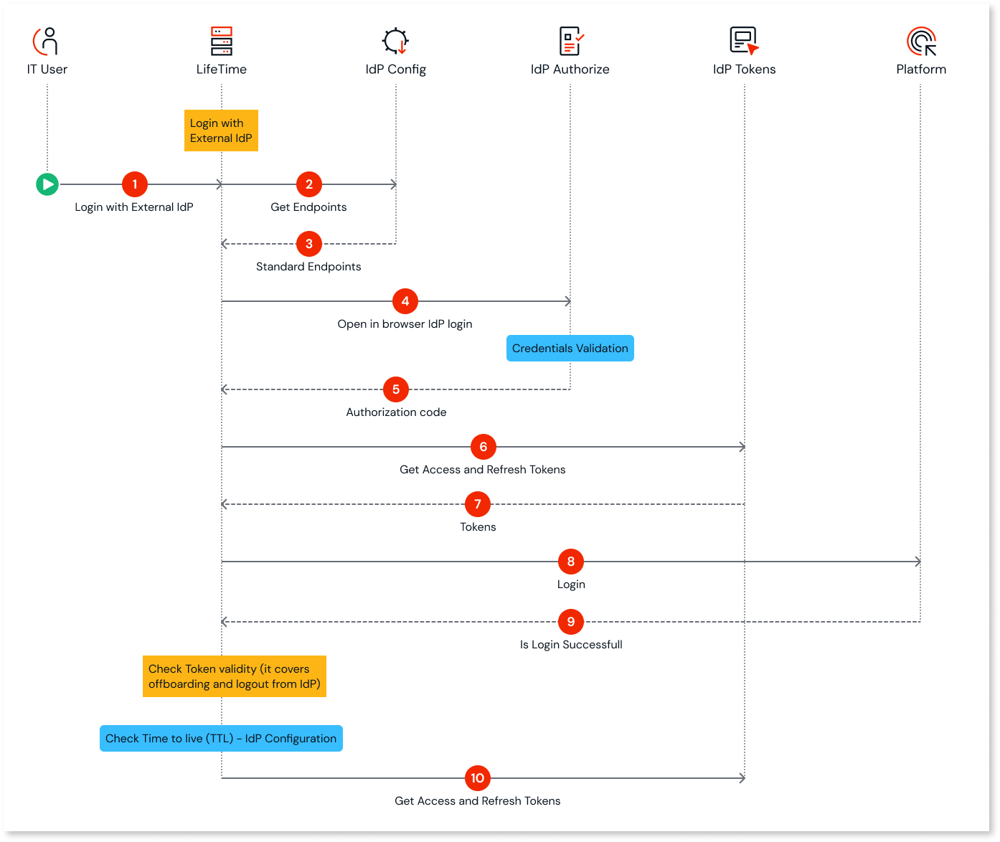

# IT Users Integration with External IdP via OpenId Connect

The **IT Users Integration with External IdP OpenId Connect (OIDC)** feature enables you to implement modern security standards to the authentication, setup, and management of IT users. The main goals of the feature are to:
* Reduce the risk associated with using unsecure passwords to access business-critical digital assets.
* Reduce the risk of managing multiple Identity Providers (IdPs). 
* Improve the authentication experience offering a single sign-on (SSO) method across the company.

## Feature summary 

The **IT Users Authentication with External IdP (OIDC)** feature enables:

* Secure the authentication of IT users, making sure that only authorized users have access to OutSystems tools and management consoles across environments.
* Secure access to OutSystems management consoles and tools by following customer compliance policies integrated with external IdPs, which use authentication best practices, for example, multi-factor authentication, password complexity, expiration, and rotation.
* Efficient authentication by using SSO across the company, which avoids users having to recall different credentials for different systems.
* Efficient external IdP login practices. You can create users without a password which forces them to log in using the external IdP.
      **Note**: Once the OIDC feature is activated, it’s not possible to add or change passwords for any new or existing users. Passwords can be added/changed only for Local admin users.

## Login flow 

You can integrate an external IdP by configuring the OIDC protocol in LifeTime. IT Users can log into the following OutSystems tools using their company IdP credentials in a new external IdP login flow: 

* Service Center (SC)

* LifeTime (LT)

* Service Studio (SS)

* Integration Studio (IS)

* Integration Builder

* Workflow Builder

* Factory Configuration 

* Workato

* AI Mentor Studio

Applications that use Service Center as a user provider and that implement the regular authentication flow using the [User_GetUnifiedLoginUrl](https://success.outsystems.com/Documentation/11/Reference/OutSystems_APIs/Users_API#User_GetUnifiedLoginUrl) API are also covered by this feature.

The following diagram shows the flow for the IT Users Integration with External IdP (OIDC) feature when you activate it.

The following diagram shows the communication flow between Service Studio, AI Mentor Studio, Integration, Experience, and Workflow Builder with External IdP (OIDC).

For example, consider using Service Studio with an External IdP,

1. User logs into Service Studio. 
1. Service Studio requests External IdP configuration metadata from the Server API.  Server API returns External IdP configuration metadata.
1. Service Studio requests endpoints from the IdP config. IdP config returns endpoints for External IdP login.
1. Service Studio displays browser login for external IdP provider. User credentials get validated at IdP Authorize. IdP returns an authorization token to Service Studio.
1. Service Studio requests access tokens using PKCE from IdP Tokens. IdP Tokens return JSON Web Tokens(JWT) to Service Studio.
1. Service Studio validates the received token and keeps updating the token while you continue to work.

The following diagram shows the communication flow between LifeTime with External IdP (OIDC).

For example, consider using LifeTime with an External IdP,

1. User logs into LifeTime. 
1. LifeTime requests endpoints from the IdP config. IdP config returns endpoints for External IdP login.
1. LifeTime displays browser login for external IdP provider. User credentials get validated at IdP Authorize. IdP 
returns an authorization token to Service Studio.
1. LifeTime requests access tokens from IdP Tokens. IdP Tokens return JSON Web Tokens(JWT) to LifeTime.
1. LifeTime validates the received token and keeps updating the token while you continue to work.

## Limitations

Tools that **don’t** enforce the external IdP flow use the username and password login authentication or [LT login authentication plugins](../use-an-external-authentication-provider.md). The following tools **do not** enforce the external IdP flow:

* [OutSystems Solution Pack (OSP) Tool](../../../setup-infra-platform/setup/unattended-install/osp-tool-ref.md) 

* Custom apps that use Service Center as a user provider and don’t use the [User_GetUnifiedLoginUrl](https://success.outsystems.com/Documentation/11/Reference/OutSystems_APIs/Users_API#User_GetUnifiedLoginUrl) API

## Prerequisites

The **IT Users Authentication with External IdP (OIDC)** feature requires the following versions of OutSystems components:

* Platform Server 11.18.1 

* LifeTime 11.16.1

* Service Studio 11.53.13

* Integration Studio 11.14.17

* Factory Configuration 11.1.1

To use an IT User as an End User in an OutSystems Reactive app, you must [configure the single sign-on between app types](../../../security/configure-authentication.md).

**Note**: This only applies to custom apps that use Service Center as a user provider. 

To avail of the IT Users Authentication with External IdP (OIDC) feature, **all** environments registered in LifeTime and Factory Configuration **must** meet the prerequisites.

