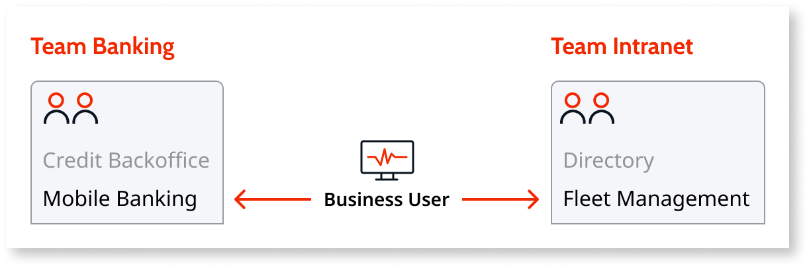

# Grant Permissions for Specific Applications

In enterprise scenarios, there is often the need to grant more granular permissions over specific applications.

In this example we want to allow a business user to **monitor** the applications Mobile Banking and Fleet Management in LifeTime Analytics, but **without granting permissions to open** the modules in those applications.

To do this, configure the business user:

1. [Create a new role](create-an-it-role.md#create-a-new-role) called Business Monitoring that has the permission level **Monitor and Add Dependencies**. This permission level allows users to monitor applications without granting access to opening the modules of those applications.  

    

1. Go to the user detail screen of the business user and [assign the role](create-an-it-role.md#assign-a-role-to-a-user-for-a-specific-application) Business Monitoring to the applications Mobile Banking and Fleet Management.  

    

Checking the [permissions of the business user](find-out-the-permissions-of-it-users.md#permissions-of-a-specific-IT-user), you can see that the user has **Monitor and Add Dependencies** permission over Fleet Management and Mobile Banking applications, but no access over any other application in the environment.

