# Set Up the Permissions in a Team

Using teams, you can manage the permissions of several IT users working in the same business team, over all the applications they own, without having to grant permissions on each application individually.

In this example we want to:

* Allow developers in Team Banking and Team Intranet to see and **work only on the applications of their respective teams**.

* Allow a senior developer of Team Banking to both **debug and add dependencies to the core applications Customers and Services**, but without granting permissions to make changes to those applications. These applications are managed by another team, the Team Core Applications.

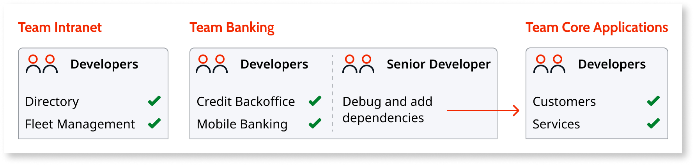

To follow the principle of security by default, we will set the IT users with a default role that grants them as little base permissions over applications as possible, and we will define all permissions necessary to perform their work through a team.

To allow the developers to work with their team’s applications, do the following:

1. [Create a new role](create-an-it-role.md#create-a-new-role) that has the permission level **Access**.  

    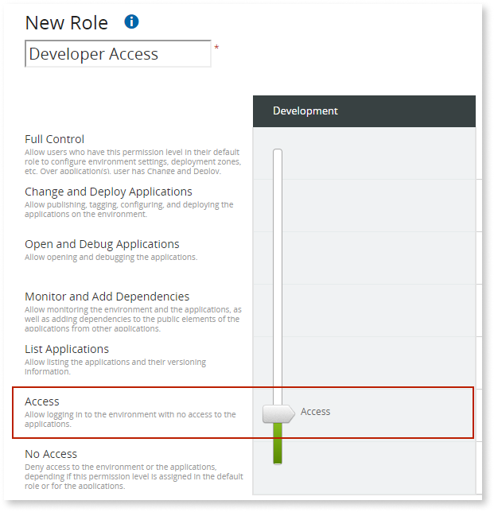

1. [Create IT users](create-an-it-user.md) for all developers with this new role set as the default role. This defines base permissions that only allow all developers to log in to an environment without granting access to any application.  

    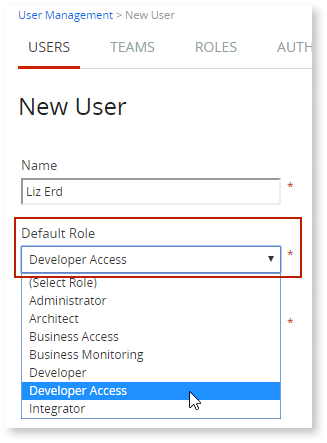

1. [Create another role](create-an-it-role.md#create-a-new-role) that explicitly grants the higher permissions necessary to work on the applications of those teams, such as **Change and Deploy Applications**.  

    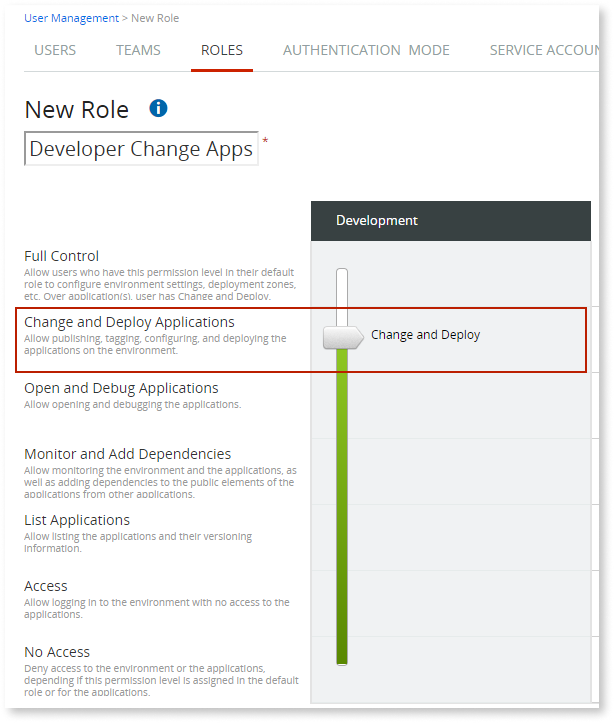

1. If the team doesn’t exist yet, [create a new team](create-an-it-team.md) and [add all the applications](create-an-it-team.md#add-applications-to-the-team) that are managed by the team.  

    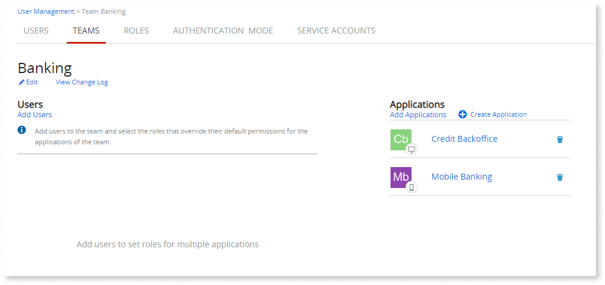

1. [Add the developers to their respective teams](create-an-it-team.md#add-it-users-to-the-team) with the role that grants them higher permissions.  

    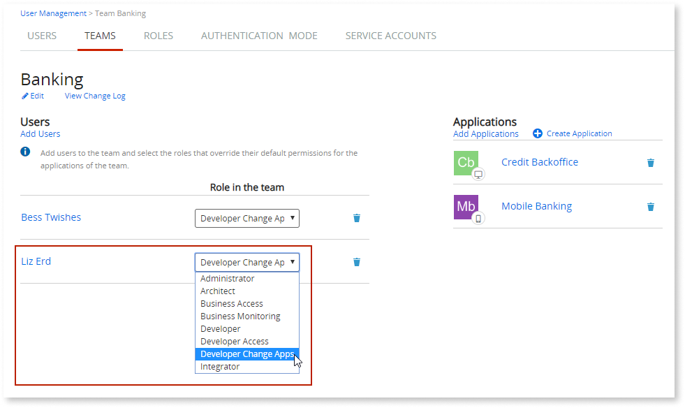

You will get something like this:

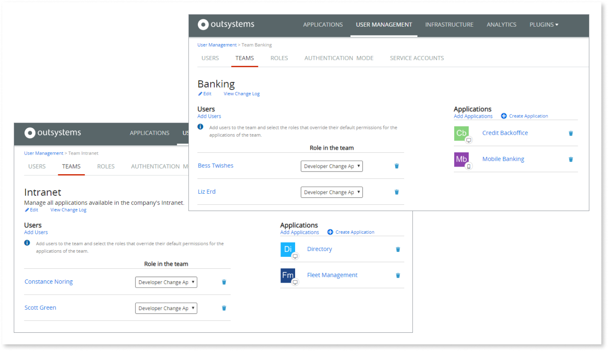

Checking the [permissions of the users](find-out-the-permissions-of-it-users.md#permissions-of-a-specific-IT-user), you can see that they have **Change and Deploy** permission over the applications of their team, but no access over any other application in the environment.

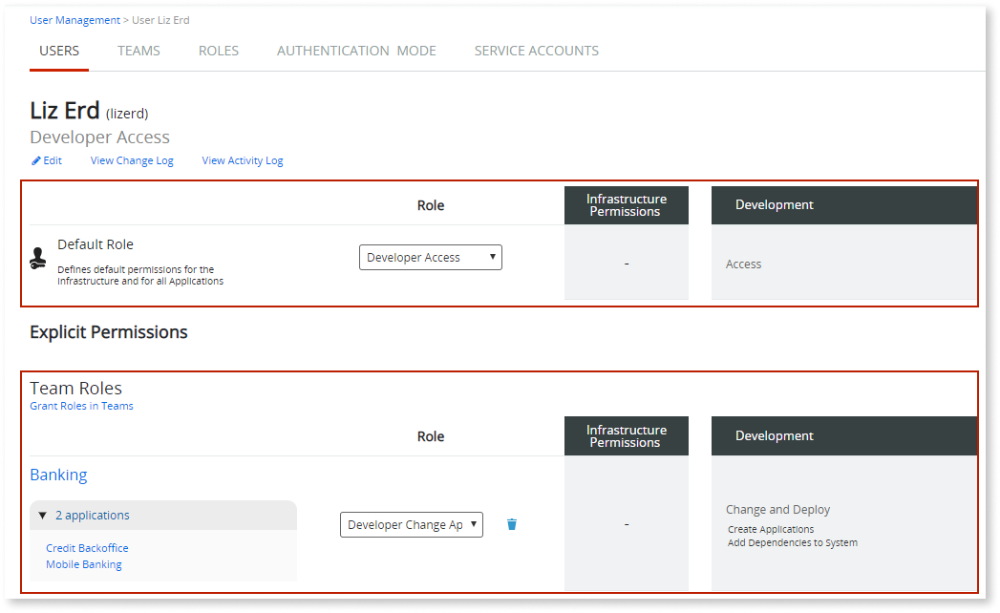

Now, let’s configure a senior developer in the Team Banking to **debug** and **add dependencies** to the applications of Team Core Applications:

1. [Create a new role](create-an-it-role.md#create-a-new-role) called Senior Developer that has the permission level **Open and Debug Applications**. To add dependencies to the applications, the permission level **Monitor and Add Dependencies** would be enough, but as the senior developer also needs to debug the applications, we must grant the above permission level, which also allows users to open and debug modules in applications.  

    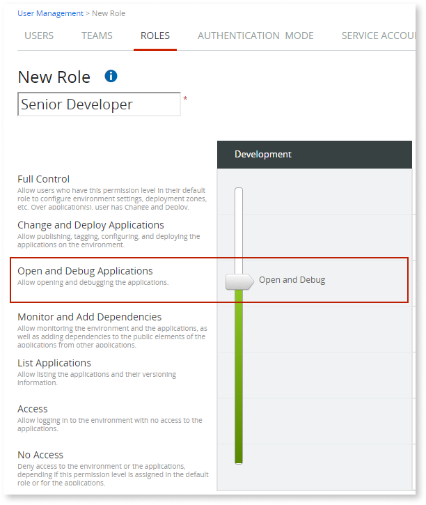

1. If the Core Applications team doesn’t exist yet, [create the team](create-an-it-team.md) and [add the applications](create-an-it-team.md#add-applications-to-the-team) Customers and Services to that team.  

    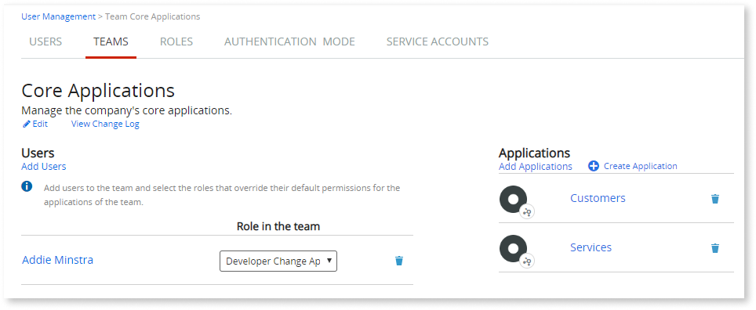

1. [Add the senior developer to this team](create-an-it-team.md#add-it-users-to-the-team) with the role Senior Developer.  

    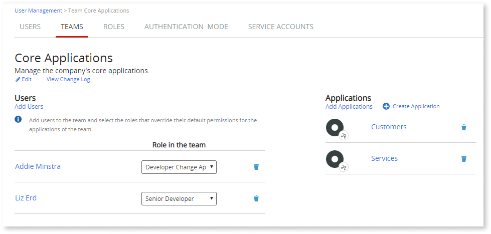

The senior developer of Team Banking can now debug and add dependencies to the core applications Customers and Services from other applications, but has no permissions to make changes to Customers and Services applications.

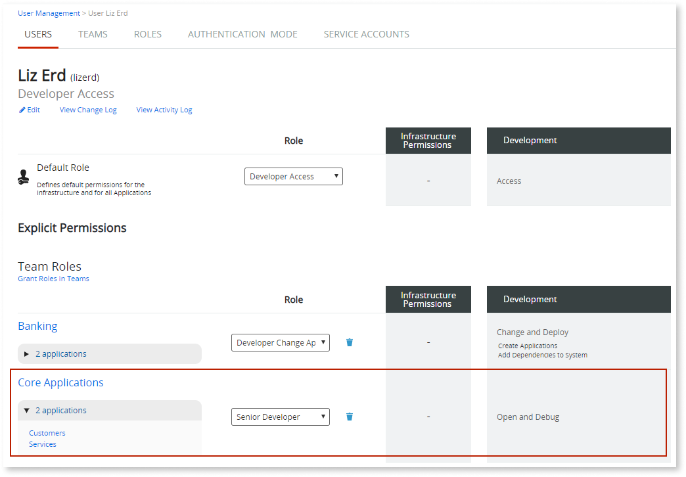
