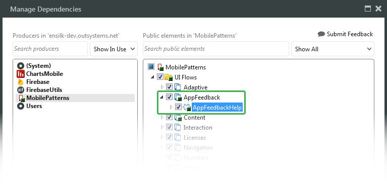
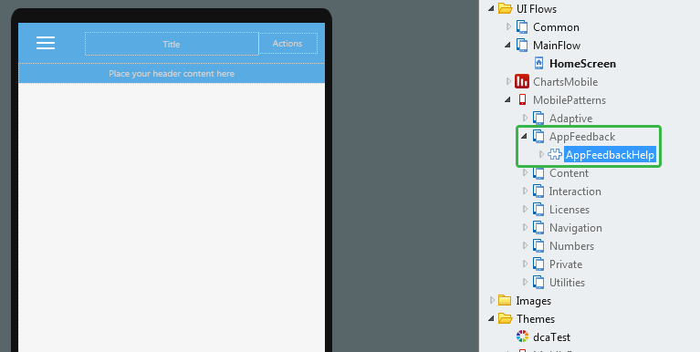

# Update Your Mobile App to Display App Feedback Instructions

If you are using the latest version of [Silk UI Framework](https://success.outsystems.com/Documentation/SILK_UI_Framework), your newly created mobile apps based on Silk UI Mobile templates will include a Block in the HomeScreen containing the instructions to access App Feedback. If App Feedback is enabled for the app, the users accessing the app for the first time will see this screen:  

However, if you have existing mobile apps that were created based on a version of Silk UI Mobile [previous to 1.3.0](https://success.outsystems.com/Documentation/SILK_UI_Framework/Upgrading_Silk_UI#Mobile), you can adapt those apps to display the App Feedback instructions by doing the following:

1. Make sure you have the [latest version of Silk UI Framework](https://success.outsystems.com/Documentation/SILK_UI_Framework/Upgrading_Silk_UI) installed in your environment.

1. Open the application module containing the screens where you want to add the App Feedback instructions.  

1. Go to **Manage Dependencies...**.

1. Find the module **MobilePatterns** and add the block **AppFeedbackHelp** from the flow **AppFeedback**:

    

1. Go to the screen where you want to add the App Feedback instructions. For example, the first screen after the user login.

1. Expand the module **MobilePatterns** and the flow **AppFeedback**.

1. Drag and drop the block **AppFeedbackHelp** to the screen:

    

When running the mobile app, **AppFeedbackHelp** block will check if App Feedback is enabled for the app. If App Feedback is enabled, the instructions to access App Feedback are displayed when users access the screen for the first time. After users dismiss the information, they will not see the App Feedback instructions again.
