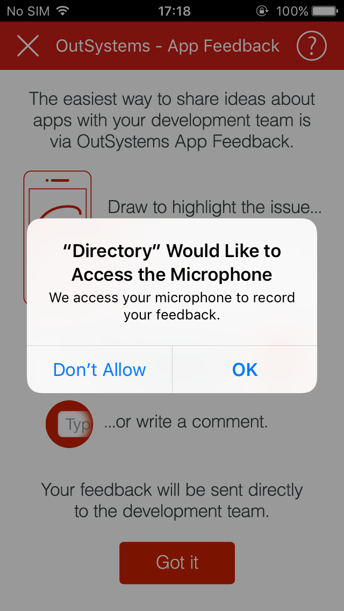
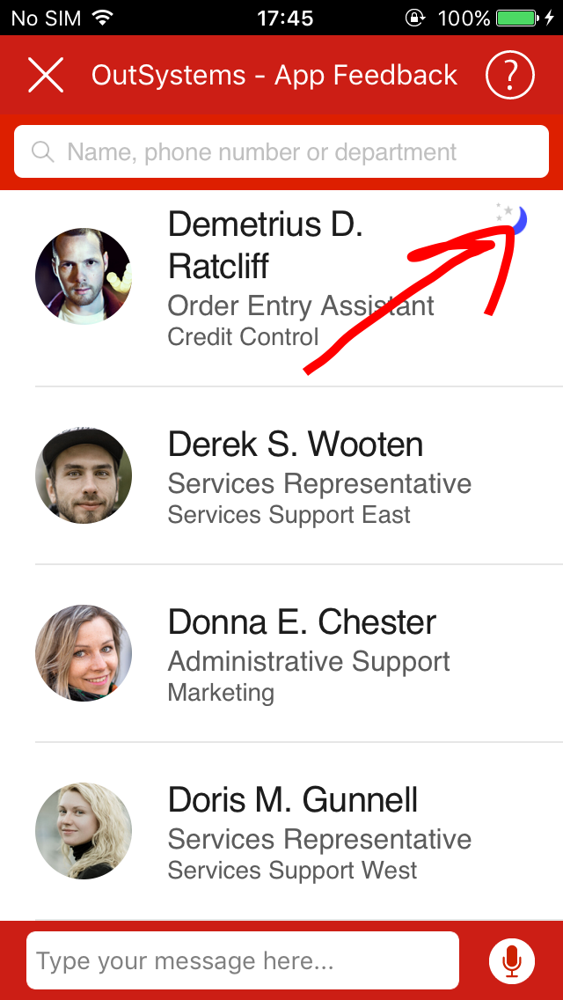
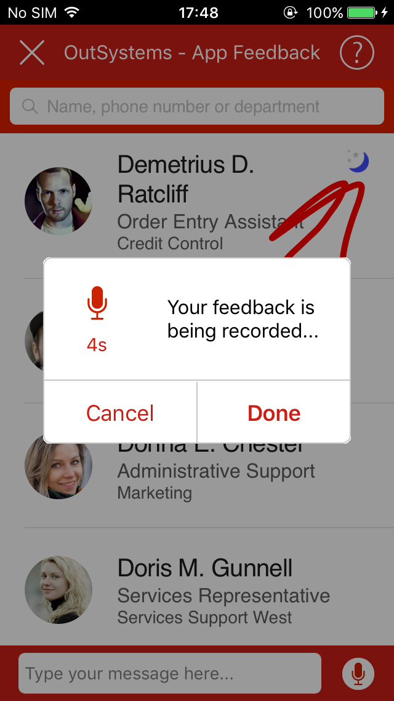

# Send feedback in mobile apps

Applies only to Mobile Apps.

Users can send feedback from mobile apps by long-pressing two fingers. [View the user feedback](user-feedback-handle.md) in the App Feedback app. Note that you first need to [activate the feedback feature in the environment](user-feedback-enable.md).

Users can send feedback as voice recordings as well, which requires a permission to access the microphone. When sending the first feedback, the app asks for the microphone access:

To send feedback, do the following:

1. Go to the screen for which you want to send feedback.

1. Long-press two fingers on the screen.

    

1. Mark the part of the screen you want to submit feedback about.  

    

1. Enter a text message in the input box.  

    

    Start a voice recording by clicking the microphone icon.

    

1. Click Send to submit the feedback.

You can send feedback only while the device has access to the network.

