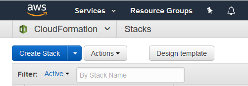
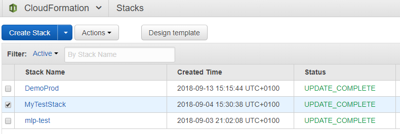
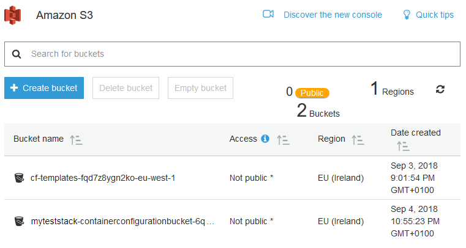
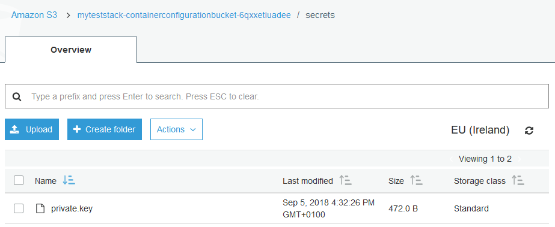
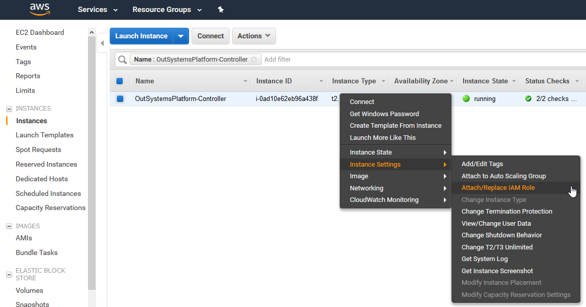
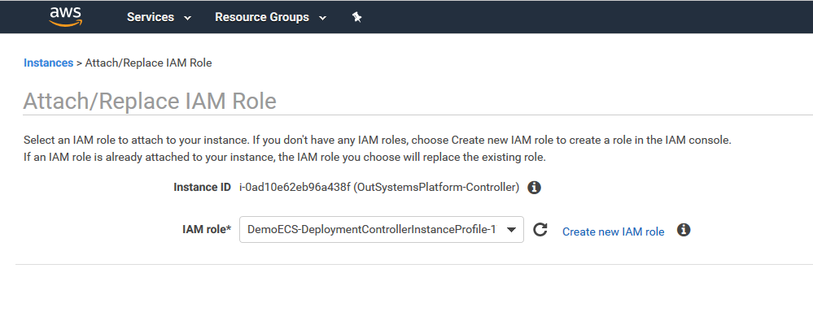
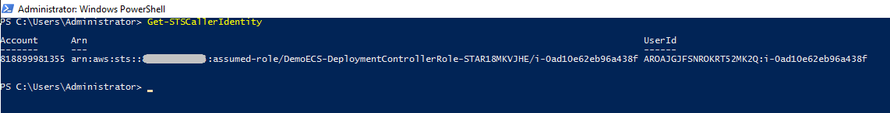
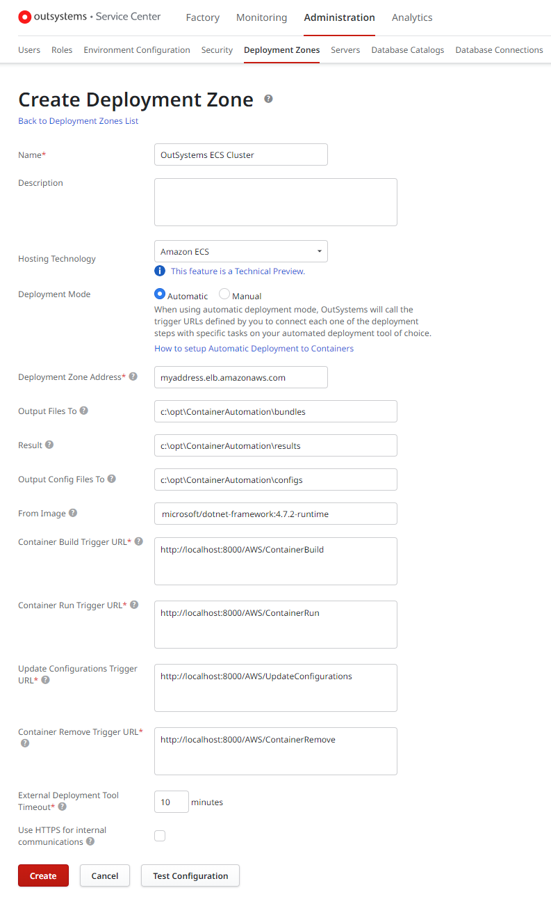
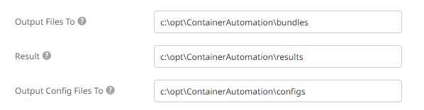

# Deploy an App to Amazon Elastic Container Service (ECS) Step-by-Step

This document will guide you from having your OutSystems platform hosted on Amazon AWS to preparing your infrastructure and deploying an OutSystems application in a container running on Amazon Elastic Container Service (ECS).

<div class="warning" style="overflow: hidden" markdown="1">

Note: The information provided in this guide should be used as general guidance. Use it for **internal and testing purposes** only. 

</div>

## Pre-requisites

You should have the following before starting:

* An AWS account;

* An IAM Identity (e.g. a user) with privileges to manage the following services:

    * AutoScaling
    * EC2
    * RDS
    * ECS
    * ECR
    * ElasticLoadBalancing(v2)
    * IAM
    * S3

* OutSystems 11 installed on an EC2 instance, connected to an RDS instance used as platform database;

* Docker Enterprise Edition (EE) installed in the OutSystems platform machine.

* PowerShell Execution Policy set to `Unrestricted`. For more information check [About Execution Policies](https://docs.microsoft.com/en-us/powershell/module/microsoft.powershell.core/about/about_execution_policies?view=powershell-6) in Microsoft PowerShell's official documentation.

## Deploying to Amazon ECS

In the sections below we will go through the following tasks to deploy an application to Amazon ECS:

1. Set up the ECS infrastructure on Amazon;
1. Copy the private key of your OutSystems installation to the provisioned S3 bucket;
1. Install the sample Container Automation Scripts;
1. Start the sample Container Automation Listener;
1. Configure a new deployment zone for deploying to ECS;
1. Publish your OutSystems application to ECS.

### 1. Set up the infrastructure

To simplify the container infrastructure setup process, OutSystems provides a CloudFormation template file that you can download from the following address:

https://github.com/OutSystems/ContainerAutomation/blob/master/misc/prerequisites/aws/cloudformation.yaml

This template will create an infrastructure with the following resources:

* An **ECS Cluster** where the OutSystems application containers will be launched;
* An **Application Load Balancer** to route requests to an appropriate application container replica;
* An **S3 Bucket** where the application configurations are placed and read from during the deploy process;
* **Security Groups**, **Roles** and **Profiles** to secure the resources mentioned above.

To set up your infrastructure, do the following:

1. Login into your AWS Console, open the CloudFormation service page and click "Create Stack".

    

1. In the "Select Template" step:

    1. Select "Upload a template to Amazon S3";
    1. Upload the `cloudformation.yaml` template file mentioned above;
    1. Click "Next".

1. In the "Specify Details" step:

    1. Fill in the "Stack name" field with a name for your infrastructure;

    1. Fill in the "ClusterName" field with a name for the container cluster;

    1. Fill in the "InstanceType" field with an instance type for the machines that will be created in the container cluster;

    1. In the "KeyPair" field select the key pair that will be used to launch the container cluster machines;

    1. Fill in the "ManagementIPAddress" field with the subnet that has permission to establish RDP connections to the container cluster, in CIDR notation. Typically this is the subnet where the operator machines are located;

    1. Fill in the "OutSystemsPlatformFrontEndServers" field with the EC2 instance IDs of the OutSystems front-end server machines;

    1. Fill in the "Subnets" field with the subnets where the cluster machines will be created;

    1. Fill in the "VpcId" field with the VPC ID where the OutSystems platform is installed;

    1. Click "Next".

1. In the "Options" step, Click "Next".

1. In the "Review" step, check "I acknowledge that AWS CloudFormation might create IAM resources." and click "Next".

The infrastructure will then be created. Check the CloudFormation service page to find out if it was provisioned successfully:



### 2. Copy the OutSystems installation private key to the S3 bucket

You must copy the `private.key` key file from your platform installation folder to the provisioned S3 bucket. This will allow applications running on the container cluster machines to access this file.

1. Find the `private.key` file of your installation (by default, at `C:\Program Files\OutSystems\Platform Server`);

2. Open the S3 Management Console and click on the cluster S3 bucket name;

    

4. Create a folder named "secrets" in the Management Console;

5. Upload the `private.key` to the "secrets" folder.

    


<div class="warning" markdown="1">

**Note:** Make sure you do not make the S3 `private.key` object public, since this would leak your private key.

</div>

#### Alternative scenario: Using the AWS Systems Manager Parameter Store

Instead of using the S3 bucket to store your `private.key` file, you can use the AWS Systems Manager Parameter Store to store the contents of the private key.

In this case, you will need to adapt the provided `cloudformation.yaml` template file by defining additional logic in the launch configuration section named "ClusterInstancesLaunchConfiguration" to place a `private.key` file in the `c:\docker\secrets` path in the cluster machines.

### 3. Install the sample Container Automation Scripts

The sample Container Automation Scripts orchestrate the deployment of applications between the OutSystems platform and the Amazon ECS infrastructure. These scripts must be installed in the EC2 instance where you previously installed the OutSystems Platform Server.

<div class="warning" markdown="1">

**Note:** _Do not use_ the provided sample Container Automation Scripts in production environments.

</div>

The scripts implement the [API for automated container deployment](app-run-automate.md), exposing an HTTP endpoint that handles the following deployment operations:

"Preparing Deploy" step
:   Builds a container image for an application, creates a repository in the ECR (Elastic Container Registry) for the application if it doesn't exist and pushes the image to that registry.

"Deploying" step
:   Pushes the application configurations to the S3 bucket, creates forwarding rules for each application module in the Elastic Load Balancer, creates an ECR task for the application container and launches a service using the created ECR task.

"Update Configuration" operation
:   Pushes a new application configuration to the S3 bucket. This configuration is propagated asynchronously to the running application containers.

"Undeploy" operation
:   Deletes bundles and any result (or marker) files associated with an application deployment.  
**Note: The sample implementation does not stop or delete running containers associated with the undeployed application.**


Install the sample Container Automation Scripts in the EC2 instance where the OutSystems platform is installed by doing the following:

1. Download and install the AWS Tools for PowerShell.  
Get the installer from the following address: https://aws.amazon.com/powershell/

1. Open Amazon's "EC2 Dashboard" and navigate to the "Instances" screen;

    _Note:_ These instructions assume that you are running the Deployment Controller on an EC2 instance.

1. Attach the Instance Profile created by the provided CloudFormation template to your Deployment Controller EC2 instance by right-clicking the deployment controller instance and selecting Instance Settings > Attach/Replace IAM Role;

    

1. In the Attach/Replace IAM Role screen, select the role provided in the CloudFormation template in the "IAM role" drop-down field;  

    _Tip:_ The correct role name contains the following string: `DeploymentControllerRole`.

    

1. Make sure that everything is working properly by running the following command in a PowerShell console:
    
    `Get-STSCallerIdentity`

    The output should be something similar to the following:

    


1. Download the sample Container Automation Scripts from the following address to the OutSystems Platform Deployment Controller machine:  
https://github.com/OutSystems/ContainerAutomation

1. Open the file `modules\AWS\Settings.psm1` and enter a value for the following variables:

    * `$global:AWSBucketName` – The name of the S3 bucket provisioned through the CloudFormation template;
    * `$global:AWSLoadBalancerArn` – The provisioned load balancer ARN;
    * `$global:AWSClusterName` – The provisioned cluster name.

### 4. Start the sample Container Automation Listener

To start the sample Container Automation Listener, execute the following command in a PowerShell console in the Deployment Controller machine:

`tools\listener\RunListener.ps1 -Port 8000`

The listener port can be customized to any available port. If you do, adapt the configurations below to the new port.

### 5. Configure a new deployment zone for deploying to ECS

Now that we have our automation infrastructure we can create a deployment zone that makes use of it.

Create a new deployment zone in Service Center, filling in its configuration parameters according to the following guidelines:

Name
:   The name you want to give to your deployment zone (e.g. `OutSystems ECS Cluster`).

Deployment Zone Address
:   Address for all applications living in the deployment zone. When applications in other deployment zones need to refer applications living in this deployment zone and do not want to use the environment URL, they will use this address (e.g. `myaddress.elb.amazonaws.com`).

Output Files To
:   The folder where the Container Automation Scripts is expecting the application bundles (e.g. `C:\opt\ContainerAutomation\bundles`).

Result
:   The folder where the Container Automation Scripts writes the deployment result files (e.g. `C:\opt\ContainerAutomation\results`).

Output Config Files To
:   The folder where the Container Automation Scripts is expecting the application configuration files (e.g. `C:\opt\ContainerAutomation\configs`).

Container Build Trigger URL
:   The Container Automation Scripts endpoint that executes the "Preparing Deploy" step (e.g. `http://localhost:8000/AWS/ContainerBuild`).

Container Run Trigger URL
:   The Container Automation Scripts endpoint that executes the "Deploying" step (e.g. `http://localhost:8000/AWS/ContainerRun`).

Update Configurations Trigger URL
:   The Container Automation Scripts endpoint that executes the "Update Configurations" operation (e.g. `http://localhost:8000/AWS/UpdateConfigurations`).

Container Remove Trigger URL
:   The Container Automation Scripts endpoint that executes the "Undeploy" operation (e.g. `http://localhost:8000/AWS/ContainerRemove`).

Here is screenshot of Service Center showing the Containers Deployment Zone configuration:



### 6. Publish your OutSystems application to ECS

Now that the configuration of deployment zone is finished, you can configure an OutSystems application with this deployment zone and deploy it to ECS.

Do the following to configure your application to use the new deployment zone:

1. In Service Center, navigate to Factory > Applications and click on your application name;
1. In the Operations tab, set the "Deployment Zone" parameter to the deployment zone you configured in the previous step;
1. Click the "Apply" button.

To publish your application to ECS, do the following:

1. In Service Center, navigate to Factory > Applications and click on your application name;
1. Click the "Publish" button.

Service Center will show the progress of the deployment.

## Production Considerations

### Sample Container Automation Scripts

The provided sample scripts have the following folder structure:

```
├─ misc
│ └─ prerequisites
│   └─ aws
│         cloudformation.yaml
├─ modules
│ ├─ AWS
│ │    Settings.psm1
│ │    Wrapper.psm1
│ ├─ DockerEE
│ └─ Dummy
├─ tests
├─ tools
│ ├─ debug
│ ├─ jenkins
│ └─ listener
│       AutomationHookListener.psm1
│       RunListener.bat
│       RunListener.ps1
└─ utils
```

The two main automation modules are the following:

`AutomationHookListener.psm1`
:   Implements a small HTTP server that responds to platform trigger operations.

    **Important remarks:**

    * This module is intended as a quick sample for testing, and in production should be replaced with a proper tool such as Jenkins, Azure DevOps Server, or any other CI/CD server;
    * It behaves poorly with concurrency.

`AWS\Wrapper.psm1`
:   Contains all logic that implements the trigger operations, and all APIs connecting to Amazon services.

    **Important remarks:**

    * This module should be customized to your needs.

### Docker engine

The setup presented in this document assumes that you have set up a Docker engine in the same machine of the OutSystems platform, which will increase the disk space requirements of the machine.

The Docker engine role can be achieved using a separate Virtual Machine, as long it can read/write in the same file system of the paths configured in "Output Files To", "Result" and "Output Config Files To" parameters of the deployment zone configuration. For this scenario, we recommend using shared folders.

 

Check the [Deployment Zones Reference](<../deploy-applications/zones/reference.md>) for more information on all the available deployment zone configuration parameters.
