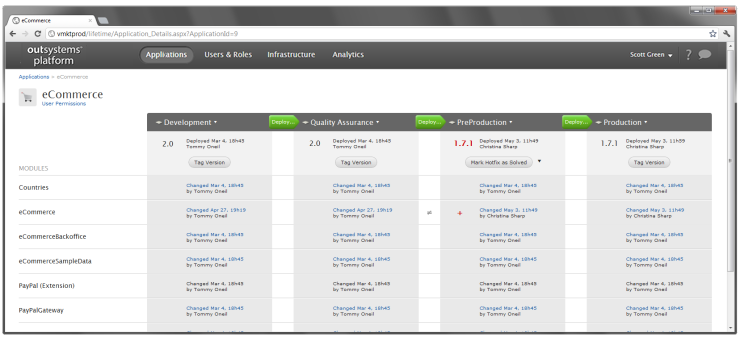
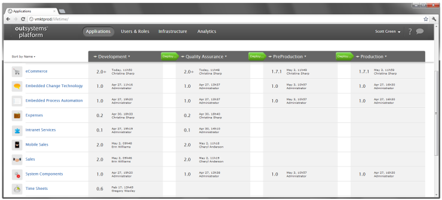

# Apply a Hotfix

This topic describes how to implement an immediate corrective development, also known as **Hotfix**.

We highly recommend publishing hotfixes to a Pre-Production environment fully synchronized with a Production environment, and not to the Production environment directly. Both environments should have the same application version as well as its data replicated. This way you can test and debug the hotfix and then deploy it to Production, with no downtime. Finally the hotfix is propagated backwards to previous environments (Quality Assurance and Development).

In the following example, it is described how a hotfix is applied to fix a severe bug found in the eCommerce application.

## Fix the Defect

A severe defect was discovered in the eCommerce application in Production and has to be immediately fixed. Proceed as follows:

1. Open Service Studio.
1. Connect it to the Pre-Production environment (or one synchronized with Production).
1. Download the module with the defect.
1. Fix the defect, deploy the module back to Pre-Production, and test it.

The version number in Pre-Production has changed: it is suffixed with a '+' (for new changes) and is in red because it is a hotfix.

## Deploy the Hotfix to Production

To apply the hotfix to Production, simply [deploy the application](<deploy-an-application.md>) from Pre-Production to Production. LifeTime automatically suggests you to choose 'Tag &amp; Deploy 1.7.1'. The hotfix is tagged with a third number in Pre-Production and the application is deployed to Production.

Both Pre-Production and Production have now the 1.7.1 version, and the Pre-Production version is still in red: the hotfix needs to be propagated backwards.

## Propagate the Hotfix

To solve an hotfix, all changes made to the application have to be propagated backwards to all of the previous environments; in this case first to Quality Assurance, and then to Development. Proceed as follows:

1. Click on the eCommerce application: the modules are listed and the ones with the hotfix are marked with a red '+'.

       

1. Merge all the modules with the hotfix changes in Pre-Production to Quality Assurance: click on the compare button (the difference sign) between the environments and select the specific changes you have done to implement the hotfix.

3. In Service Studio select the hotfix changes and click **Merge**.

4. In Service Studio publish the new versions of the modules to Quality Assurance.

5. Repeat steps 2, 3 and 4 from Quality Assurance to Development.

6. When the fix is propagated through all environments, click the **Mark Hotfix as Solved** button on the application details screen, to signal that the fix is now implemented across all infrastructure.

The hotfix is solved and there are no more application versions marked in red.

